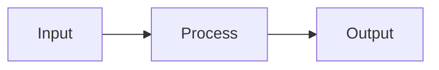

# Chapter Title

<div className="learning-objectives">

## Learning Objectives

By the end of this chapter, you will be able to:

- Objective 1: Describe what the reader will learn
- Objective 2: Another specific skill or concept
- Objective 3: Third measurable outcome

</div>

<div className="prerequisites">

## Prerequisites

Before starting this chapter, ensure you have:

- **Chapter**: Completed [Previous Chapter](./previous-chapter)
- **Software**: Ubuntu 22.04, ROS 2 Humble installed
- **Knowledge**: Basic Python programming experience

</div>

## Introduction

Brief introduction to the chapter topic. Explain why this is important and how it fits into the broader learning journey.

## Section 1: Main Concept

Content for the first major section. Include explanations, diagrams, and context.

### Subsection 1.1

More detailed content with code examples:

```python title="example.py"
#!/usr/bin/env python3
"""Example code demonstrating the concept."""

import rclpy
from rclpy.node import Node

class ExampleNode(Node):
    def __init__(self):
        super().__init__('example_node')
        self.get_logger().info('Node initialized')

def main(args=None):
    rclpy.init(args=args)
    node = ExampleNode()
    rclpy.spin(node)
    rclpy.shutdown()

if __name__ == '__main__':
    main()
```

:::tip
Helpful tips appear in admonition boxes like this.
:::

## Section 2: Practical Application

Show how the concept applies in practice.



:::warning
Important warnings or common pitfalls to avoid.
:::

## Section 3: Hands-On Exercise

Step-by-step instructions for the reader to practice.

1. First step with clear instructions
2. Second step building on the first
3. Third step completing the exercise

:::info Expected Output
Describe what the reader should see when successful.
:::

<div className="key-takeaways">

## Key Takeaways

- **Takeaway 1**: Most important concept from this chapter
- **Takeaway 2**: Second key learning point
- **Takeaway 3**: Third essential concept to remember

</div>

## References

1. Author, A. (Year). *Title of Reference*. Publisher. https://example.com
2. Official Documentation. (Year). *Documentation Title*. Retrieved from https://docs.example.com
