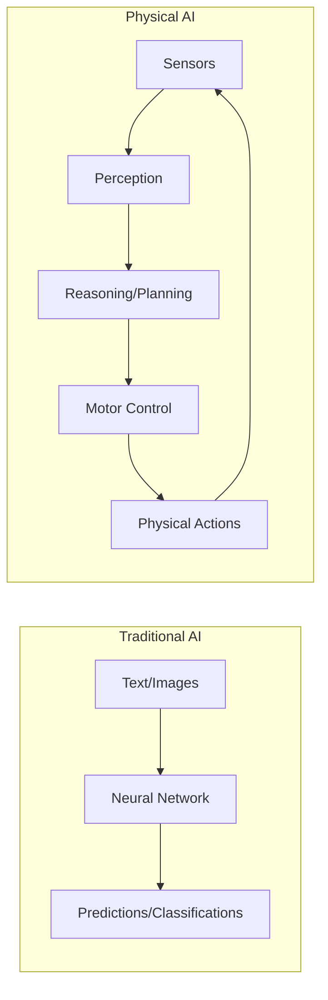
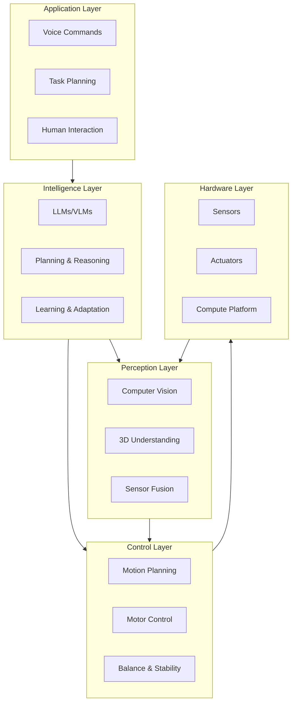

# Foundations of Physical AI

## Learning Objectives

By the end of this chapter, you will be able to:

- Define Physical AI and distinguish it from traditional AI approaches
- Explain why embodiment matters for intelligent systems
- Identify the key components of a Physical AI stack
- Understand the convergence of AI and robotics in 2025

## Prerequisites

Before starting this chapter, ensure you have:

- **Background**: Basic understanding of AI/ML concepts
- **Curiosity**: Interest in robotics and physical systems
- **Mindset**: Readiness to think beyond software-only AI

## What is Physical AI?

**Physical AI** refers to artificial intelligence systems that perceive, reason, and act in the physical world. Unlike traditional AI that operates purely in digital domains (text, images, data), Physical AI must understand and manipulate physical reality.

The key distinction is the **perception-action loop**: Physical AI systems continuously sense their environment, make decisions, and take physical actions that change the world around them.

## Why Embodiment Matters

The concept of **embodied intelligence** suggests that true intelligence cannot be separated from a physical body that interacts with the world. This idea, rooted in cognitive science, has profound implications for AI:

### The Grounding Problem

Traditional AI systems learn from data that has been abstracted from physical reality. A language model learns about "cups" from text descriptions, but never experiences picking up a cup, feeling its weight, or understanding the consequences of dropping it.

:::tip Key Insight
An embodied agent doesn't just know that "cups can break when dropped" - it has learned this through direct physical experience, creating a fundamentally different kind of knowledge.
:::

### Sensorimotor Learning

Physical AI systems learn through **sensorimotor interaction**:

1. **Sensing**: Cameras, LiDAR, force sensors capture environmental state
2. **Acting**: Motors and actuators change the physical world
3. **Feedback**: The consequences of actions provide learning signals

This creates a tight coupling between perception and action that mirrors biological intelligence.

## The Physical AI Stack

Building Physical AI systems requires integrating multiple technology layers:

Each layer presents unique challenges:

| Layer | Key Challenges | Technologies |
|-------|----------------|--------------|
| Application | Natural interaction, task understanding | Speech recognition, NLU |
| Intelligence | Reasoning, planning under uncertainty | LLMs, reinforcement learning |
| Perception | Real-time 3D understanding | CNNs, transformers, SLAM |
| Control | Precision, stability, safety | PID, MPC, neural controllers |
| Hardware | Power, weight, reliability | Sensors, motors, batteries |

## The 2025 Convergence

Several factors have converged to make 2025 a pivotal moment for Physical AI:

### Foundation Models Meet Robotics

Large Language Models (LLMs) and Vision-Language Models (VLMs) have achieved remarkable capabilities in understanding and reasoning. Projects like RT-2, PaLM-E, and others are demonstrating that these capabilities can transfer to robotic control.

### Simulation at Scale

Modern simulation platforms (Isaac Sim, Gazebo, Unity) enable training robots on billions of interactions in virtual environments. This "sim-to-real" approach accelerates development while reducing hardware costs and safety risks.

### Hardware Renaissance

Humanoid robots from companies like Figure, Tesla (Optimus), Agility (Digit), and Unitree have reached new levels of capability. Simultaneously, compute platforms like NVIDIA Jetson enable running sophisticated AI models on mobile robots.

### Open Ecosystems

ROS 2 has matured into a robust, production-ready framework. Open datasets, pretrained models, and shared tools have lowered the barrier to entry for robotics development.

:::info Industry Momentum
Major tech companies and well-funded startups are racing to develop general-purpose humanoid robots, with total investment exceeding $10 billion in 2024 alone.
:::

## Why This Book?

This book provides a practical path through the Physical AI stack:

1. **ROS 2 Fundamentals**: The foundation for all robotics development
2. **Simulation**: Build and test before deploying to real hardware
3. **NVIDIA Isaac**: GPU-accelerated perception and navigation
4. **Vision-Language-Action**: Integrate modern AI with physical control
5. **Capstone**: Build a complete voice-controlled humanoid

By the end, you'll have hands-on experience with each layer of the stack and the skills to build intelligent physical systems.

## Key Takeaways

- **Physical AI** combines perception, reasoning, and physical action in the real world
- **Embodiment** creates fundamentally different learning opportunities than pure software AI
- The **Physical AI stack** spans from hardware through perception, control, intelligence, and application layers
- **2025 represents a convergence** of foundation models, simulation, hardware, and open ecosystems
- This book provides a **practical path** through the complete stack

## What's Next?

In the next chapter, we'll explore the journey from digital AI to physical systems, examining the key challenges and approaches for bridging the sim-to-real gap.

## References

1. Brooks, R. A. (1991). *Intelligence without representation*. Artificial Intelligence, 47(1-3), 139-159.
2. NVIDIA. (2024). *Isaac Sim Documentation*. https://docs.nvidia.com/isaac/
3. Open Robotics. (2024). *ROS 2 Documentation*. https://docs.ros.org/en/humble/
4. Brohan, A., et al. (2023). *RT-2: Vision-Language-Action Models Transfer Web Knowledge to Robotic Control*. arXiv:2307.15818.
