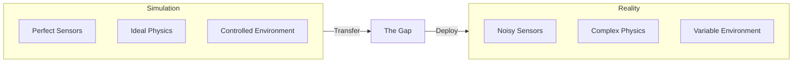
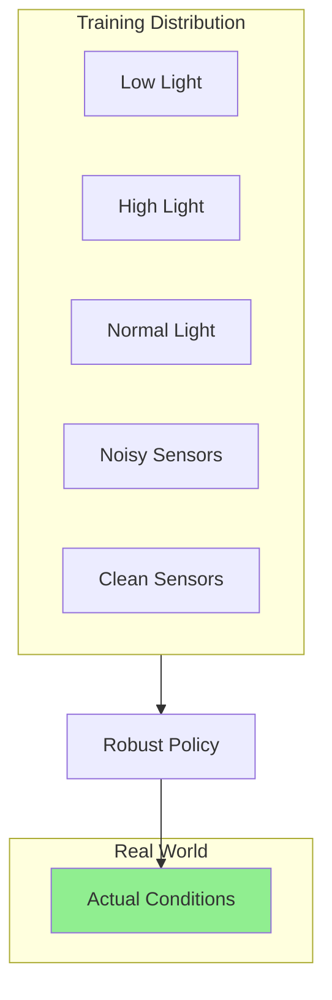
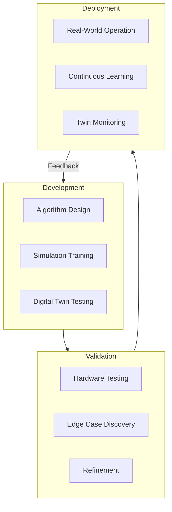

# From Digital to Physical

<div className="learning-objectives">

## Learning Objectives

By the end of this chapter, you will be able to:

- Explain the "sim-to-real gap" and why it exists
- Describe domain randomization and other transfer techniques
- Understand the role of digital twins in robotics development
- Identify when simulation is sufficient vs. when real hardware is needed

</div>

<div className="prerequisites">

## Prerequisites

Before starting this chapter, ensure you have:

- **Chapter**: Completed [Foundations of Physical AI](./01-foundations)
- **Concepts**: Basic understanding of machine learning training
- **Interest**: Curiosity about how virtual robots become real ones

</div>

## The Sim-to-Real Gap

When we train a robot in simulation, it learns to navigate a mathematically perfect world. Real-world deployment introduces:

- **Sensor noise**: Real cameras have blur, lighting variations, and artifacts
- **Motor imperfections**: Actuators have delays, backlash, and wear
- **Environmental variation**: Surfaces, objects, and conditions vary unpredictably
- **Physics mismatches**: Simulated physics never perfectly matches reality



:::warning The Core Challenge
A policy that achieves 99% success in simulation might fail 50% of the time on real hardware due to this gap.
:::

## Domain Randomization

**Domain randomization** deliberately introduces variation during simulation training to make the learned policy robust to real-world conditions.

### Visual Randomization

Vary visual properties during training:

```python title="visual_randomization.py"
import numpy as np

class VisualRandomizer:
    """Randomize visual properties for sim-to-real transfer."""

    def randomize_lighting(self, scene):
        """Vary lighting conditions randomly."""
        scene.light_intensity = np.random.uniform(0.3, 1.5)
        scene.light_color = np.random.uniform(0.8, 1.2, size=3)
        scene.shadow_strength = np.random.uniform(0.0, 0.8)
        return scene

    def randomize_textures(self, objects):
        """Apply random textures to objects."""
        for obj in objects:
            obj.texture = self.sample_random_texture()
            obj.color_variation = np.random.uniform(0.8, 1.2, size=3)
        return objects

    def randomize_camera(self, camera):
        """Add realistic camera imperfections."""
        camera.noise_level = np.random.uniform(0.01, 0.05)
        camera.blur_kernel = np.random.randint(0, 3)
        camera.exposure = np.random.uniform(0.8, 1.2)
        return camera
```

### Dynamics Randomization

Vary physical properties:

| Property | Simulation Default | Randomization Range |
|----------|-------------------|---------------------|
| Mass | 1.0 kg | 0.8 - 1.2 kg |
| Friction | 0.5 | 0.3 - 0.8 |
| Motor delay | 0 ms | 0 - 20 ms |
| Joint damping | 0.1 | 0.05 - 0.2 |

### The Intuition

By training on a wide distribution of conditions, the robot learns features and strategies that are robust across the entire distribution - including real-world conditions it has never explicitly seen.



## Digital Twins

A **digital twin** is a virtual replica of a physical system that stays synchronized with its real-world counterpart.

### Types of Digital Twins

1. **Design Twin**: Used during development to prototype and test
2. **Production Twin**: Mirrors a deployed robot for monitoring
3. **Predictive Twin**: Anticipates future states and failures

### Implementation Pattern

```python title="digital_twin.py"
class DigitalTwin:
    """Synchronized simulation of a physical robot."""

    def __init__(self, robot_id: str, sim_config: dict):
        self.robot_id = robot_id
        self.simulation = self._create_simulation(sim_config)
        self.state_buffer = StateBuffer(max_size=1000)

    def sync_from_robot(self, sensor_data: dict):
        """Update twin state from real robot sensors."""
        self.simulation.set_joint_positions(sensor_data['joints'])
        self.simulation.set_base_pose(sensor_data['pose'])
        self.state_buffer.add(sensor_data)

    def predict_action_outcome(self, action: np.ndarray) -> dict:
        """Simulate an action before executing on real robot."""
        # Save current state
        checkpoint = self.simulation.save_state()

        # Simulate action
        self.simulation.apply_action(action)
        predicted_state = self.simulation.step()

        # Restore state
        self.simulation.load_state(checkpoint)

        return predicted_state

    def detect_anomalies(self, actual_outcome: dict,
                        predicted_outcome: dict) -> list:
        """Compare predicted vs actual to detect problems."""
        anomalies = []
        for key in actual_outcome:
            diff = np.abs(actual_outcome[key] - predicted_outcome[key])
            if np.max(diff) > self.anomaly_thresholds[key]:
                anomalies.append({
                    'type': key,
                    'difference': diff,
                    'timestamp': time.time()
                })
        return anomalies
```

### Benefits of Digital Twins

| Benefit | Description |
|---------|-------------|
| **Safe experimentation** | Test risky maneuvers virtually first |
| **Anomaly detection** | Compare expected vs. actual behavior |
| **Remote monitoring** | Visualize robot state from anywhere |
| **What-if analysis** | Explore alternative strategies |
| **Training data** | Generate realistic synthetic data |

## When Simulation is Enough

Simulation works well for:

- **High-level planning**: Navigation, task sequencing
- **Coarse motor skills**: Walking, reaching, basic manipulation
- **Perception pre-training**: Object detection, segmentation
- **System integration**: Testing component interactions

:::tip Simulation Sweet Spots
If your robot's success depends primarily on correct high-level decisions rather than precise low-level control, simulation-only development can work well.
:::

## When Real Hardware is Essential

Real hardware is needed for:

- **Fine manipulation**: Contact-rich tasks with precise force control
- **Deformable objects**: Cloth, food, cables with complex physics
- **Human interaction**: Safety, comfort, and social acceptability
- **Long-term reliability**: Wear, calibration drift, environmental effects

### The Hybrid Approach

Most successful robotics projects use a hybrid approach:



## Practical Strategies

### 1. Start Simple

Begin with the simplest simulation that captures essential dynamics:

```python title="progressive_fidelity.py"
def training_curriculum():
    """Progressive increase in simulation fidelity."""
    stages = [
        {'physics_dt': 0.01, 'visual_fidelity': 'low', 'epochs': 100},
        {'physics_dt': 0.002, 'visual_fidelity': 'medium', 'epochs': 200},
        {'physics_dt': 0.001, 'visual_fidelity': 'high', 'epochs': 100},
    ]

    for stage in stages:
        train_with_config(stage)
```

### 2. Identify Critical Parameters

Profile which simulation parameters most affect transfer:

1. Run policy on real hardware
2. Identify failure modes
3. Adjust corresponding simulation parameters
4. Retrain and iterate

### 3. Build Calibration Pipelines

Create systematic processes to align simulation with reality:

```python title="calibration.py"
def calibrate_joint_model(robot, joint_name: str) -> dict:
    """Calibrate simulated joint against real hardware."""
    # Command series of positions
    test_positions = np.linspace(-np.pi, np.pi, 20)

    actual_positions = []
    actual_velocities = []

    for target in test_positions:
        robot.command_joint(joint_name, target)
        time.sleep(0.5)  # Allow settling
        actual_positions.append(robot.read_joint_position(joint_name))
        actual_velocities.append(robot.read_joint_velocity(joint_name))

    # Fit model parameters
    return fit_joint_model(
        commanded=test_positions,
        actual_positions=np.array(actual_positions),
        actual_velocities=np.array(actual_velocities)
    )
```

<div className="key-takeaways">

## Key Takeaways

- The **sim-to-real gap** exists because simulations never perfectly match reality
- **Domain randomization** trains robust policies by varying simulation conditions
- **Digital twins** enable safe testing, monitoring, and anomaly detection
- **Simulation excels** at high-level planning and coarse motor skills
- **Real hardware** is essential for fine manipulation and safety validation
- A **hybrid approach** combining simulation and hardware produces the best results

</div>

## What's Next?

In the next chapter, we'll survey the humanoid robotics landscape in 2025, examining the major platforms and their capabilities.

## References

1. Tobin, J., et al. (2017). *Domain Randomization for Transferring Deep Neural Networks from Simulation to the Real World*. IROS 2017.
2. NVIDIA. (2024). *Isaac Sim - Digital Twin*. https://developer.nvidia.com/isaac-sim
3. OpenAI. (2019). *Solving Rubik's Cube with a Robot Hand*. arXiv:1910.07113.
4. Akkaya, I., et al. (2019). *Learning Dexterous In-Hand Manipulation*. arXiv:1808.00177.
