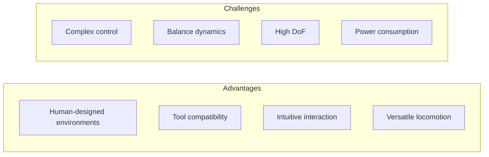
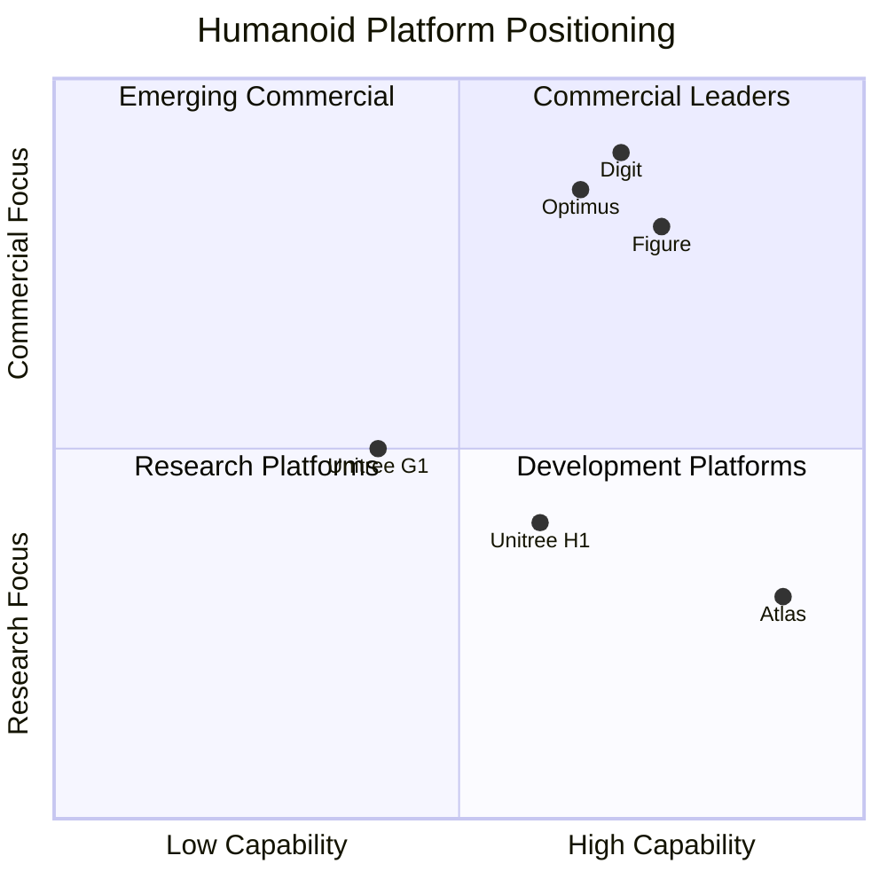
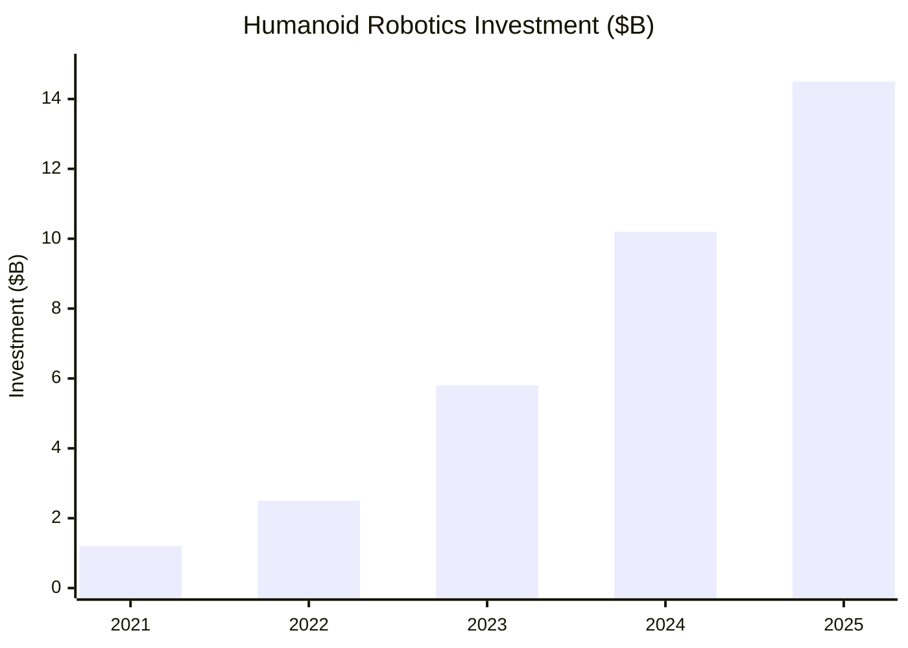

# The Humanoid Robotics Landscape (2025)

## Learning Objectives

By the end of this chapter, you will be able to:

- Identify the major humanoid robotics platforms and their target applications
- Compare capabilities across different humanoid designs
- Understand the business drivers behind humanoid development
- Evaluate which platforms are most suitable for different use cases

## Prerequisites

Before starting this chapter, ensure you have:

- **Chapter**: Completed [From Digital to Physical](./02-digital-to-physical)
- **Context**: General awareness of robotics industry news
- **Perspective**: Interest in commercial robotics applications

## Why Humanoids?

The human form factor offers compelling advantages for general-purpose robotics:

### The Environment Argument

Our world is built for humans:
- **Stairs and doors** sized for human bodies
- **Tools** designed for human hands
- **Workspaces** optimized for human reach and height
- **Interfaces** (buttons, handles, levers) for human operation

:::tip Economic Reality
Adapting every factory, warehouse, and home for robots would cost trillions. A robot that adapts to human spaces is far more practical.
:::

## Major Platforms (2025)

### Figure AI - Figure 01/02

**Focus**: General-purpose humanoid for commercial applications

| Specification | Figure 01 | Figure 02 |
|--------------|-----------|-----------|
| Height | 1.68 m | 1.70 m |
| Weight | 60 kg | 58 kg |
| Payload | 20 kg | 25 kg |
| Battery Life | 5 hours | 8 hours |
| Degrees of Freedom | 41 | 45 |
| Compute | NVIDIA Jetson | Custom SoC |

**Key Capabilities**:
- Full-body motion with 16 DoF arms
- Vision-language model integration
- Natural language task understanding
- Dexterous manipulation with 4-finger hands

**Target Applications**: Manufacturing, logistics, retail assistance

### Tesla - Optimus (Gen 2)

**Focus**: Mass-producible humanoid for Tesla factories and beyond

| Specification | Value |
|--------------|-------|
| Height | 1.72 m |
| Weight | 57 kg |
| Actuators | 28 structural, 11 per hand |
| Walking Speed | 1.3 m/s |
| Lift Capacity | 20 kg |

**Key Capabilities**:
- Actuator design optimized for manufacturing scale
- Tesla FSD-derived perception system
- End-to-end neural network control
- Self-calibrating sensor suite

**Target Applications**: Tesla factories, eventually home assistance

### Agility Robotics - Digit

**Focus**: Warehouse and logistics automation

| Specification | Value |
|--------------|-------|
| Height | 1.75 m |
| Weight | 65 kg |
| Payload | 16 kg |
| Speed | 1.5 m/s |
| Battery | 4+ hours |

**Key Capabilities**:
- Robust bipedal locomotion on varied terrain
- Purpose-built for box handling and transport
- Modular end-effectors for different tasks
- Fleet management software

**Target Applications**: Warehouses, distribution centers, manufacturing

### Unitree - H1/G1

**Focus**: Affordable research and development platform

| Specification | H1 | G1 |
|--------------|-----|-----|
| Height | 1.80 m | 1.27 m |
| Weight | 47 kg | 35 kg |
| Max Speed | 3.3 m/s | 2.0 m/s |
| Degrees of Freedom | 19 | 23-43 |
| Price Point | ~$90,000 | ~$16,000 |

**Key Capabilities**:
- Industry-leading locomotion performance
- Open SDK for custom development
- Aggressive pricing for research accessibility
- Rapid iteration on hardware

**Target Applications**: Research, development, education

### Boston Dynamics - Atlas

**Focus**: Research and demonstration of dynamic capabilities

| Specification | Value |
|--------------|-------|
| Height | 1.5 m |
| Weight | 89 kg |
| Degrees of Freedom | 28 |
| Notable | Electric (2024 redesign) |

**Key Capabilities**:
- Unmatched dynamic movement (parkour, backflips)
- Hydraulic → electric transition in 2024
- Advanced whole-body coordination
- Manipulation demonstrations improving

**Target Applications**: Research, potential commercial future

## Capability Comparison

### Locomotion Capabilities

| Platform | Walking | Running | Stairs | Rough Terrain |
|----------|---------|---------|--------|---------------|
| Figure | Good | Basic | Yes | Limited |
| Optimus | Good | No | Yes | Limited |
| Digit | Excellent | Good | Yes | Good |
| H1 | Excellent | Yes | Yes | Good |
| Atlas | Excellent | Excellent | Yes | Excellent |

### Manipulation Capabilities

| Platform | Dexterity | Force Control | Tool Use | Bimanual |
|----------|-----------|---------------|----------|----------|
| Figure | High | Good | Yes | Yes |
| Optimus | High | Good | Yes | Yes |
| Digit | Medium | Good | Limited | Basic |
| H1 | Medium | Basic | Limited | Basic |
| Atlas | High | Excellent | Demos | Yes |

## Industry Trends

### Investment Surge

Humanoid robotics funding has accelerated dramatically:

### Key Drivers

1. **Labor Shortages**: Aging populations, worker preferences shifting away from manual labor
2. **AI Capabilities**: Foundation models enable natural interaction and generalization
3. **Manufacturing Cost Reduction**: Volume production reducing per-unit costs
4. **Proof Points**: Early deployments demonstrating ROI

### Deployment Timeline Expectations

| Capability | 2025 | 2027 | 2030 |
|------------|------|------|------|
| Structured logistics | Pilot | Scale | Widespread |
| Light manufacturing | Demo | Pilot | Scale |
| Home assistance | Research | Demo | Pilot |
| Healthcare | Research | Research | Demo |
| General-purpose | Concept | Research | Demo |

:::info Reality Check
Despite rapid progress, general-purpose household robots remain 5-10+ years away. Near-term success focuses on structured industrial environments.
:::

## Choosing a Platform

### For Research & Education

**Recommended**: Unitree G1 or H1
- Affordable entry point
- Open development environment
- Strong locomotion capabilities
- Active research community

### For Commercial Pilots

**Recommended**: Digit or Figure
- Production-ready platforms
- Commercial support and partnerships
- Fleet management capabilities
- Safety certifications

### For Cutting-Edge Development

**Recommended**: Custom or Atlas (if accessible)
- Maximum flexibility
- Latest capabilities
- Higher cost and complexity

## What This Means for Developers

The humanoid landscape creates opportunities across the stack:

1. **Control Engineers**: Developing robust locomotion and manipulation
2. **Perception Engineers**: Building real-time 3D understanding
3. **AI/ML Engineers**: Creating task learning and language grounding
4. **Systems Engineers**: Integrating complex hardware/software systems
5. **Application Developers**: Building task-specific capabilities

:::tip Your Path
This book focuses on skills transferable across platforms: ROS 2 provides the standard framework, simulation enables hardware-agnostic development, and AI integration patterns apply regardless of specific robot.
:::

## Key Takeaways

- **Humanoid form** enables operation in human-designed environments
- **Major platforms** include Figure, Tesla Optimus, Digit, Unitree, and Atlas
- **Investment has surged** with $10B+ in 2024 alone
- **Near-term applications** focus on structured industrial environments
- **Developers need skills** across control, perception, AI, and systems integration
- **This book's skills** transfer across platforms via ROS 2 and common AI patterns

## What's Next?

In the next chapter, we'll explore the sensor systems that give humanoids the ability to perceive and understand their environment.

## References

1. Figure AI. (2024). *Figure 01 Technical Specifications*. https://figure.ai/
2. Tesla. (2024). *Optimus Gen 2 Announcement*. https://tesla.com/optimus
3. Agility Robotics. (2024). *Digit Product Information*. https://agilityrobotics.com/digit
4. Unitree Robotics. (2024). *H1 and G1 Specifications*. https://unitree.com/
5. Boston Dynamics. (2024). *Atlas Platform*. https://bostondynamics.com/atlas/
