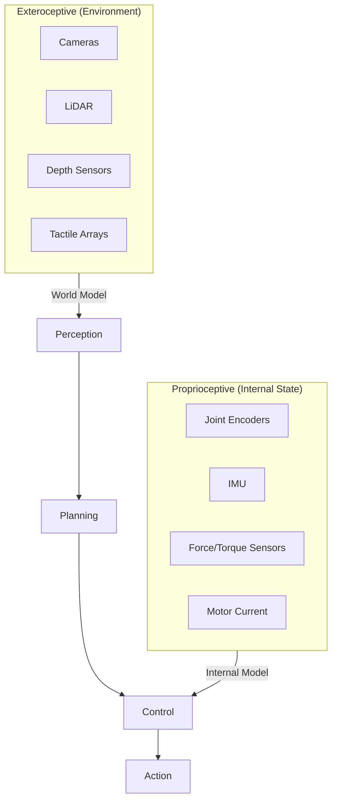
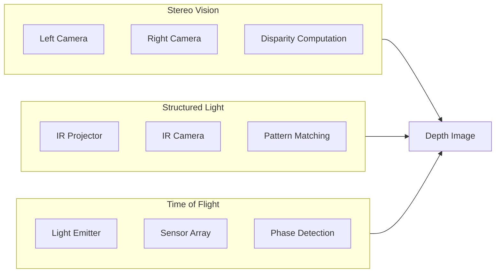
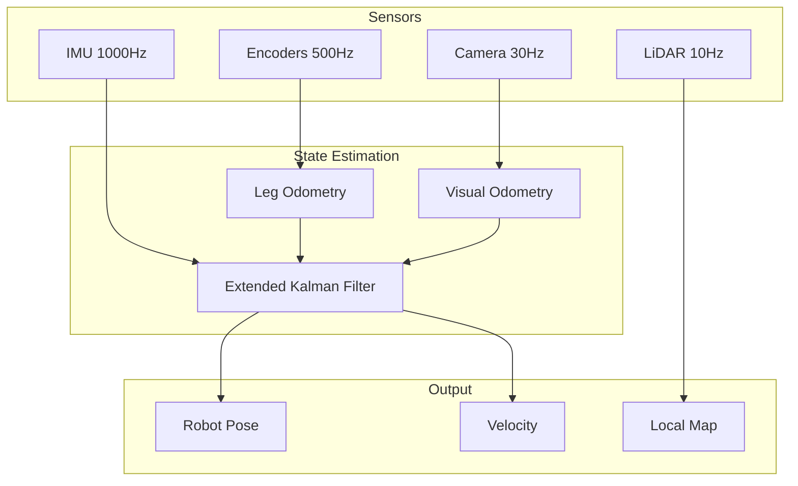

# Sensor Systems for Humanoids

<div className="learning-objectives">

## Learning Objectives

By the end of this chapter, you will be able to:

- Identify the key sensor modalities used in humanoid robots
- Explain the role of proprioceptive vs. exteroceptive sensors
- Understand sensor fusion principles for robust perception
- Select appropriate sensors for different robotic tasks

</div>

<div className="prerequisites">

## Prerequisites

Before starting this chapter, ensure you have:

- **Chapter**: Completed [The Humanoid Robotics Landscape](./03-humanoid-landscape)
- **Physics**: Basic understanding of light, sound, and motion
- **Math**: Familiarity with coordinate systems and transformations

</div>

## Sensor Categories

Humanoid sensors fall into two fundamental categories:



## Proprioceptive Sensors

### Joint Encoders

Joint encoders measure the position and velocity of each joint:

| Encoder Type | Resolution | Cost | Durability |
|--------------|------------|------|------------|
| Incremental | High | Low | Good |
| Absolute | Medium-High | Medium | Excellent |
| Magnetic | Medium | Low | Excellent |
| Optical | Very High | High | Moderate |

```python title="joint_encoder_reading.py"
import numpy as np
from dataclasses import dataclass

@dataclass
class JointState:
    """State from joint encoder."""
    position: float  # radians
    velocity: float  # rad/s
    timestamp: float  # seconds

class JointEncoder:
    """Interface for reading joint encoder data."""

    def __init__(self, joint_name: str, resolution: int = 4096):
        self.joint_name = joint_name
        self.resolution = resolution  # ticks per revolution
        self._last_position = 0.0
        self._last_time = 0.0

    def read(self) -> JointState:
        """Read current joint state."""
        raw_position = self._read_raw_encoder()
        current_time = self._get_timestamp()

        # Convert to radians
        position = (raw_position / self.resolution) * 2 * np.pi

        # Compute velocity
        dt = current_time - self._last_time
        velocity = (position - self._last_position) / dt if dt > 0 else 0.0

        self._last_position = position
        self._last_time = current_time

        return JointState(
            position=position,
            velocity=velocity,
            timestamp=current_time
        )
```

### Inertial Measurement Unit (IMU)

IMUs combine accelerometers and gyroscopes to measure body motion:

**Components**:
- **3-axis accelerometer**: Linear acceleration (including gravity)
- **3-axis gyroscope**: Angular velocity
- **3-axis magnetometer** (optional): Heading reference

```python title="imu_processing.py"
import numpy as np
from scipy.spatial.transform import Rotation

class IMUProcessor:
    """Process IMU data for state estimation."""

    def __init__(self, dt: float = 0.001):
        self.dt = dt
        self.orientation = Rotation.identity()
        self.velocity = np.zeros(3)
        self.position = np.zeros(3)

    def update(self, accel: np.ndarray, gyro: np.ndarray):
        """Update state estimate from IMU readings."""
        # Update orientation from gyroscope
        delta_rotation = Rotation.from_rotvec(gyro * self.dt)
        self.orientation = self.orientation * delta_rotation

        # Remove gravity and integrate acceleration
        gravity = np.array([0, 0, -9.81])
        world_accel = self.orientation.apply(accel) - gravity

        self.velocity += world_accel * self.dt
        self.position += self.velocity * self.dt

        return {
            'orientation': self.orientation.as_quat(),
            'velocity': self.velocity.copy(),
            'position': self.position.copy()
        }
```

:::warning IMU Drift
Pure IMU integration drifts significantly over time. Real systems combine IMU with other sensors (GPS, visual odometry, leg odometry) for accurate state estimation.
:::

### Force/Torque Sensors

Force sensors measure contact forces, essential for:
- **Foot contact detection** for walking
- **Manipulation force control** for grasping
- **Collision detection** for safety

| Location | Measures | Application |
|----------|----------|-------------|
| Feet | Ground reaction force | Balance, gait detection |
| Wrists | End-effector force | Manipulation control |
| Joints | Joint torque | Compliant control |
| Skin | Distributed pressure | Tactile perception |

## Exteroceptive Sensors

### RGB Cameras

Standard cameras provide rich visual information:

**Specifications to Consider**:
- Resolution (1080p, 4K)
- Frame rate (30, 60, 120 fps)
- Field of view (narrow vs. wide-angle)
- Low-light performance
- Rolling vs. global shutter

```python title="camera_config.py"
@dataclass
class CameraConfig:
    """Configuration for RGB camera."""
    resolution: tuple = (1920, 1080)
    fps: int = 30
    fov_horizontal: float = 90.0  # degrees
    fov_vertical: float = 60.0
    distortion_model: str = 'plumb_bob'
    distortion_coeffs: np.ndarray = None

    @property
    def intrinsic_matrix(self) -> np.ndarray:
        """Compute camera intrinsic matrix."""
        fx = self.resolution[0] / (2 * np.tan(np.radians(self.fov_horizontal/2)))
        fy = self.resolution[1] / (2 * np.tan(np.radians(self.fov_vertical/2)))
        cx = self.resolution[0] / 2
        cy = self.resolution[1] / 2

        return np.array([
            [fx, 0, cx],
            [0, fy, cy],
            [0,  0,  1]
        ])
```

### Depth Sensors

Depth sensors provide 3D information about the environment:



**Comparison of Depth Technologies**:

| Technology | Range | Accuracy | Sunlight | Cost |
|------------|-------|----------|----------|------|
| Stereo | 0.5-20m | Medium | Good | Low |
| Structured Light | 0.3-10m | High | Poor | Medium |
| Time of Flight | 0.1-10m | Medium | Moderate | Medium |
| LiDAR | 0.1-100m+ | Very High | Excellent | High |

### LiDAR

Light Detection and Ranging (LiDAR) provides precise 3D point clouds:

**Types**:
- **Mechanical spinning**: 360° coverage, high accuracy
- **Solid-state**: Lower cost, limited FoV
- **Flash LiDAR**: Full scene capture, shorter range

```python title="lidar_processing.py"
import numpy as np

class LiDARProcessor:
    """Process LiDAR point clouds for navigation."""

    def __init__(self, voxel_size: float = 0.05):
        self.voxel_size = voxel_size

    def voxel_downsample(self, points: np.ndarray) -> np.ndarray:
        """Downsample point cloud using voxel grid."""
        # Quantize points to voxel grid
        voxel_indices = np.floor(points / self.voxel_size).astype(int)

        # Find unique voxels and compute centroids
        unique_voxels, inverse = np.unique(
            voxel_indices, axis=0, return_inverse=True
        )

        # Compute centroid for each voxel
        centroids = np.zeros((len(unique_voxels), 3))
        counts = np.zeros(len(unique_voxels))

        for i, point in enumerate(points):
            centroids[inverse[i]] += point
            counts[inverse[i]] += 1

        return centroids / counts[:, np.newaxis]

    def extract_ground_plane(self, points: np.ndarray) -> tuple:
        """Extract ground plane using RANSAC."""
        from sklearn.linear_model import RANSACRegressor

        # Fit plane to points
        X = points[:, :2]  # x, y
        y = points[:, 2]   # z

        ransac = RANSACRegressor(residual_threshold=0.05)
        ransac.fit(X, y)

        inlier_mask = ransac.inlier_mask_
        ground_points = points[inlier_mask]
        obstacle_points = points[~inlier_mask]

        return ground_points, obstacle_points
```

## Sensor Fusion

Real robots combine multiple sensors for robust perception:

### Why Fusion?

| Challenge | Single Sensor | Fused Solution |
|-----------|---------------|----------------|
| Occlusion | Blind spots | Multiple viewpoints |
| Noise | Unreliable | Redundancy |
| Different strengths | Limited capability | Complementary |
| Failure modes | System failure | Graceful degradation |

### Kalman Filter Basics

The Kalman filter is the foundational algorithm for sensor fusion:

```python title="kalman_filter.py"
import numpy as np

class KalmanFilter:
    """Simple Kalman filter for sensor fusion."""

    def __init__(self, state_dim: int, meas_dim: int):
        self.state = np.zeros(state_dim)
        self.covariance = np.eye(state_dim)

        # Model matrices (to be configured)
        self.F = np.eye(state_dim)  # State transition
        self.H = np.zeros((meas_dim, state_dim))  # Measurement
        self.Q = np.eye(state_dim) * 0.01  # Process noise
        self.R = np.eye(meas_dim) * 0.1  # Measurement noise

    def predict(self, dt: float):
        """Predict step: propagate state forward."""
        self.state = self.F @ self.state
        self.covariance = self.F @ self.covariance @ self.F.T + self.Q

    def update(self, measurement: np.ndarray):
        """Update step: incorporate measurement."""
        # Innovation
        y = measurement - self.H @ self.state
        S = self.H @ self.covariance @ self.H.T + self.R

        # Kalman gain
        K = self.covariance @ self.H.T @ np.linalg.inv(S)

        # Update state and covariance
        self.state = self.state + K @ y
        self.covariance = (np.eye(len(self.state)) - K @ self.H) @ self.covariance

        return self.state.copy()
```

### Practical Fusion Architecture



<div className="key-takeaways">

## Key Takeaways

- **Proprioceptive sensors** (encoders, IMU, force sensors) measure internal robot state
- **Exteroceptive sensors** (cameras, LiDAR, depth) measure the environment
- **IMU provides high-rate** motion data but drifts without correction
- **Depth sensors** vary in technology with different tradeoffs for range, accuracy, and cost
- **Sensor fusion** combines multiple sensors for robust, accurate perception
- **Kalman filters** are the foundation for multi-sensor state estimation

</div>

## What's Next?

With the foundational concepts covered, you're ready to dive into Module 1: ROS 2 Fundamentals, where you'll learn the software framework for building robot systems.

## References

1. Thrun, S., Burgard, W., & Fox, D. (2005). *Probabilistic Robotics*. MIT Press.
2. Intel RealSense. (2024). *Depth Camera Comparison*. https://www.intelrealsense.com/
3. Velodyne. (2024). *LiDAR Products*. https://velodynelidar.com/
4. Kalman, R. E. (1960). *A New Approach to Linear Filtering and Prediction Problems*. ASME Journal of Basic Engineering.
