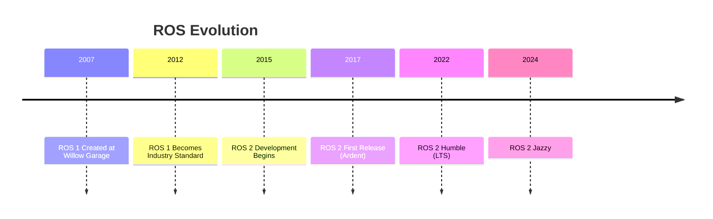
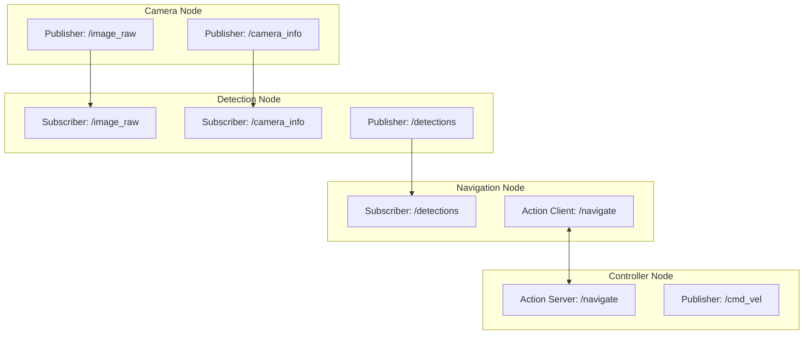
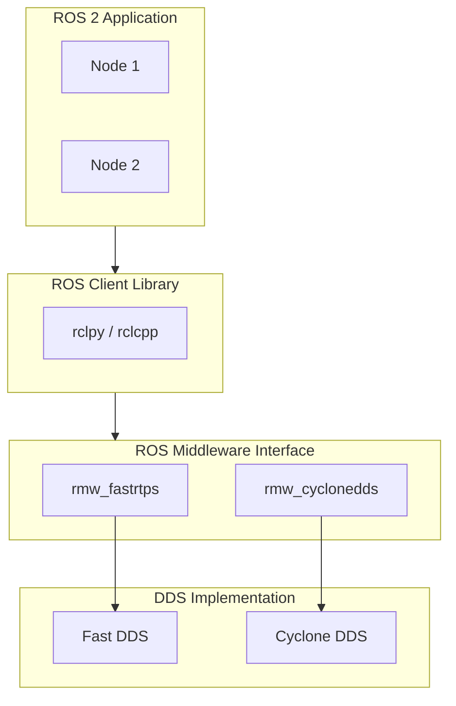
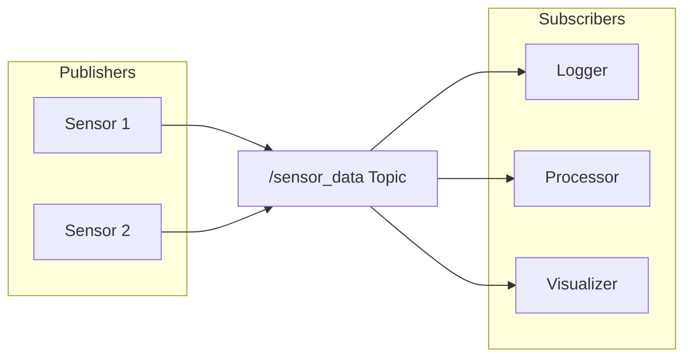
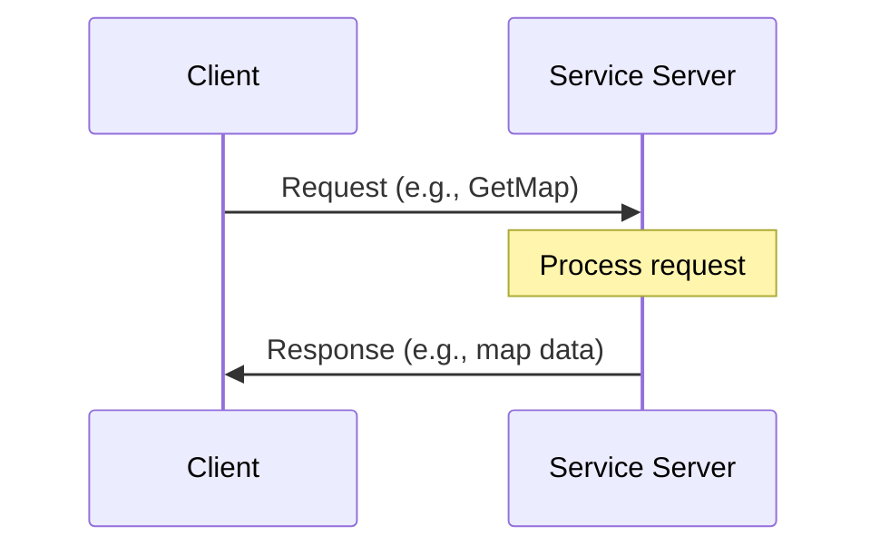
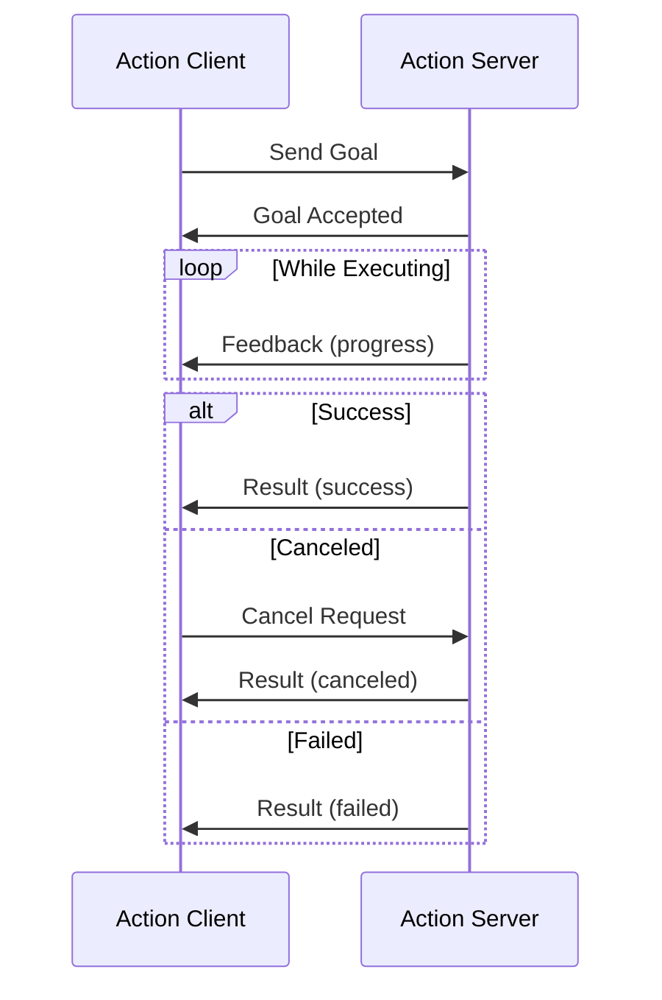
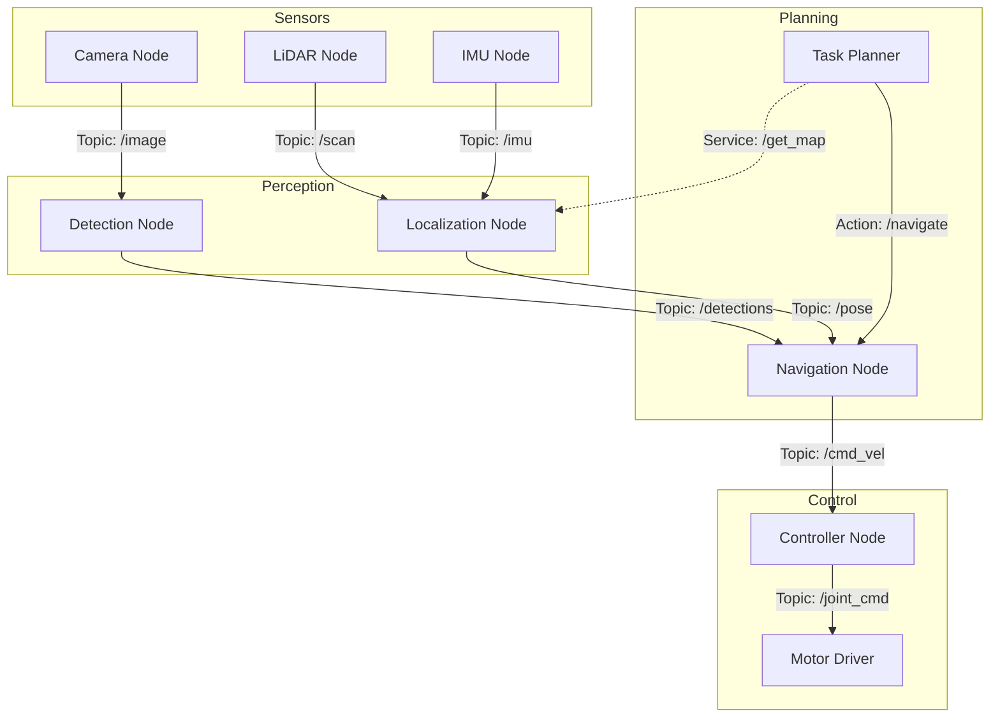

# ROS 2 Architecture

<div className="learning-objectives">

## Learning Objectives

By the end of this chapter, you will be able to:

- Explain the key differences between ROS 1 and ROS 2
- Describe the DDS middleware and its role in ROS 2
- Identify the core communication patterns: topics, services, and actions
- Understand the ROS 2 computational graph

</div>

<div className="prerequisites">

## Prerequisites

Before starting this chapter, ensure you have:

- **Software**: Ubuntu 22.04 with ROS 2 Humble installed
- **Knowledge**: Basic Linux command line experience
- **Background**: Familiarity with publish-subscribe patterns (helpful)

</div>

## Why ROS 2?

ROS 2 is a complete redesign of the Robot Operating System, addressing limitations that emerged as ROS 1 matured:

| Aspect | ROS 1 | ROS 2 |
|--------|-------|-------|
| Real-time | Limited | Supported |
| Security | None | DDS Security |
| Multi-robot | Workarounds | Native |
| Embedded | Difficult | Micro-ROS |
| Middleware | Custom | DDS Standard |
| Lifecycle | Ad-hoc | Managed Nodes |



## The ROS 2 Computational Graph

The **computational graph** is the network of ROS 2 processes that communicate at runtime:



### Core Concepts

| Concept | Description | Use Case |
|---------|-------------|----------|
| **Node** | A single-purpose process | Camera driver, motion planner |
| **Topic** | Named bus for streaming data | Sensor data, commands |
| **Service** | Synchronous request-response | Configuration, queries |
| **Action** | Async long-running task with feedback | Navigation, manipulation |
| **Parameter** | Runtime configuration values | Thresholds, rates |

## DDS: The Middleware Foundation

ROS 2 uses the **Data Distribution Service (DDS)** standard for communication:



### Why DDS?

1. **Industry Standard**: OMG specification used in aerospace, defense, finance
2. **Quality of Service (QoS)**: Fine-grained control over reliability, latency
3. **Discovery**: Automatic peer discovery without central broker
4. **Security**: Built-in authentication, encryption, access control

### QoS Profiles

QoS settings control communication behavior:

```python title="qos_example.py"
from rclpy.qos import QoSProfile, ReliabilityPolicy, HistoryPolicy, DurabilityPolicy

# For sensor data: best-effort, latest only
sensor_qos = QoSProfile(
    reliability=ReliabilityPolicy.BEST_EFFORT,
    history=HistoryPolicy.KEEP_LAST,
    depth=1
)

# For commands: reliable delivery
command_qos = QoSProfile(
    reliability=ReliabilityPolicy.RELIABLE,
    history=HistoryPolicy.KEEP_LAST,
    depth=10
)

# For configuration: reliable + transient local
config_qos = QoSProfile(
    reliability=ReliabilityPolicy.RELIABLE,
    durability=DurabilityPolicy.TRANSIENT_LOCAL,
    history=HistoryPolicy.KEEP_LAST,
    depth=1
)
```

| QoS Policy | Options | Trade-off |
|------------|---------|-----------|
| Reliability | BEST_EFFORT / RELIABLE | Latency vs. Delivery |
| History | KEEP_LAST / KEEP_ALL | Memory vs. Completeness |
| Durability | VOLATILE / TRANSIENT_LOCAL | Memory vs. Late Joiners |
| Deadline | Duration | Timeliness Guarantee |
| Lifespan | Duration | Data Freshness |

## Topics: Streaming Data

Topics provide asynchronous, one-to-many data streaming:



### When to Use Topics

- Continuous sensor streams (images, LiDAR, IMU)
- Control commands (velocity, joint positions)
- State updates (robot pose, battery level)
- Any data that flows continuously

:::tip Topic Naming
Use descriptive, namespaced names: `/robot/sensors/camera/image_raw` rather than `/img`. This enables remapping and multi-robot scenarios.
:::

## Services: Request-Response

Services provide synchronous, one-to-one communication:



### When to Use Services

- Configuration changes (set parameters)
- One-time queries (get current state)
- Discrete actions that complete quickly
- Operations that need confirmation

```python title="service_example.py"
from example_interfaces.srv import AddTwoInts
import rclpy

def add_callback(request, response):
    """Service callback for adding two integers."""
    response.sum = request.a + request.b
    return response

# Create service
node.create_service(AddTwoInts, 'add_two_ints', add_callback)
```

:::warning Service Blocking
Service calls block the client until response. Don't use services for:
- Long-running operations (use actions)
- High-frequency communication (use topics)
:::

## Actions: Long-Running Tasks

Actions handle asynchronous, preemptable, long-running tasks with feedback:



### When to Use Actions

- Navigation to a pose
- Manipulation sequences
- Any task that takes significant time
- Operations that might need cancellation

```python title="action_client_example.py"
from nav2_msgs.action import NavigateToPose
from rclpy.action import ActionClient

class Navigator:
    def __init__(self, node):
        self._action_client = ActionClient(
            node, NavigateToPose, 'navigate_to_pose'
        )

    def go_to_pose(self, pose):
        """Navigate to a target pose."""
        goal_msg = NavigateToPose.Goal()
        goal_msg.pose = pose

        self._action_client.wait_for_server()
        self._send_goal_future = self._action_client.send_goal_async(
            goal_msg,
            feedback_callback=self.feedback_callback
        )

    def feedback_callback(self, feedback_msg):
        """Handle navigation progress updates."""
        feedback = feedback_msg.feedback
        print(f"Distance remaining: {feedback.distance_remaining:.2f}m")
```

## Putting It Together

A typical robot system uses all communication patterns:



<div className="key-takeaways">

## Key Takeaways

- **ROS 2** is a complete redesign with real-time support, security, and multi-robot capabilities
- **DDS middleware** provides automatic discovery, QoS control, and security
- **Topics** are for continuous streaming data (sensors, commands)
- **Services** are for quick request-response interactions
- **Actions** handle long-running tasks with feedback and cancellation
- **QoS profiles** let you tune reliability vs. latency trade-offs

</div>

## What's Next?

In the next chapter, we'll dive into writing your first ROS 2 nodes and working with topics in Python.

## References

1. Open Robotics. (2024). *ROS 2 Documentation*. https://docs.ros.org/en/humble/
2. OMG. (2015). *Data Distribution Service Specification*. https://www.omg.org/spec/DDS/
3. Maruyama, Y., et al. (2016). *Exploring the performance of ROS2*. EMSOFT 2016.
