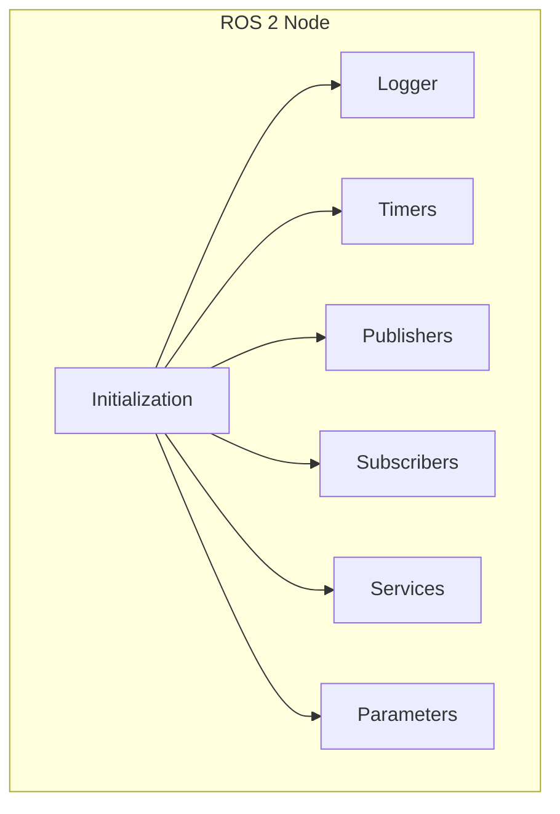

# Nodes and Topics

<div className="learning-objectives">

## Learning Objectives

By the end of this chapter, you will be able to:

- Create ROS 2 nodes using rclpy (Python)
- Publish messages to topics
- Subscribe to topics and process incoming data
- Use common message types for robotics
- Debug communication with ROS 2 CLI tools

</div>

<div className="prerequisites">

## Prerequisites

Before starting this chapter, ensure you have:

- **Software**: ROS 2 Humble installed and sourced
- **Chapter**: Completed [ROS 2 Architecture](./01-architecture)
- **Python**: Basic Python 3 programming experience

</div>

## Your First Node

A **node** is a single-purpose process that participates in the ROS 2 graph. Let's create one:

```python title="simple_node.py"
#!/usr/bin/env python3
"""A minimal ROS 2 node."""

import rclpy
from rclpy.node import Node


class SimpleNode(Node):
    """A simple ROS 2 node that logs a message."""

    def __init__(self):
        super().__init__('simple_node')
        self.get_logger().info('Simple node has started!')


def main(args=None):
    rclpy.init(args=args)
    node = SimpleNode()

    try:
        rclpy.spin(node)
    except KeyboardInterrupt:
        pass
    finally:
        node.destroy_node()
        rclpy.shutdown()


if __name__ == '__main__':
    main()
```

### Running the Node

```bash
# Terminal 1: Run the node
python3 simple_node.py

# Terminal 2: See active nodes
ros2 node list
# Output: /simple_node

# Get node info
ros2 node info /simple_node
```

### Node Anatomy



## Publishing Messages

Publishers send messages to topics. Let's create a node that publishes robot velocity commands:

```python title="velocity_publisher.py"
#!/usr/bin/env python3
"""Publish velocity commands to a robot."""

import rclpy
from rclpy.node import Node
from geometry_msgs.msg import Twist


class VelocityPublisher(Node):
    """Publishes velocity commands at a fixed rate."""

    def __init__(self):
        super().__init__('velocity_publisher')

        # Create publisher
        self.publisher = self.create_publisher(
            Twist,           # Message type
            'cmd_vel',       # Topic name
            10               # Queue size
        )

        # Create timer for periodic publishing
        timer_period = 0.1  # 10 Hz
        self.timer = self.create_timer(timer_period, self.timer_callback)

        self.get_logger().info('Velocity publisher started')

    def timer_callback(self):
        """Called every timer period to publish a message."""
        msg = Twist()
        msg.linear.x = 0.5   # Forward velocity (m/s)
        msg.angular.z = 0.1  # Rotation velocity (rad/s)

        self.publisher.publish(msg)
        self.get_logger().debug(
            f'Publishing: linear={msg.linear.x:.2f}, angular={msg.angular.z:.2f}'
        )


def main(args=None):
    rclpy.init(args=args)
    node = VelocityPublisher()

    try:
        rclpy.spin(node)
    except KeyboardInterrupt:
        pass
    finally:
        node.destroy_node()
        rclpy.shutdown()


if __name__ == '__main__':
    main()
```

### Viewing Published Messages

```bash
# List all topics
ros2 topic list
# Output: /cmd_vel

# See topic info
ros2 topic info /cmd_vel
# Output: Type: geometry_msgs/msg/Twist
#         Publisher count: 1
#         Subscription count: 0

# Echo messages
ros2 topic echo /cmd_vel
# Output: linear:
#           x: 0.5
#           y: 0.0
#           z: 0.0
#         angular:
#           x: 0.0
#           y: 0.0
#           z: 0.1

# Check publishing rate
ros2 topic hz /cmd_vel
# Output: average rate: 10.0 Hz
```

## Subscribing to Messages

Subscribers receive and process messages from topics:

```python title="velocity_subscriber.py"
#!/usr/bin/env python3
"""Subscribe to velocity commands and log them."""

import rclpy
from rclpy.node import Node
from geometry_msgs.msg import Twist


class VelocitySubscriber(Node):
    """Subscribes to velocity commands."""

    def __init__(self):
        super().__init__('velocity_subscriber')

        # Create subscription
        self.subscription = self.create_subscription(
            Twist,                    # Message type
            'cmd_vel',                # Topic name
            self.velocity_callback,   # Callback function
            10                        # Queue size
        )

        self.get_logger().info('Velocity subscriber started')

    def velocity_callback(self, msg: Twist):
        """Process received velocity command."""
        linear = msg.linear.x
        angular = msg.angular.z

        self.get_logger().info(
            f'Received: linear={linear:.2f} m/s, angular={angular:.2f} rad/s'
        )

        # Compute wheel speeds for differential drive
        wheel_base = 0.5  # meters
        left_speed = linear - (angular * wheel_base / 2)
        right_speed = linear + (angular * wheel_base / 2)

        self.get_logger().debug(
            f'Wheel speeds: L={left_speed:.2f}, R={right_speed:.2f}'
        )


def main(args=None):
    rclpy.init(args=args)
    node = VelocitySubscriber()

    try:
        rclpy.spin(node)
    except KeyboardInterrupt:
        pass
    finally:
        node.destroy_node()
        rclpy.shutdown()


if __name__ == '__main__':
    main()
```

## Common Message Types

ROS 2 provides standard message types for common robotics data:

### geometry_msgs

```python
from geometry_msgs.msg import (
    Point,          # x, y, z coordinates
    Quaternion,     # Orientation as quaternion
    Pose,           # Position + Orientation
    PoseStamped,    # Pose with header (timestamp, frame)
    Twist,          # Linear + Angular velocity
    TwistStamped,   # Twist with header
    Wrench,         # Force + Torque
    Transform,      # Translation + Rotation
)
```

### sensor_msgs

```python
from sensor_msgs.msg import (
    Image,              # Camera image
    CompressedImage,    # Compressed image (JPEG, PNG)
    CameraInfo,         # Camera intrinsics
    Imu,                # IMU data (accel, gyro, orientation)
    LaserScan,          # 2D LiDAR scan
    PointCloud2,        # 3D point cloud
    JointState,         # Joint positions, velocities, efforts
    BatteryState,       # Battery status
)
```

### nav_msgs

```python
from nav_msgs.msg import (
    Odometry,       # Robot pose and velocity estimate
    Path,           # Sequence of poses
    OccupancyGrid,  # 2D map as grid
    MapMetaData,    # Map metadata
)
```

### Example: Processing Sensor Data

```python title="imu_processor.py"
#!/usr/bin/env python3
"""Process IMU data and detect falls."""

import rclpy
from rclpy.node import Node
from sensor_msgs.msg import Imu
import numpy as np


class IMUProcessor(Node):
    """Monitors IMU for fall detection."""

    def __init__(self):
        super().__init__('imu_processor')

        self.subscription = self.create_subscription(
            Imu,
            'imu/data',
            self.imu_callback,
            10
        )

        self.fall_threshold = 15.0  # m/s^2 (beyond gravity)
        self.get_logger().info('IMU processor started')

    def imu_callback(self, msg: Imu):
        """Check for unusual accelerations."""
        # Extract acceleration vector
        accel = np.array([
            msg.linear_acceleration.x,
            msg.linear_acceleration.y,
            msg.linear_acceleration.z
        ])

        # Compute magnitude
        magnitude = np.linalg.norm(accel)

        # Check for fall (sudden large acceleration or near-zero)
        if magnitude > self.fall_threshold:
            self.get_logger().warn(
                f'High acceleration detected: {magnitude:.2f} m/s^2'
            )
        elif magnitude < 5.0:  # Much less than gravity
            self.get_logger().warn(
                f'Free fall detected: {magnitude:.2f} m/s^2'
            )


def main(args=None):
    rclpy.init(args=args)
    node = IMUProcessor()
    rclpy.spin(node)
    node.destroy_node()
    rclpy.shutdown()


if __name__ == '__main__':
    main()
```

## Message Filters and Synchronization

When processing data from multiple topics, you often need to synchronize messages:

```python title="synchronized_subscriber.py"
#!/usr/bin/env python3
"""Synchronize camera image with depth data."""

import rclpy
from rclpy.node import Node
from sensor_msgs.msg import Image
from message_filters import Subscriber, ApproximateTimeSynchronizer


class SynchronizedProcessor(Node):
    """Process synchronized RGB and depth images."""

    def __init__(self):
        super().__init__('synchronized_processor')

        # Create message filter subscribers
        self.rgb_sub = Subscriber(self, Image, 'camera/rgb/image_raw')
        self.depth_sub = Subscriber(self, Image, 'camera/depth/image_raw')

        # Synchronize with 0.1 second tolerance
        self.sync = ApproximateTimeSynchronizer(
            [self.rgb_sub, self.depth_sub],
            queue_size=10,
            slop=0.1
        )
        self.sync.registerCallback(self.synced_callback)

        self.get_logger().info('Synchronized processor started')

    def synced_callback(self, rgb_msg: Image, depth_msg: Image):
        """Process synchronized RGB and depth images."""
        time_diff = abs(
            rgb_msg.header.stamp.sec + rgb_msg.header.stamp.nanosec * 1e-9 -
            depth_msg.header.stamp.sec - depth_msg.header.stamp.nanosec * 1e-9
        )

        self.get_logger().info(
            f'Received synced images, time diff: {time_diff*1000:.1f} ms'
        )
        # Process the synchronized images here
```

## Debugging with CLI Tools

ROS 2 provides powerful command-line tools:

```bash
# List all topics
ros2 topic list

# Get topic details
ros2 topic info /cmd_vel

# Echo messages (with message type discovery)
ros2 topic echo /cmd_vel

# Check publishing rate
ros2 topic hz /cmd_vel

# Check bandwidth
ros2 topic bw /camera/image_raw

# Publish a single message
ros2 topic pub /cmd_vel geometry_msgs/msg/Twist \
  "{linear: {x: 0.5, y: 0.0, z: 0.0}, angular: {x: 0.0, y: 0.0, z: 0.1}}"

# Publish at a rate
ros2 topic pub --rate 10 /cmd_vel geometry_msgs/msg/Twist \
  "{linear: {x: 0.5}, angular: {z: 0.1}}"

# Record topics to a bag file
ros2 bag record /cmd_vel /odom -o my_recording

# Play back a recording
ros2 bag play my_recording
```

## Best Practices

### 1. Use Descriptive Topic Names

```python
# Good: Clear, namespaced
self.create_publisher(Twist, 'robot/base/cmd_vel', 10)
self.create_subscription(Image, 'robot/sensors/camera/front/image_raw', ...)

# Bad: Ambiguous, too short
self.create_publisher(Twist, 'vel', 10)
self.create_subscription(Image, 'img', ...)
```

### 2. Handle Missing Data Gracefully

```python
def callback(self, msg):
    if not self._is_ready:
        self.get_logger().warn('System not ready, ignoring message')
        return
    # Process message
```

### 3. Use Appropriate Queue Sizes

```python
# High-frequency sensor data: small queue, drop old
self.create_subscription(Image, 'camera/image_raw', callback, 1)

# Important commands: larger queue
self.create_subscription(Twist, 'cmd_vel', callback, 10)
```

<div className="key-takeaways">

## Key Takeaways

- **Nodes** are single-purpose processes created by subclassing `rclpy.node.Node`
- **Publishers** send messages using `create_publisher()` and `publish()`
- **Subscribers** receive messages using `create_subscription()` with a callback
- **Standard message types** exist for common robotics data (geometry, sensors, nav)
- **Message filters** synchronize data from multiple topics
- **CLI tools** (`ros2 topic`) are invaluable for debugging

</div>

## What's Next?

In the next chapter, we'll learn how to organize code into proper ROS 2 Python packages with correct project structure.

## References

1. Open Robotics. (2024). *Writing a Simple Publisher and Subscriber (Python)*. https://docs.ros.org/en/humble/Tutorials/Beginner-Client-Libraries/Writing-A-Simple-Py-Publisher-And-Subscriber.html
2. Open Robotics. (2024). *ROS 2 Common Interfaces*. https://github.com/ros2/common_interfaces
