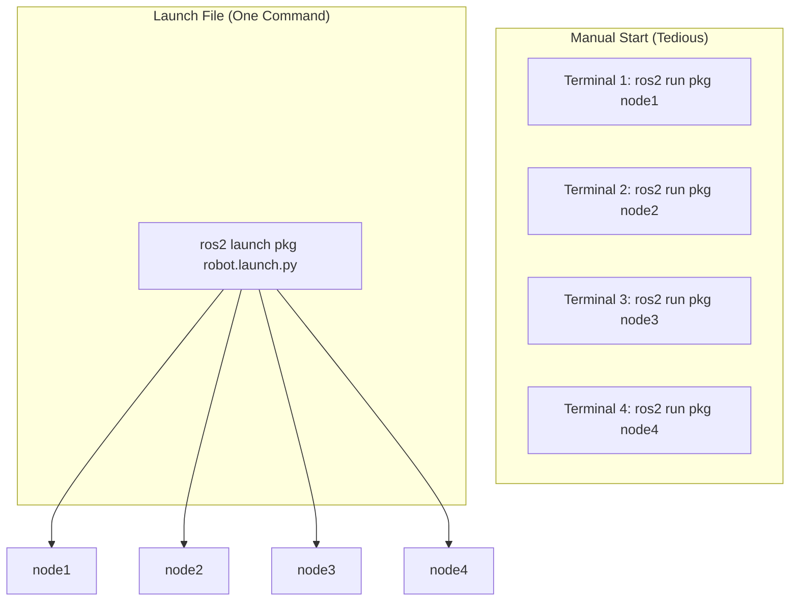

# Launch Files

<div className="learning-objectives">

## Learning Objectives

By the end of this chapter, you will be able to:

- Create Python launch files for ROS 2
- Pass parameters and arguments to nodes
- Remap topics and node names
- Include other launch files
- Use launch arguments for configurability

</div>

<div className="prerequisites">

## Prerequisites

Before starting this chapter, ensure you have:

- **Software**: ROS 2 Humble installed
- **Chapter**: Completed [Python Packages](./03-python-packages)
- **Knowledge**: Basic ROS 2 node creation

</div>

## Why Launch Files?

Real robot systems have many nodes that need to start together with correct configuration:



## Basic Launch File

```python title="launch/basic_robot.launch.py"
from launch import LaunchDescription
from launch_ros.actions import Node


def generate_launch_description():
    """Generate launch description for basic robot."""
    return LaunchDescription([
        # Camera node
        Node(
            package='camera_driver',
            executable='camera_node',
            name='front_camera',
            output='screen'
        ),

        # Controller node
        Node(
            package='my_robot_pkg',
            executable='robot_controller',
            name='controller',
            output='screen'
        ),

        # Sensor processor
        Node(
            package='my_robot_pkg',
            executable='sensor_processor',
            name='sensor_proc',
            output='screen'
        ),
    ])
```

### Running Launch Files

```bash
# Run from package
ros2 launch my_robot_pkg basic_robot.launch.py

# Run from file path
ros2 launch ./launch/basic_robot.launch.py
```

## Parameters

Pass configuration values to nodes:

```python title="launch/robot_with_params.launch.py"
from launch import LaunchDescription
from launch_ros.actions import Node


def generate_launch_description():
    return LaunchDescription([
        Node(
            package='my_robot_pkg',
            executable='robot_controller',
            name='controller',
            parameters=[
                {'wheel_base': 0.5},
                {'wheel_radius': 0.1},
                {'max_wheel_speed': 2.0},
                {'control_frequency': 100.0},
            ]
        ),
    ])
```

### Using YAML Parameter Files

```yaml title="config/robot_params.yaml"
controller:
  ros__parameters:
    wheel_base: 0.5
    wheel_radius: 0.1
    max_wheel_speed: 2.0
    control_frequency: 100.0
    pid:
      kp: 1.0
      ki: 0.1
      kd: 0.05

sensor_processor:
  ros__parameters:
    filter_size: 5
    outlier_threshold: 3.0
```

```python title="launch/robot_with_yaml.launch.py"
import os
from ament_index_python.packages import get_package_share_directory
from launch import LaunchDescription
from launch_ros.actions import Node


def generate_launch_description():
    # Get path to config file
    config_file = os.path.join(
        get_package_share_directory('my_robot_pkg'),
        'config',
        'robot_params.yaml'
    )

    return LaunchDescription([
        Node(
            package='my_robot_pkg',
            executable='robot_controller',
            name='controller',
            parameters=[config_file]
        ),
        Node(
            package='my_robot_pkg',
            executable='sensor_processor',
            name='sensor_processor',
            parameters=[config_file]
        ),
    ])
```

## Remapping

Rename topics and services:

```python title="launch/robot_with_remapping.launch.py"
from launch import LaunchDescription
from launch_ros.actions import Node


def generate_launch_description():
    return LaunchDescription([
        # Remap the camera output topic
        Node(
            package='camera_driver',
            executable='camera_node',
            name='front_camera',
            remappings=[
                ('image_raw', 'front_camera/image'),
                ('camera_info', 'front_camera/info'),
            ]
        ),

        # Remap controller inputs
        Node(
            package='my_robot_pkg',
            executable='robot_controller',
            remappings=[
                ('cmd_vel', 'robot/cmd_vel'),
                ('wheel_velocities', 'robot/wheels/cmd'),
            ]
        ),
    ])
```

## Launch Arguments

Make launch files configurable:

```python title="launch/configurable_robot.launch.py"
from launch import LaunchDescription
from launch.actions import DeclareLaunchArgument
from launch.substitutions import LaunchConfiguration
from launch_ros.actions import Node


def generate_launch_description():
    # Declare arguments
    robot_name_arg = DeclareLaunchArgument(
        'robot_name',
        default_value='robot1',
        description='Name of the robot'
    )

    use_sim_arg = DeclareLaunchArgument(
        'use_sim',
        default_value='false',
        description='Use simulation time'
    )

    config_file_arg = DeclareLaunchArgument(
        'config_file',
        default_value='default_params.yaml',
        description='Configuration file name'
    )

    # Get argument values
    robot_name = LaunchConfiguration('robot_name')
    use_sim = LaunchConfiguration('use_sim')

    return LaunchDescription([
        robot_name_arg,
        use_sim_arg,
        config_file_arg,

        Node(
            package='my_robot_pkg',
            executable='robot_controller',
            name=['controller_', robot_name],
            namespace=robot_name,
            parameters=[{'use_sim_time': use_sim}],
            output='screen'
        ),
    ])
```

### Passing Arguments

```bash
# With arguments
ros2 launch my_robot_pkg configurable_robot.launch.py \
    robot_name:=huey \
    use_sim:=true

# List available arguments
ros2 launch my_robot_pkg configurable_robot.launch.py --show-args
```

## Including Other Launch Files

Compose complex launches from simpler ones:

```python title="launch/full_system.launch.py"
import os
from ament_index_python.packages import get_package_share_directory
from launch import LaunchDescription
from launch.actions import IncludeLaunchDescription
from launch.launch_description_sources import PythonLaunchDescriptionSource
from launch_ros.actions import Node


def generate_launch_description():
    # Include sensor launch
    sensors_launch = IncludeLaunchDescription(
        PythonLaunchDescriptionSource([
            get_package_share_directory('sensor_pkg'),
            '/launch/sensors.launch.py'
        ]),
        launch_arguments={'rate': '30'}.items()
    )

    # Include navigation launch
    nav_launch = IncludeLaunchDescription(
        PythonLaunchDescriptionSource([
            get_package_share_directory('navigation_pkg'),
            '/launch/navigation.launch.py'
        ])
    )

    return LaunchDescription([
        sensors_launch,
        nav_launch,

        # Add additional nodes
        Node(
            package='my_robot_pkg',
            executable='mission_controller',
            name='mission',
            output='screen'
        ),
    ])
```

## Conditional Logic

Use conditions to control what launches:

```python title="launch/conditional_robot.launch.py"
from launch import LaunchDescription
from launch.actions import DeclareLaunchArgument
from launch.conditions import IfCondition, UnlessCondition
from launch.substitutions import LaunchConfiguration, PythonExpression
from launch_ros.actions import Node


def generate_launch_description():
    use_rviz_arg = DeclareLaunchArgument(
        'use_rviz',
        default_value='true'
    )

    debug_arg = DeclareLaunchArgument(
        'debug',
        default_value='false'
    )

    use_rviz = LaunchConfiguration('use_rviz')
    debug = LaunchConfiguration('debug')

    return LaunchDescription([
        use_rviz_arg,
        debug_arg,

        # Always launch controller
        Node(
            package='my_robot_pkg',
            executable='robot_controller',
            name='controller'
        ),

        # Conditionally launch RViz
        Node(
            package='rviz2',
            executable='rviz2',
            name='rviz',
            condition=IfCondition(use_rviz)
        ),

        # Launch logger only in debug mode
        Node(
            package='my_robot_pkg',
            executable='debug_logger',
            name='logger',
            condition=IfCondition(debug)
        ),

        # Launch optimizer only in non-debug mode
        Node(
            package='my_robot_pkg',
            executable='optimizer',
            name='optimizer',
            condition=UnlessCondition(debug)
        ),
    ])
```

## Events and Actions

React to launch events:

```python title="launch/event_handling.launch.py"
from launch import LaunchDescription
from launch.actions import (
    DeclareLaunchArgument,
    LogInfo,
    RegisterEventHandler,
    TimerAction,
)
from launch.event_handlers import OnProcessExit, OnProcessStart
from launch_ros.actions import Node


def generate_launch_description():
    driver_node = Node(
        package='motor_driver',
        executable='driver_node',
        name='motor_driver'
    )

    controller_node = Node(
        package='my_robot_pkg',
        executable='robot_controller',
        name='controller'
    )

    return LaunchDescription([
        driver_node,

        # Start controller 2 seconds after launch
        TimerAction(
            period=2.0,
            actions=[controller_node]
        ),

        # Log when driver starts
        RegisterEventHandler(
            OnProcessStart(
                target_action=driver_node,
                on_start=[
                    LogInfo(msg='Motor driver started!')
                ]
            )
        ),

        # React if driver exits
        RegisterEventHandler(
            OnProcessExit(
                target_action=driver_node,
                on_exit=[
                    LogInfo(msg='Motor driver exited, this is bad!')
                ]
            )
        ),
    ])
```

## Complete Example

A production-ready launch file:

```python title="launch/humanoid_robot.launch.py"
"""Launch file for humanoid robot full system."""

import os
from ament_index_python.packages import get_package_share_directory
from launch import LaunchDescription
from launch.actions import (
    DeclareLaunchArgument,
    GroupAction,
    IncludeLaunchDescription,
)
from launch.conditions import IfCondition
from launch.launch_description_sources import PythonLaunchDescriptionSource
from launch.substitutions import LaunchConfiguration, PathJoinSubstitution
from launch_ros.actions import Node, PushRosNamespace


def generate_launch_description():
    # Package directories
    pkg_dir = get_package_share_directory('my_robot_pkg')

    # Declare arguments
    args = [
        DeclareLaunchArgument('robot_name', default_value='humanoid'),
        DeclareLaunchArgument('use_sim', default_value='false'),
        DeclareLaunchArgument('use_rviz', default_value='true'),
        DeclareLaunchArgument('log_level', default_value='info'),
    ]

    # Get configurations
    robot_name = LaunchConfiguration('robot_name')
    use_sim = LaunchConfiguration('use_sim')
    use_rviz = LaunchConfiguration('use_rviz')
    log_level = LaunchConfiguration('log_level')

    # Config file path
    config_file = PathJoinSubstitution([pkg_dir, 'config', 'robot.yaml'])

    # Robot nodes in namespace
    robot_nodes = GroupAction([
        PushRosNamespace(robot_name),

        Node(
            package='my_robot_pkg',
            executable='state_estimator',
            name='state_estimator',
            parameters=[config_file, {'use_sim_time': use_sim}],
            arguments=['--ros-args', '--log-level', log_level],
        ),

        Node(
            package='my_robot_pkg',
            executable='robot_controller',
            name='controller',
            parameters=[config_file, {'use_sim_time': use_sim}],
            arguments=['--ros-args', '--log-level', log_level],
        ),

        Node(
            package='my_robot_pkg',
            executable='motion_planner',
            name='planner',
            parameters=[config_file, {'use_sim_time': use_sim}],
        ),
    ])

    # Visualization
    rviz_node = Node(
        package='rviz2',
        executable='rviz2',
        name='rviz2',
        arguments=['-d', PathJoinSubstitution([pkg_dir, 'rviz', 'robot.rviz'])],
        condition=IfCondition(use_rviz),
    )

    return LaunchDescription(args + [robot_nodes, rviz_node])
```

<div className="key-takeaways">

## Key Takeaways

- **Launch files** start multiple nodes with one command
- **Parameters** can be passed inline or loaded from YAML files
- **Remapping** changes topic/service names without code changes
- **Launch arguments** make files configurable at runtime
- **IncludeLaunchDescription** composes complex systems
- **Conditions** enable/disable nodes based on arguments

</div>

## What's Next?

In the next chapter, we'll explore URDF for describing robot geometry and kinematics.

## References

1. Open Robotics. (2024). *Creating a Launch File*. https://docs.ros.org/en/humble/Tutorials/Intermediate/Launch/Creating-Launch-Files.html
2. Open Robotics. (2024). *Launch Architecture*. https://docs.ros.org/en/humble/Concepts/About-Launch.html
