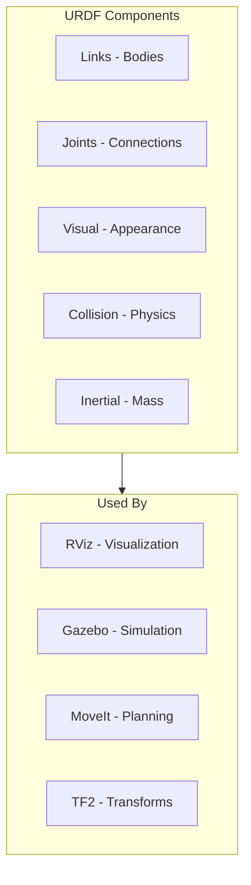
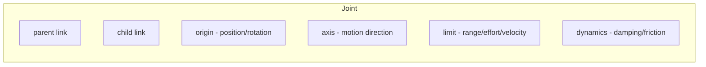

# URDF Robot Description

<div className="learning-objectives">

## Learning Objectives

By the end of this chapter, you will be able to:

- Understand the URDF format and its components
- Create links and joints to describe robot geometry
- Add visual and collision properties
- Use xacro for modular robot descriptions
- Visualize robots in RViz

</div>

<div className="prerequisites">

## Prerequisites

Before starting this chapter, ensure you have:

- **Software**: ROS 2 Humble with `urdf`, `xacro`, and `rviz2` packages
- **Chapter**: Completed [Launch Files](./04-launch-files)
- **Knowledge**: Basic 3D geometry concepts (position, rotation)

</div>

## What is URDF?

**URDF** (Unified Robot Description Format) is an XML format that describes a robot's physical structure:



## Basic Structure

A URDF file defines a tree of **links** connected by **joints**:

```xml title="simple_robot.urdf"
<?xml version="1.0"?>
<robot name="simple_robot">

  <!-- Base link (root of the kinematic tree) -->
  <link name="base_link">
    <visual>
      <geometry>
        <box size="0.5 0.3 0.1"/>
      </geometry>
      <material name="blue">
        <color rgba="0 0 0.8 1"/>
      </material>
    </visual>
  </link>

  <!-- Wheel link -->
  <link name="wheel_link">
    <visual>
      <geometry>
        <cylinder radius="0.1" length="0.05"/>
      </geometry>
      <material name="black">
        <color rgba="0.1 0.1 0.1 1"/>
      </material>
    </visual>
  </link>

  <!-- Joint connecting base to wheel -->
  <joint name="wheel_joint" type="continuous">
    <parent link="base_link"/>
    <child link="wheel_link"/>
    <origin xyz="0.2 0.15 0" rpy="1.5708 0 0"/>
    <axis xyz="0 0 1"/>
  </joint>

</robot>
```

## Links

Links represent the rigid bodies of the robot:

```xml
<link name="arm_link">
  <!-- Visual: What you see in visualization -->
  <visual>
    <origin xyz="0 0 0.1" rpy="0 0 0"/>
    <geometry>
      <cylinder radius="0.05" length="0.2"/>
    </geometry>
    <material name="aluminum">
      <color rgba="0.8 0.8 0.8 1"/>
    </material>
  </visual>

  <!-- Collision: Simplified geometry for physics -->
  <collision>
    <origin xyz="0 0 0.1" rpy="0 0 0"/>
    <geometry>
      <cylinder radius="0.055" length="0.21"/>
    </geometry>
  </collision>

  <!-- Inertial: Mass and moment of inertia -->
  <inertial>
    <origin xyz="0 0 0.1" rpy="0 0 0"/>
    <mass value="1.0"/>
    <inertia ixx="0.01" ixy="0" ixz="0"
             iyy="0.01" iyz="0"
             izz="0.005"/>
  </inertial>
</link>
```

### Geometry Types

| Type | Parameters | Use Case |
|------|------------|----------|
| `box` | `size="x y z"` | Body frames, platforms |
| `cylinder` | `radius`, `length` | Arms, legs, wheels |
| `sphere` | `radius` | Joints, heads |
| `mesh` | `filename` | Complex shapes |

```xml
<!-- Using mesh files -->
<visual>
  <geometry>
    <mesh filename="package://my_robot/meshes/arm.stl" scale="0.001 0.001 0.001"/>
  </geometry>
</visual>
```

## Joints

Joints connect links and define how they move:

```xml
<joint name="shoulder_joint" type="revolute">
  <parent link="torso_link"/>
  <child link="upper_arm_link"/>
  <origin xyz="0.2 0 0.3" rpy="0 0 0"/>
  <axis xyz="0 1 0"/>
  <limit lower="-1.57" upper="1.57" effort="100" velocity="1.0"/>
  <dynamics damping="0.1" friction="0.05"/>
</joint>
```

### Joint Types

| Type | Motion | Example |
|------|--------|---------|
| `revolute` | Rotation with limits | Shoulder, elbow |
| `continuous` | Unlimited rotation | Wheel |
| `prismatic` | Linear sliding | Linear actuator |
| `fixed` | No motion | Sensor mount |
| `floating` | 6-DOF | Free-floating base |
| `planar` | 2D plane motion | X-Y stage |

### Joint Elements



## Xacro: Modular URDF

**Xacro** (XML Macro) makes URDF more maintainable:

```xml title="robot.urdf.xacro"
<?xml version="1.0"?>
<robot xmlns:xacro="http://www.ros.org/wiki/xacro" name="humanoid">

  <!-- Properties (variables) -->
  <xacro:property name="leg_length" value="0.4"/>
  <xacro:property name="leg_radius" value="0.05"/>

  <!-- Macro for leg link -->
  <xacro:macro name="leg_link" params="prefix">
    <link name="${prefix}_leg_link">
      <visual>
        <geometry>
          <cylinder radius="${leg_radius}" length="${leg_length}"/>
        </geometry>
      </visual>
      <collision>
        <geometry>
          <cylinder radius="${leg_radius}" length="${leg_length}"/>
        </geometry>
      </collision>
      <inertial>
        <mass value="2.0"/>
        <inertia ixx="0.03" ixy="0" ixz="0"
                 iyy="0.03" iyz="0"
                 izz="0.01"/>
      </inertial>
    </link>
  </xacro:macro>

  <!-- Use the macro for both legs -->
  <xacro:leg_link prefix="left"/>
  <xacro:leg_link prefix="right"/>

  <!-- Include other xacro files -->
  <xacro:include filename="$(find my_robot)/urdf/arm.urdf.xacro"/>

  <!-- Conditional elements -->
  <xacro:if value="${use_sensors}">
    <xacro:include filename="$(find my_robot)/urdf/sensors.urdf.xacro"/>
  </xacro:if>

</robot>
```

### Processing Xacro

```bash
# Convert xacro to URDF
xacro robot.urdf.xacro > robot.urdf

# With arguments
xacro robot.urdf.xacro use_sensors:=true > robot.urdf

# In launch file
from launch_ros.parameter_descriptions import ParameterValue
from launch.substitutions import Command

robot_description = ParameterValue(
    Command(['xacro ', PathJoinSubstitution([pkg_dir, 'urdf', 'robot.urdf.xacro'])]),
    value_type=str
)
```

## Humanoid Example

A simplified humanoid URDF:

```xml title="humanoid.urdf.xacro"
<?xml version="1.0"?>
<robot xmlns:xacro="http://www.ros.org/wiki/xacro" name="humanoid">

  <!-- Properties -->
  <xacro:property name="torso_height" value="0.4"/>
  <xacro:property name="hip_width" value="0.3"/>
  <xacro:property name="upper_leg" value="0.35"/>
  <xacro:property name="lower_leg" value="0.35"/>

  <!-- Materials -->
  <material name="body_color">
    <color rgba="0.7 0.7 0.7 1"/>
  </material>

  <!-- Base/Pelvis -->
  <link name="base_link">
    <visual>
      <geometry>
        <box size="0.2 ${hip_width} 0.15"/>
      </geometry>
      <material name="body_color"/>
    </visual>
  </link>

  <!-- Torso -->
  <link name="torso_link">
    <visual>
      <origin xyz="0 0 ${torso_height/2}"/>
      <geometry>
        <box size="0.25 0.35 ${torso_height}"/>
      </geometry>
      <material name="body_color"/>
    </visual>
  </link>

  <joint name="torso_joint" type="fixed">
    <parent link="base_link"/>
    <child link="torso_link"/>
    <origin xyz="0 0 0.1"/>
  </joint>

  <!-- Leg macro -->
  <xacro:macro name="leg" params="side reflect">
    <!-- Hip joint -->
    <joint name="${side}_hip_pitch" type="revolute">
      <parent link="base_link"/>
      <child link="${side}_upper_leg"/>
      <origin xyz="0 ${reflect * hip_width/2} 0"/>
      <axis xyz="0 1 0"/>
      <limit lower="-1.5" upper="1.5" effort="100" velocity="2"/>
    </joint>

    <link name="${side}_upper_leg">
      <visual>
        <origin xyz="0 0 ${-upper_leg/2}"/>
        <geometry>
          <cylinder radius="0.05" length="${upper_leg}"/>
        </geometry>
        <material name="body_color"/>
      </visual>
    </link>

    <!-- Knee joint -->
    <joint name="${side}_knee" type="revolute">
      <parent link="${side}_upper_leg"/>
      <child link="${side}_lower_leg"/>
      <origin xyz="0 0 ${-upper_leg}"/>
      <axis xyz="0 1 0"/>
      <limit lower="0" upper="2.5" effort="100" velocity="2"/>
    </joint>

    <link name="${side}_lower_leg">
      <visual>
        <origin xyz="0 0 ${-lower_leg/2}"/>
        <geometry>
          <cylinder radius="0.04" length="${lower_leg}"/>
        </geometry>
        <material name="body_color"/>
      </visual>
    </link>
  </xacro:macro>

  <!-- Create both legs -->
  <xacro:leg side="left" reflect="1"/>
  <xacro:leg side="right" reflect="-1"/>

</robot>
```

## Visualizing in RViz

Launch file to display the robot:

```python title="launch/display_robot.launch.py"
import os
from ament_index_python.packages import get_package_share_directory
from launch import LaunchDescription
from launch.substitutions import Command
from launch_ros.actions import Node
from launch_ros.parameter_descriptions import ParameterValue


def generate_launch_description():
    pkg_dir = get_package_share_directory('my_robot')

    # Get robot description from xacro
    robot_description = ParameterValue(
        Command(['xacro ', os.path.join(pkg_dir, 'urdf', 'humanoid.urdf.xacro')]),
        value_type=str
    )

    return LaunchDescription([
        # Robot state publisher (broadcasts TF)
        Node(
            package='robot_state_publisher',
            executable='robot_state_publisher',
            parameters=[{'robot_description': robot_description}]
        ),

        # Joint state publisher GUI (for testing)
        Node(
            package='joint_state_publisher_gui',
            executable='joint_state_publisher_gui',
        ),

        # RViz
        Node(
            package='rviz2',
            executable='rviz2',
            arguments=['-d', os.path.join(pkg_dir, 'rviz', 'robot.rviz')]
        ),
    ])
```

```bash
# Install required packages
sudo apt install ros-humble-joint-state-publisher-gui ros-humble-xacro

# Launch visualization
ros2 launch my_robot display_robot.launch.py
```

## Validation

Check your URDF for errors:

```bash
# Check URDF syntax
check_urdf robot.urdf

# Visualize kinematic tree
urdf_to_graphviz robot.urdf
# Opens robot.pdf showing the link/joint tree
```

<div className="key-takeaways">

## Key Takeaways

- **URDF** describes robot structure as links connected by joints
- **Links** have visual, collision, and inertial properties
- **Joint types** include revolute, continuous, prismatic, and fixed
- **Xacro** enables modular, reusable robot descriptions with macros
- **robot_state_publisher** broadcasts transforms from joint states
- Always validate URDF with `check_urdf` before use

</div>

## What's Next?

In the next chapter, we'll explore creating Python agents that combine perception and action for autonomous behavior.

## References

1. Open Robotics. (2024). *URDF Tutorials*. https://docs.ros.org/en/humble/Tutorials/Intermediate/URDF/URDF-Main.html
2. Open Robotics. (2024). *Xacro*. http://wiki.ros.org/xacro
