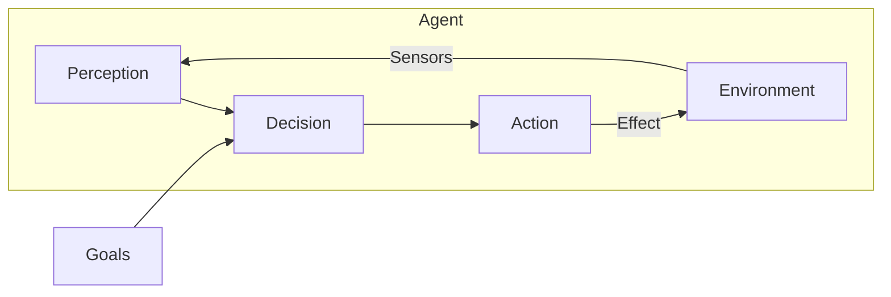
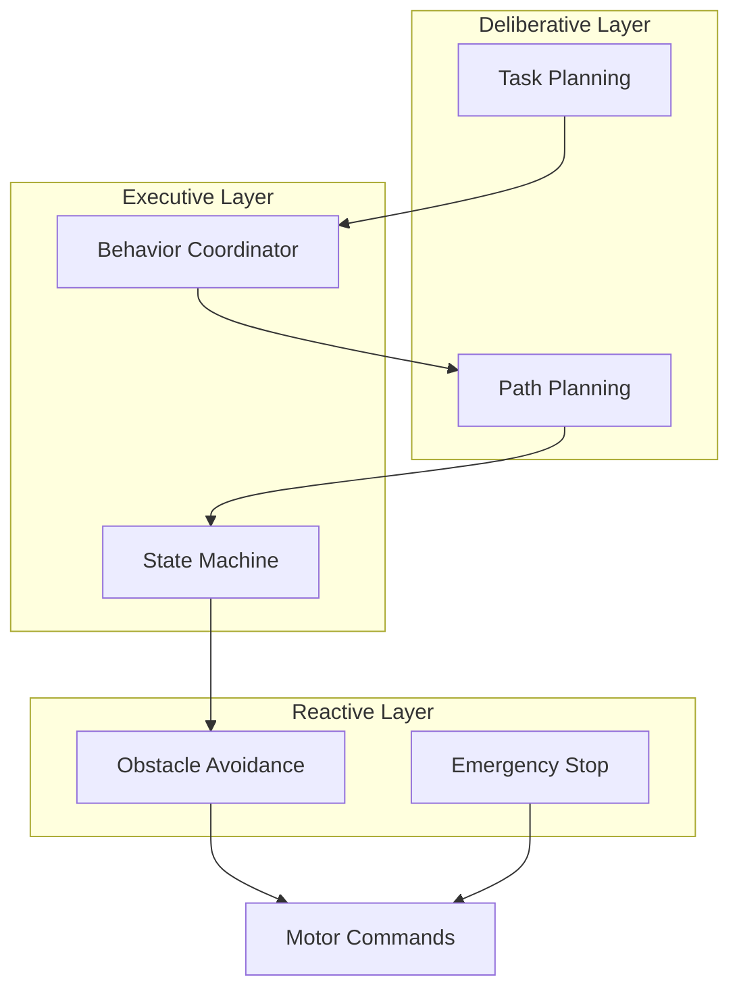

# Python Agents

<div className="learning-objectives">

## Learning Objectives

By the end of this chapter, you will be able to:

- Design autonomous agents that combine perception and action
- Implement state machines for robot behavior
- Use action clients for long-running tasks
- Handle multiple sensor inputs for decision making
- Build reactive and deliberative behaviors

</div>

<div className="prerequisites">

## Prerequisites

Before starting this chapter, ensure you have:

- **Software**: ROS 2 Humble with navigation packages
- **Chapter**: Completed [URDF](./05-urdf)
- **Knowledge**: ROS 2 topics, services, and actions

</div>

## What is a Robot Agent?

A robot **agent** is an autonomous system that:
1. **Perceives** the environment through sensors
2. **Decides** on actions based on goals and perceptions
3. **Acts** on the environment through actuators



## Simple Reactive Agent

A reactive agent responds directly to sensor inputs:

```python title="reactive_agent.py"
#!/usr/bin/env python3
"""Reactive obstacle avoidance agent."""

import rclpy
from rclpy.node import Node
from sensor_msgs.msg import LaserScan
from geometry_msgs.msg import Twist


class ReactiveAgent(Node):
    """Agent that reacts to obstacles by turning."""

    def __init__(self):
        super().__init__('reactive_agent')

        # Parameters
        self.declare_parameter('obstacle_distance', 0.5)
        self.declare_parameter('linear_speed', 0.3)
        self.declare_parameter('angular_speed', 0.5)

        self.obstacle_dist = self.get_parameter('obstacle_distance').value
        self.linear_speed = self.get_parameter('linear_speed').value
        self.angular_speed = self.get_parameter('angular_speed').value

        # Subscriber for laser scan
        self.scan_sub = self.create_subscription(
            LaserScan,
            'scan',
            self.scan_callback,
            10
        )

        # Publisher for velocity commands
        self.cmd_pub = self.create_publisher(Twist, 'cmd_vel', 10)

        self.get_logger().info('Reactive agent started')

    def scan_callback(self, msg: LaserScan):
        """React to laser scan data."""
        # Get minimum distance in front (center portion of scan)
        center_start = len(msg.ranges) // 3
        center_end = 2 * len(msg.ranges) // 3
        front_ranges = msg.ranges[center_start:center_end]

        # Filter out invalid readings
        valid_ranges = [r for r in front_ranges
                       if msg.range_min < r < msg.range_max]

        if not valid_ranges:
            return

        min_distance = min(valid_ranges)

        # Create velocity command
        cmd = Twist()

        if min_distance < self.obstacle_dist:
            # Obstacle ahead: stop and turn
            cmd.linear.x = 0.0
            cmd.angular.z = self.angular_speed
            self.get_logger().info(f'Obstacle at {min_distance:.2f}m, turning')
        else:
            # Clear ahead: move forward
            cmd.linear.x = self.linear_speed
            cmd.angular.z = 0.0

        self.cmd_pub.publish(cmd)


def main(args=None):
    rclpy.init(args=args)
    node = ReactiveAgent()
    rclpy.spin(node)
    node.destroy_node()
    rclpy.shutdown()


if __name__ == '__main__':
    main()
```

## State Machine Agent

Complex behaviors require state management:

```python title="state_machine_agent.py"
#!/usr/bin/env python3
"""State machine-based patrol agent."""

from enum import Enum, auto
import rclpy
from rclpy.node import Node
from rclpy.action import ActionClient
from nav2_msgs.action import NavigateToPose
from geometry_msgs.msg import PoseStamped
from sensor_msgs.msg import BatteryState
import math


class AgentState(Enum):
    """Possible agent states."""
    IDLE = auto()
    PATROLLING = auto()
    NAVIGATING = auto()
    CHARGING = auto()
    ERROR = auto()


class PatrolAgent(Node):
    """Agent that patrols waypoints and manages battery."""

    def __init__(self):
        super().__init__('patrol_agent')

        # State
        self.state = AgentState.IDLE
        self.current_waypoint = 0
        self.battery_level = 100.0

        # Patrol waypoints
        self.waypoints = [
            self._create_pose(0.0, 0.0, 0.0),
            self._create_pose(2.0, 0.0, 1.57),
            self._create_pose(2.0, 2.0, 3.14),
            self._create_pose(0.0, 2.0, -1.57),
        ]

        # Action client for navigation
        self.nav_client = ActionClient(
            self, NavigateToPose, 'navigate_to_pose'
        )

        # Battery subscriber
        self.battery_sub = self.create_subscription(
            BatteryState,
            'battery_state',
            self.battery_callback,
            10
        )

        # Timer for state machine updates
        self.timer = self.create_timer(1.0, self.state_machine_update)

        self.get_logger().info('Patrol agent initialized')

    def _create_pose(self, x: float, y: float, yaw: float) -> PoseStamped:
        """Create a PoseStamped message."""
        pose = PoseStamped()
        pose.header.frame_id = 'map'
        pose.pose.position.x = x
        pose.pose.position.y = y
        pose.pose.orientation.z = math.sin(yaw / 2)
        pose.pose.orientation.w = math.cos(yaw / 2)
        return pose

    def battery_callback(self, msg: BatteryState):
        """Update battery level."""
        self.battery_level = msg.percentage * 100

    def state_machine_update(self):
        """Main state machine logic."""
        self.get_logger().debug(f'State: {self.state.name}, Battery: {self.battery_level:.1f}%')

        if self.state == AgentState.IDLE:
            self._handle_idle()
        elif self.state == AgentState.PATROLLING:
            self._handle_patrolling()
        elif self.state == AgentState.NAVIGATING:
            self._handle_navigating()
        elif self.state == AgentState.CHARGING:
            self._handle_charging()
        elif self.state == AgentState.ERROR:
            self._handle_error()

    def _handle_idle(self):
        """Handle idle state."""
        if self.battery_level > 20:
            self.get_logger().info('Starting patrol')
            self.state = AgentState.PATROLLING
        else:
            self.state = AgentState.CHARGING

    def _handle_patrolling(self):
        """Handle patrolling state."""
        if self.battery_level < 15:
            self.get_logger().warn('Low battery, returning to charge')
            self.state = AgentState.CHARGING
            return

        # Start navigation to next waypoint
        waypoint = self.waypoints[self.current_waypoint]
        self._navigate_to(waypoint)
        self.state = AgentState.NAVIGATING

    def _handle_navigating(self):
        """Handle navigation state (waiting for result)."""
        # Navigation completion is handled by action callback
        pass

    def _handle_charging(self):
        """Handle charging state."""
        if self.battery_level > 90:
            self.get_logger().info('Battery charged, resuming patrol')
            self.state = AgentState.PATROLLING

    def _handle_error(self):
        """Handle error state."""
        self.get_logger().error('In error state, manual intervention required')

    def _navigate_to(self, pose: PoseStamped):
        """Send navigation goal."""
        if not self.nav_client.wait_for_server(timeout_sec=5.0):
            self.get_logger().error('Navigation server not available')
            self.state = AgentState.ERROR
            return

        goal = NavigateToPose.Goal()
        goal.pose = pose
        goal.pose.header.stamp = self.get_clock().now().to_msg()

        self.get_logger().info(
            f'Navigating to waypoint {self.current_waypoint}: '
            f'({pose.pose.position.x:.1f}, {pose.pose.position.y:.1f})'
        )

        future = self.nav_client.send_goal_async(
            goal,
            feedback_callback=self._nav_feedback_callback
        )
        future.add_done_callback(self._nav_goal_response_callback)

    def _nav_goal_response_callback(self, future):
        """Handle navigation goal response."""
        goal_handle = future.result()
        if not goal_handle.accepted:
            self.get_logger().warn('Navigation goal rejected')
            self.state = AgentState.ERROR
            return

        result_future = goal_handle.get_result_async()
        result_future.add_done_callback(self._nav_result_callback)

    def _nav_feedback_callback(self, feedback_msg):
        """Handle navigation feedback."""
        feedback = feedback_msg.feedback
        self.get_logger().debug(
            f'Distance remaining: {feedback.distance_remaining:.2f}m'
        )

    def _nav_result_callback(self, future):
        """Handle navigation result."""
        result = future.result().result
        status = future.result().status

        if status == 4:  # SUCCEEDED
            self.get_logger().info(
                f'Reached waypoint {self.current_waypoint}'
            )
            self.current_waypoint = (self.current_waypoint + 1) % len(self.waypoints)
            self.state = AgentState.PATROLLING
        else:
            self.get_logger().warn(f'Navigation failed with status {status}')
            self.state = AgentState.ERROR


def main(args=None):
    rclpy.init(args=args)
    node = PatrolAgent()
    rclpy.spin(node)
    node.destroy_node()
    rclpy.shutdown()


if __name__ == '__main__':
    main()
```

## Multi-Sensor Agent

Agents often need to fuse multiple sensor inputs:

```python title="multi_sensor_agent.py"
#!/usr/bin/env python3
"""Agent that combines camera and LiDAR for navigation."""

import rclpy
from rclpy.node import Node
from rclpy.qos import QoSProfile, ReliabilityPolicy
from sensor_msgs.msg import Image, LaserScan
from geometry_msgs.msg import Twist
from cv_bridge import CvBridge
import numpy as np


class MultiSensorAgent(Node):
    """Agent combining visual and range sensing."""

    def __init__(self):
        super().__init__('multi_sensor_agent')

        self.bridge = CvBridge()

        # Sensor data storage
        self.latest_scan = None
        self.latest_image = None
        self.detected_target = None

        # Subscribers
        self.scan_sub = self.create_subscription(
            LaserScan, 'scan', self.scan_callback, 10
        )

        self.image_sub = self.create_subscription(
            Image, 'camera/image_raw', self.image_callback,
            QoSProfile(depth=1, reliability=ReliabilityPolicy.BEST_EFFORT)
        )

        # Publisher
        self.cmd_pub = self.create_publisher(Twist, 'cmd_vel', 10)

        # Control loop timer
        self.timer = self.create_timer(0.1, self.control_loop)

        self.get_logger().info('Multi-sensor agent started')

    def scan_callback(self, msg: LaserScan):
        """Store latest scan."""
        self.latest_scan = msg

    def image_callback(self, msg: Image):
        """Process image for target detection."""
        try:
            cv_image = self.bridge.imgmsg_to_cv2(msg, 'bgr8')
            self.detected_target = self._detect_target(cv_image)
            self.latest_image = cv_image
        except Exception as e:
            self.get_logger().error(f'Image processing error: {e}')

    def _detect_target(self, image: np.ndarray) -> dict:
        """Detect target in image (simplified red ball detection)."""
        import cv2

        # Convert to HSV
        hsv = cv2.cvtColor(image, cv2.COLOR_BGR2HSV)

        # Red color range
        lower_red = np.array([0, 100, 100])
        upper_red = np.array([10, 255, 255])

        # Create mask
        mask = cv2.inRange(hsv, lower_red, upper_red)

        # Find contours
        contours, _ = cv2.findContours(
            mask, cv2.RETR_EXTERNAL, cv2.CHAIN_APPROX_SIMPLE
        )

        if contours:
            # Find largest contour
            largest = max(contours, key=cv2.contourArea)
            area = cv2.contourArea(largest)

            if area > 500:  # Minimum size threshold
                M = cv2.moments(largest)
                if M['m00'] > 0:
                    cx = int(M['m10'] / M['m00'])
                    cy = int(M['m01'] / M['m00'])
                    return {
                        'detected': True,
                        'center_x': cx,
                        'center_y': cy,
                        'area': area,
                        'image_width': image.shape[1]
                    }

        return {'detected': False}

    def control_loop(self):
        """Main control loop combining sensor data."""
        cmd = Twist()

        # Check for obstacles first (safety)
        obstacle_ahead = self._check_obstacles()

        if obstacle_ahead:
            # Stop and turn
            cmd.linear.x = 0.0
            cmd.angular.z = 0.5
            self.get_logger().debug('Obstacle avoidance active')

        elif self.detected_target and self.detected_target.get('detected'):
            # Track detected target
            target = self.detected_target
            image_center = target['image_width'] / 2
            error = (target['center_x'] - image_center) / image_center

            # Proportional control for turning
            cmd.angular.z = -0.5 * error

            # Move forward if target is small (far away)
            if target['area'] < 5000:
                cmd.linear.x = 0.2

            self.get_logger().debug(
                f'Tracking target, error: {error:.2f}'
            )
        else:
            # Search behavior: slow rotation
            cmd.angular.z = 0.2
            self.get_logger().debug('Searching for target')

        self.cmd_pub.publish(cmd)

    def _check_obstacles(self) -> bool:
        """Check for nearby obstacles."""
        if self.latest_scan is None:
            return False

        scan = self.latest_scan
        center = len(scan.ranges) // 2
        front_ranges = scan.ranges[center-30:center+30]

        valid = [r for r in front_ranges
                if scan.range_min < r < scan.range_max]

        if valid and min(valid) < 0.3:
            return True
        return False


def main(args=None):
    rclpy.init(args=args)
    node = MultiSensorAgent()
    rclpy.spin(node)
    node.destroy_node()
    rclpy.shutdown()


if __name__ == '__main__':
    main()
```

## Agent Architecture Patterns



### Key Patterns

| Pattern | Description | Use Case |
|---------|-------------|----------|
| **Subsumption** | Lower layers override higher | Safety-critical systems |
| **Behavior Trees** | Hierarchical task switching | Complex mission logic |
| **State Machines** | Explicit state transitions | Well-defined workflows |
| **Blackboard** | Shared data repository | Multi-agent coordination |

<div className="key-takeaways">

## Key Takeaways

- **Agents** combine perception, decision, and action in a loop
- **Reactive agents** respond directly to sensor inputs (fast, simple)
- **State machines** manage complex behaviors with explicit transitions
- **Multi-sensor agents** fuse data from cameras, LiDAR, and other sensors
- **Layered architectures** combine reactive safety with deliberative planning
- Action clients enable **long-running tasks** like navigation

</div>

## What's Next?

You've completed Module 1! In Module 2, we'll explore simulation environments where you can test your agents safely before deploying to real hardware.

## References

1. Brooks, R. A. (1986). *A Robust Layered Control System for a Mobile Robot*. IEEE Journal on Robotics and Automation.
2. Arkin, R. C. (1998). *Behavior-Based Robotics*. MIT Press.
3. Open Robotics. (2024). *Nav2 Documentation*. https://navigation.ros.org/
