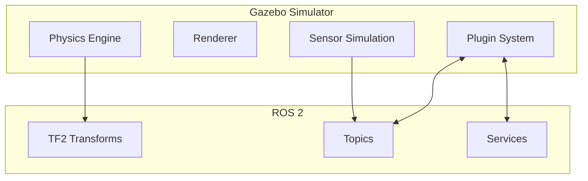

# Gazebo Setup

<div className="learning-objectives">

## Learning Objectives

By the end of this chapter, you will be able to:

- Install Gazebo for use with ROS 2 Humble
- Understand the Gazebo architecture and components
- Launch basic simulations with ROS 2 integration
- Configure world files and model spawning

</div>

<div className="prerequisites">

## Prerequisites

Before starting this chapter, ensure you have:

- **Software**: ROS 2 Humble installed on Ubuntu 22.04
- **Module**: Completed Module 1: ROS 2 Fundamentals
- **Hardware**: GPU recommended for visualization

</div>

## Gazebo Overview

**Gazebo** is a physics-based robot simulator that integrates with ROS 2:



### Gazebo Versions

| Version | ROS 2 Version | Status |
|---------|---------------|--------|
| Gazebo Classic (11) | Foxy, Galactic | Legacy |
| Gazebo Fortress | Humble | LTS (Recommended) |
| Gazebo Garden | Humble, Iron | Current |
| Gazebo Harmonic | Jazzy | Latest |

For ROS 2 Humble, we use **Gazebo Fortress** (the new "Ignition" Gazebo).

## Installation

```bash
# Install Gazebo Fortress
sudo apt install ros-humble-ros-gz

# Install additional ROS-Gazebo packages
sudo apt install ros-humble-ros-gz-sim \
                 ros-humble-ros-gz-bridge \
                 ros-humble-ros-gz-image \
                 ros-humble-ros-gz-interfaces

# Verify installation
gz sim --version
```

## First Simulation

Launch an empty world:

```bash
# Launch Gazebo with empty world
gz sim empty.sdf

# Or with ROS 2 integration
ros2 launch ros_gz_sim gz_sim.launch.py gz_args:='empty.sdf'
```

### World Files (SDF)

World files define the simulation environment:

```xml title="worlds/simple_world.sdf"
<?xml version="1.0" ?>
<sdf version="1.8">
  <world name="simple_world">

    <!-- Physics configuration -->
    <physics name="1ms" type="ode">
      <max_step_size>0.001</max_step_size>
      <real_time_factor>1.0</real_time_factor>
    </physics>

    <!-- Plugins for ROS 2 integration -->
    <plugin
      filename="gz-sim-physics-system"
      name="gz::sim::systems::Physics">
    </plugin>
    <plugin
      filename="gz-sim-scene-broadcaster-system"
      name="gz::sim::systems::SceneBroadcaster">
    </plugin>
    <plugin
      filename="gz-sim-user-commands-system"
      name="gz::sim::systems::UserCommands">
    </plugin>

    <!-- Ground plane -->
    <model name="ground_plane">
      <static>true</static>
      <link name="link">
        <collision name="collision">
          <geometry>
            <plane>
              <normal>0 0 1</normal>
            </plane>
          </geometry>
        </collision>
        <visual name="visual">
          <geometry>
            <plane>
              <normal>0 0 1</normal>
              <size>100 100</size>
            </plane>
          </geometry>
          <material>
            <ambient>0.8 0.8 0.8 1</ambient>
          </material>
        </visual>
      </link>
    </model>

    <!-- Sun light -->
    <light type="directional" name="sun">
      <cast_shadows>true</cast_shadows>
      <pose>0 0 10 0 0 0</pose>
      <diffuse>0.8 0.8 0.8 1</diffuse>
      <specular>0.2 0.2 0.2 1</specular>
      <direction>-0.5 0.1 -0.9</direction>
    </light>

  </world>
</sdf>
```

## Spawning Models

### From Command Line

```bash
# Spawn a model into running simulation
gz service -s /world/simple_world/create \
  --reqtype gz.msgs.EntityFactory \
  --reptype gz.msgs.Boolean \
  --timeout 1000 \
  --req 'sdf_filename: "model://simple_robot", name: "robot1"'
```

### From ROS 2 Launch

```python title="launch/spawn_robot.launch.py"
from launch import LaunchDescription
from launch.actions import IncludeLaunchDescription
from launch.launch_description_sources import PythonLaunchDescriptionSource
from launch_ros.actions import Node
from ament_index_python.packages import get_package_share_directory
import os


def generate_launch_description():
    pkg_dir = get_package_share_directory('my_robot_sim')

    # Launch Gazebo
    gazebo = IncludeLaunchDescription(
        PythonLaunchDescriptionSource([
            get_package_share_directory('ros_gz_sim'),
            '/launch/gz_sim.launch.py'
        ]),
        launch_arguments={'gz_args': '-r simple_world.sdf'}.items()
    )

    # Spawn robot
    spawn_robot = Node(
        package='ros_gz_sim',
        executable='create',
        arguments=[
            '-name', 'robot',
            '-file', os.path.join(pkg_dir, 'models', 'robot.sdf'),
            '-x', '0', '-y', '0', '-z', '0.5'
        ],
        output='screen'
    )

    return LaunchDescription([gazebo, spawn_robot])
```

## ROS 2 Bridge

The **ros_gz_bridge** connects Gazebo topics to ROS 2:

```python title="launch/bridge.launch.py"
from launch import LaunchDescription
from launch_ros.actions import Node


def generate_launch_description():
    bridge = Node(
        package='ros_gz_bridge',
        executable='parameter_bridge',
        arguments=[
            # Sensor topics (Gazebo -> ROS 2)
            '/camera/image@sensor_msgs/msg/Image@gz.msgs.Image',
            '/scan@sensor_msgs/msg/LaserScan@gz.msgs.LaserScan',
            '/imu@sensor_msgs/msg/Imu@gz.msgs.IMU',

            # Command topics (ROS 2 -> Gazebo)
            '/cmd_vel@geometry_msgs/msg/Twist@gz.msgs.Twist',

            # Clock (Gazebo -> ROS 2)
            '/clock@rosgraph_msgs/msg/Clock@gz.msgs.Clock',
        ],
        output='screen'
    )

    return LaunchDescription([bridge])
```

### Bridge Configuration YAML

```yaml title="config/bridge.yaml"
# Bidirectional bridges
- topic_name: "/cmd_vel"
  ros_type_name: "geometry_msgs/msg/Twist"
  gz_type_name: "gz.msgs.Twist"
  direction: ROS_TO_GZ

- topic_name: "/odom"
  ros_type_name: "nav_msgs/msg/Odometry"
  gz_type_name: "gz.msgs.Odometry"
  direction: GZ_TO_ROS

# Sensor bridges
- topic_name: "/camera/image"
  ros_type_name: "sensor_msgs/msg/Image"
  gz_type_name: "gz.msgs.Image"
  direction: GZ_TO_ROS

- topic_name: "/scan"
  ros_type_name: "sensor_msgs/msg/LaserScan"
  gz_type_name: "gz.msgs.LaserScan"
  direction: GZ_TO_ROS
```

## Simulation Time

Always use simulation time for consistent behavior:

```python title="config/params.yaml"
/**:
  ros__parameters:
    use_sim_time: true
```

```bash
# Check simulation time is being published
ros2 topic echo /clock
```

## Complete Launch Example

```python title="launch/simulation.launch.py"
import os
from ament_index_python.packages import get_package_share_directory
from launch import LaunchDescription
from launch.actions import IncludeLaunchDescription, SetEnvironmentVariable
from launch.launch_description_sources import PythonLaunchDescriptionSource
from launch_ros.actions import Node


def generate_launch_description():
    pkg_dir = get_package_share_directory('my_robot_sim')

    # Set Gazebo resource paths
    gz_resource_path = SetEnvironmentVariable(
        name='GZ_SIM_RESOURCE_PATH',
        value=[os.path.join(pkg_dir, 'worlds'), ':',
               os.path.join(pkg_dir, 'models')]
    )

    # Launch Gazebo simulator
    gazebo = IncludeLaunchDescription(
        PythonLaunchDescriptionSource([
            get_package_share_directory('ros_gz_sim'),
            '/launch/gz_sim.launch.py'
        ]),
        launch_arguments={
            'gz_args': '-r ' + os.path.join(pkg_dir, 'worlds', 'warehouse.sdf')
        }.items()
    )

    # Spawn robot
    spawn = Node(
        package='ros_gz_sim',
        executable='create',
        arguments=[
            '-name', 'humanoid',
            '-file', os.path.join(pkg_dir, 'models', 'humanoid', 'model.sdf'),
            '-x', '0', '-y', '0', '-z', '1.0'
        ],
        output='screen'
    )

    # ROS-Gazebo bridge
    bridge = Node(
        package='ros_gz_bridge',
        executable='parameter_bridge',
        parameters=[{
            'config_file': os.path.join(pkg_dir, 'config', 'bridge.yaml')
        }],
        output='screen'
    )

    return LaunchDescription([
        gz_resource_path,
        gazebo,
        spawn,
        bridge
    ])
```

<div className="key-takeaways">

## Key Takeaways

- **Gazebo Fortress** is the recommended simulator for ROS 2 Humble
- **SDF world files** define environments, physics, and lighting
- **ros_gz_bridge** connects Gazebo and ROS 2 topics bidirectionally
- Always enable **use_sim_time** for consistent timing
- **Resource paths** must include your model and world directories

</div>

## What's Next?

In the next chapter, we'll compare URDF and SDF formats for robot description.

## References

1. Open Robotics. (2024). *Gazebo Documentation*. https://gazebosim.org/docs
2. Open Robotics. (2024). *ros_gz Documentation*. https://github.com/gazebosim/ros_gz
