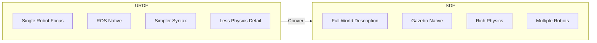
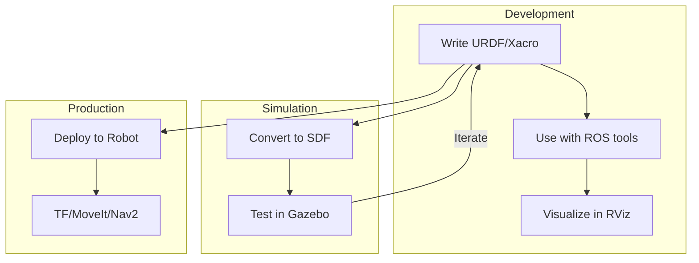

# URDF vs SDF

<div className="learning-objectives">

## Learning Objectives

By the end of this chapter, you will be able to:

- Compare URDF and SDF formats and their capabilities
- Convert between URDF and SDF when needed
- Choose the right format for your use case
- Create simulation-ready robot descriptions

</div>

<div className="prerequisites">

## Prerequisites

Before starting this chapter, ensure you have:

- **Module 1**: Understanding of URDF from [Chapter 5](../module1-ros2/05-urdf)
- **Chapter**: Completed [Gazebo Setup](./01-gazebo-setup)
- **Tools**: `xacro`, `gz sdf` commands available

</div>

## Format Comparison

Both formats describe robots, but with different capabilities:



### Feature Comparison

| Feature | URDF | SDF |
|---------|------|-----|
| Robot description | ✅ | ✅ |
| World description | ❌ | ✅ |
| Multiple robots | ❌ | ✅ |
| Closed kinematic loops | ❌ | ✅ |
| Lights | ❌ | ✅ |
| Advanced physics | Limited | ✅ |
| Nested models | ❌ | ✅ |
| ROS integration | Native | Via bridge |
| Gazebo Classic | Via plugin | Native |
| Gazebo Fortress+ | Converted | Native |

## URDF Strengths

URDF is ideal for:
- **ROS tooling**: TF, MoveIt, robot_state_publisher
- **Simple robots**: Mobile bases, arms
- **Team familiarity**: Widely known in ROS community

```xml title="robot.urdf"
<?xml version="1.0"?>
<robot name="simple_arm">
  <link name="base_link">
    <visual>
      <geometry>
        <box size="0.2 0.2 0.1"/>
      </geometry>
    </visual>
    <collision>
      <geometry>
        <box size="0.2 0.2 0.1"/>
      </geometry>
    </collision>
    <inertial>
      <mass value="5.0"/>
      <inertia ixx="0.01" ixy="0" ixz="0"
               iyy="0.01" iyz="0" izz="0.01"/>
    </inertial>
  </link>

  <joint name="shoulder" type="revolute">
    <parent link="base_link"/>
    <child link="upper_arm"/>
    <axis xyz="0 0 1"/>
    <limit lower="-3.14" upper="3.14" effort="100" velocity="1"/>
  </joint>

  <link name="upper_arm">
    <!-- Link definition -->
  </link>
</robot>
```

## SDF Strengths

SDF excels at:
- **World creation**: Environments with objects, lights, terrain
- **Complex physics**: Friction, contact, actuator dynamics
- **Multi-robot**: Swarms, cooperative systems

```xml title="world.sdf"
<?xml version="1.0" ?>
<sdf version="1.8">
  <world name="warehouse">
    <!-- World physics -->
    <physics type="ode">
      <max_step_size>0.001</max_step_size>
      <real_time_factor>1</real_time_factor>
    </physics>

    <!-- Lighting -->
    <light type="directional" name="sun">
      <pose>0 0 10 0 0 0</pose>
      <diffuse>1 1 1 1</diffuse>
      <specular>0.5 0.5 0.5 1</specular>
      <direction>-0.5 0.1 -0.9</direction>
      <cast_shadows>true</cast_shadows>
    </light>

    <!-- Ground -->
    <model name="ground">
      <static>true</static>
      <link name="link">
        <collision name="collision">
          <geometry>
            <plane>
              <normal>0 0 1</normal>
            </plane>
          </geometry>
          <surface>
            <friction>
              <ode>
                <mu>0.8</mu>
                <mu2>0.8</mu2>
              </ode>
            </friction>
          </surface>
        </collision>
      </link>
    </model>

    <!-- Multiple robots -->
    <include>
      <uri>model://humanoid</uri>
      <name>robot1</name>
      <pose>0 0 1 0 0 0</pose>
    </include>

    <include>
      <uri>model://humanoid</uri>
      <name>robot2</name>
      <pose>3 0 1 0 0 0</pose>
    </include>
  </world>
</sdf>
```

## Converting URDF to SDF

Gazebo automatically converts URDF, but explicit conversion helps debugging:

```bash
# Convert URDF to SDF
gz sdf -p robot.urdf > robot.sdf

# With xacro processing
xacro robot.urdf.xacro > robot.urdf
gz sdf -p robot.urdf > robot.sdf
```

### Common Conversion Issues

| Issue | Cause | Solution |
|-------|-------|----------|
| Missing inertials | URDF links lack `<inertial>` | Add mass and inertia to all non-fixed links |
| Invalid meshes | Mesh file not found | Use `package://` or absolute paths |
| Physics issues | Default friction/contact | Add `<gazebo>` extensions to URDF |

## Gazebo Extensions for URDF

Add Gazebo-specific properties to URDF:

```xml title="robot.gazebo"
<?xml version="1.0"?>
<robot>
  <!-- Material colors for Gazebo -->
  <gazebo reference="base_link">
    <material>Gazebo/Blue</material>
  </gazebo>

  <!-- Surface properties -->
  <gazebo reference="wheel_link">
    <mu1>0.9</mu1>
    <mu2>0.9</mu2>
    <kp>1000000.0</kp>
    <kd>100.0</kd>
  </gazebo>

  <!-- Sensor plugins -->
  <gazebo reference="camera_link">
    <sensor name="camera" type="camera">
      <camera>
        <horizontal_fov>1.047</horizontal_fov>
        <image>
          <width>640</width>
          <height>480</height>
        </image>
        <clip>
          <near>0.1</near>
          <far>100</far>
        </clip>
      </camera>
      <always_on>1</always_on>
      <update_rate>30</update_rate>
      <visualize>true</visualize>
    </sensor>
  </gazebo>

  <!-- Differential drive controller -->
  <gazebo>
    <plugin name="diff_drive" filename="libgazebo_ros_diff_drive.so">
      <ros>
        <namespace>/robot</namespace>
      </ros>
      <left_joint>left_wheel_joint</left_joint>
      <right_joint>right_wheel_joint</right_joint>
      <wheel_separation>0.5</wheel_separation>
      <wheel_diameter>0.2</wheel_diameter>
      <command_topic>cmd_vel</command_topic>
      <odometry_topic>odom</odometry_topic>
    </plugin>
  </gazebo>
</robot>
```

## Recommended Workflow



### Best Practice: Hybrid Approach

1. **Write robot in URDF/Xacro**: Leverage ROS tooling
2. **Add Gazebo extensions**: Physics, sensors, plugins
3. **Write worlds in SDF**: Full simulation environment
4. **Use includes**: Reference URDF models from SDF worlds

```xml title="warehouse_world.sdf"
<sdf version="1.8">
  <world name="warehouse">
    <!-- World setup (physics, lighting, ground) -->

    <!-- Include robot from URDF -->
    <include>
      <uri>package://my_robot/urdf/robot.urdf</uri>
      <name>my_robot</name>
      <pose>0 0 0.1 0 0 0</pose>
    </include>

    <!-- Environment objects defined in SDF -->
    <include>
      <uri>model://shelf</uri>
      <pose>2 0 0 0 0 0</pose>
    </include>
  </world>
</sdf>
```

## SDF Robot Model

Complete SDF robot for simulation:

```xml title="models/humanoid/model.sdf"
<?xml version="1.0" ?>
<sdf version="1.8">
  <model name="humanoid">
    <pose>0 0 0.9 0 0 0</pose>

    <!-- Torso (base) -->
    <link name="torso">
      <pose>0 0 0 0 0 0</pose>
      <inertial>
        <mass>10</mass>
        <inertia>
          <ixx>0.1</ixx>
          <iyy>0.1</iyy>
          <izz>0.1</izz>
        </inertia>
      </inertial>
      <collision name="collision">
        <geometry>
          <box><size>0.3 0.4 0.5</size></box>
        </geometry>
      </collision>
      <visual name="visual">
        <geometry>
          <box><size>0.3 0.4 0.5</size></box>
        </geometry>
        <material>
          <ambient>0.5 0.5 0.5 1</ambient>
        </material>
      </visual>

      <!-- IMU sensor -->
      <sensor name="imu" type="imu">
        <always_on>true</always_on>
        <update_rate>100</update_rate>
        <imu>
          <angular_velocity>
            <x><noise type="gaussian"><stddev>0.01</stddev></noise></x>
            <y><noise type="gaussian"><stddev>0.01</stddev></noise></y>
            <z><noise type="gaussian"><stddev>0.01</stddev></noise></z>
          </angular_velocity>
        </imu>
      </sensor>
    </link>

    <!-- Head with camera -->
    <link name="head">
      <pose relative_to="torso">0 0 0.35 0 0 0</pose>
      <inertial>
        <mass>2</mass>
        <inertia>
          <ixx>0.01</ixx>
          <iyy>0.01</iyy>
          <izz>0.01</izz>
        </inertia>
      </inertial>
      <collision name="collision">
        <geometry>
          <sphere><radius>0.1</radius></sphere>
        </geometry>
      </collision>
      <visual name="visual">
        <geometry>
          <sphere><radius>0.1</radius></sphere>
        </geometry>
      </visual>

      <!-- Camera sensor -->
      <sensor name="camera" type="camera">
        <pose>0.1 0 0 0 0 0</pose>
        <camera>
          <horizontal_fov>1.047</horizontal_fov>
          <image>
            <width>640</width>
            <height>480</height>
          </image>
        </camera>
        <always_on>1</always_on>
        <update_rate>30</update_rate>
      </sensor>
    </link>

    <joint name="neck" type="revolute">
      <parent>torso</parent>
      <child>head</child>
      <axis>
        <xyz>0 1 0</xyz>
        <limit>
          <lower>-0.5</lower>
          <upper>0.5</upper>
        </limit>
      </axis>
    </joint>

    <!-- Add leg joints and links similarly -->

  </model>
</sdf>
```

<div className="key-takeaways">

## Key Takeaways

- **URDF** is best for ROS tooling (TF, MoveIt, visualization)
- **SDF** is best for simulation (physics, worlds, multi-robot)
- **Gazebo extensions** add simulation features to URDF
- **Convert URDF→SDF** using `gz sdf -p` for debugging
- Use **hybrid approach**: URDF robots + SDF worlds
- Always include **inertial properties** for physics simulation

</div>

## What's Next?

In the next chapter, we'll explore physics simulation in depth.

## References

1. Open Robotics. (2024). *SDFormat Specification*. http://sdformat.org/spec
2. Open Robotics. (2024). *URDF Specification*. http://wiki.ros.org/urdf/XML
