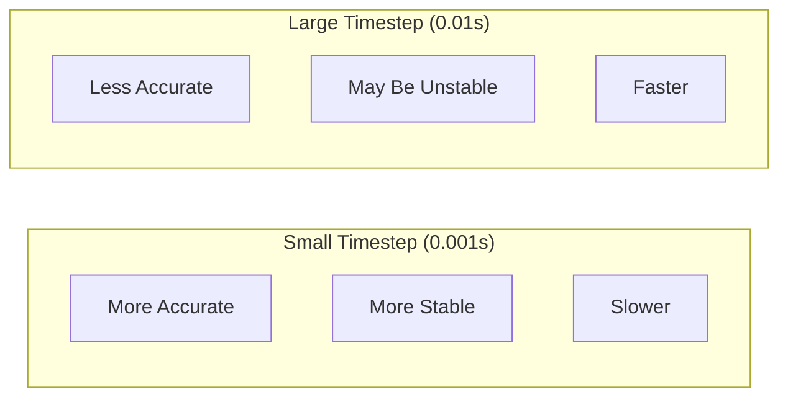

# Physics Simulation

<div className="learning-objectives">

## Learning Objectives

By the end of this chapter, you will be able to:

- Configure physics engines in Gazebo
- Tune contact and friction parameters
- Set appropriate simulation timesteps
- Debug common physics issues
- Optimize simulation performance

</div>

<div className="prerequisites">

## Prerequisites

Before starting this chapter, ensure you have:

- **Chapter**: Completed [URDF vs SDF](./02-urdf-sdf)
- **Knowledge**: Basic understanding of rigid body dynamics
- **Software**: Gazebo Fortress with ROS 2

</div>

## Physics Engines

Gazebo supports multiple physics engines:

| Engine | Strengths | Limitations |
|--------|-----------|-------------|
| **ODE** | Stable, well-tested | Basic contact |
| **DART** | Accurate dynamics | Slower |
| **Bullet** | Fast collision | Less accurate |
| **TPE** | Very fast | Simplified physics |

```xml title="world.sdf"
<physics name="default_physics" type="ode">
  <max_step_size>0.001</max_step_size>
  <real_time_factor>1.0</real_time_factor>
  <real_time_update_rate>1000</real_time_update_rate>
  <max_contacts>20</max_contacts>

  <ode>
    <solver>
      <type>quick</type>
      <iters>50</iters>
      <sor>1.3</sor>
    </solver>
    <constraints>
      <cfm>0.0</cfm>
      <erp>0.2</erp>
    </constraints>
  </ode>
</physics>
```

## Timestep Selection

The **timestep** critically affects simulation accuracy and stability:



### Recommended Timesteps

| Robot Type | Timestep | Rationale |
|------------|----------|-----------|
| Mobile base | 0.001-0.01s | Simple dynamics |
| Manipulator arm | 0.001s | Joint precision |
| Humanoid | 0.0005-0.001s | Balance stability |
| High-speed systems | 0.0001s | Rapid dynamics |

```python title="Physics timestep effect"
# If robot moves at 1 m/s with 0.01s timestep:
# Position resolution = 1 * 0.01 = 0.01m = 1cm per step

# For a fast arm at 5 rad/s with 0.001s timestep:
# Angle resolution = 5 * 0.001 = 0.005 rad ≈ 0.3° per step
```

## Inertia Configuration

Accurate inertia values are essential for realistic dynamics:

```xml
<inertial>
  <pose>0 0 0.1 0 0 0</pose>  <!-- Center of mass -->
  <mass>5.0</mass>
  <inertia>
    <ixx>0.1</ixx>  <!-- Moment about x-axis -->
    <ixy>0.0</ixy>  <!-- Product of inertia -->
    <ixz>0.0</ixz>
    <iyy>0.1</iyy>  <!-- Moment about y-axis -->
    <iyz>0.0</iyz>
    <izz>0.05</izz> <!-- Moment about z-axis -->
  </inertia>
</inertial>
```

### Computing Inertia

For common shapes:

```python title="Inertia calculations"
import numpy as np

def box_inertia(mass: float, x: float, y: float, z: float) -> dict:
    """Inertia tensor for a box."""
    return {
        'ixx': mass * (y**2 + z**2) / 12,
        'iyy': mass * (x**2 + z**2) / 12,
        'izz': mass * (x**2 + y**2) / 12,
    }

def cylinder_inertia(mass: float, radius: float, length: float) -> dict:
    """Inertia tensor for a cylinder (along z-axis)."""
    return {
        'ixx': mass * (3*radius**2 + length**2) / 12,
        'iyy': mass * (3*radius**2 + length**2) / 12,
        'izz': mass * radius**2 / 2,
    }

def sphere_inertia(mass: float, radius: float) -> dict:
    """Inertia tensor for a sphere."""
    i = 2 * mass * radius**2 / 5
    return {'ixx': i, 'iyy': i, 'izz': i}

# Example: 2kg cylinder, 0.05m radius, 0.3m length
print(cylinder_inertia(2.0, 0.05, 0.3))
# {'ixx': 0.01625, 'iyy': 0.01625, 'izz': 0.0025}
```

## Contact and Friction

Contact parameters determine how surfaces interact:

```xml title="Surface properties"
<collision name="wheel_collision">
  <geometry>
    <cylinder>
      <radius>0.1</radius>
      <length>0.05</length>
    </cylinder>
  </geometry>
  <surface>
    <friction>
      <ode>
        <mu>0.9</mu>      <!-- Friction coefficient (direction 1) -->
        <mu2>0.9</mu2>    <!-- Friction coefficient (direction 2) -->
        <slip1>0.0</slip1>
        <slip2>0.0</slip2>
        <fdir1>1 0 0</fdir1>  <!-- Friction direction -->
      </ode>
    </friction>
    <contact>
      <ode>
        <kp>1000000</kp>  <!-- Contact stiffness -->
        <kd>100</kd>      <!-- Contact damping -->
        <max_vel>0.01</max_vel>
        <min_depth>0.001</min_depth>
      </ode>
    </contact>
    <bounce>
      <restitution_coefficient>0.0</restitution_coefficient>
      <threshold>0.01</threshold>
    </bounce>
  </surface>
</collision>
```

### Friction Guidelines

| Surface Pair | μ (Coefficient) |
|--------------|-----------------|
| Rubber on concrete | 0.8-1.0 |
| Rubber on wood | 0.7-0.9 |
| Metal on metal | 0.3-0.5 |
| Plastic on metal | 0.2-0.4 |
| Ice | 0.01-0.05 |

## Joint Dynamics

Configure joint behavior for realistic actuation:

```xml title="Joint dynamics"
<joint name="shoulder" type="revolute">
  <parent>torso</parent>
  <child>upper_arm</child>
  <axis>
    <xyz>0 1 0</xyz>
    <limit>
      <lower>-1.57</lower>
      <upper>1.57</upper>
      <effort>100</effort>    <!-- Max torque (Nm) -->
      <velocity>2.0</velocity> <!-- Max velocity (rad/s) -->
    </limit>
    <dynamics>
      <damping>0.5</damping>   <!-- Viscous damping -->
      <friction>0.1</friction> <!-- Coulomb friction -->
      <spring_reference>0</spring_reference>
      <spring_stiffness>0</spring_stiffness>
    </dynamics>
  </axis>
</joint>
```

### Actuator Modeling

Model motor characteristics:

```python title="motor_model.py"
class MotorModel:
    """Simple DC motor model for simulation."""

    def __init__(self, max_torque: float, max_velocity: float,
                 gear_ratio: float = 1.0):
        self.max_torque = max_torque
        self.max_velocity = max_velocity
        self.gear_ratio = gear_ratio

    def compute_torque(self, command: float, current_velocity: float) -> float:
        """
        Compute output torque given command and state.

        Accounts for:
        - Torque saturation
        - Back-EMF (torque decreases at high velocity)
        - Gear ratio effects
        """
        # Normalize velocity
        vel_ratio = abs(current_velocity) / self.max_velocity

        # Available torque decreases with speed (motor curve)
        available_torque = self.max_torque * (1 - vel_ratio)

        # Apply command and saturate
        commanded_torque = command * self.max_torque
        output_torque = np.clip(
            commanded_torque,
            -available_torque,
            available_torque
        )

        return output_torque * self.gear_ratio
```

## Debugging Physics Issues

### Common Problems and Solutions

| Symptom | Likely Cause | Solution |
|---------|--------------|----------|
| Robot explodes | Missing inertia | Add `<inertial>` to all links |
| Jittery motion | Timestep too large | Reduce `max_step_size` |
| Sinks through floor | Low contact stiffness | Increase `kp` |
| Slides on surfaces | Low friction | Increase `mu` |
| Unstable joints | High damping/stiffness | Tune `dynamics` values |

### Visualization Tools

```bash
# View collision shapes
gz sim -v 4 world.sdf  # Verbose mode shows physics

# Check physics statistics in Gazebo GUI:
# Window > Statistics > Real Time Factor
# Should be ~1.0 for real-time simulation
```

## Performance Optimization

### Collision Simplification

```xml
<!-- Visual: High detail mesh -->
<visual>
  <geometry>
    <mesh><uri>model://robot/meshes/arm_detailed.stl</uri></mesh>
  </geometry>
</visual>

<!-- Collision: Simple primitive -->
<collision>
  <geometry>
    <cylinder>
      <radius>0.05</radius>
      <length>0.3</length>
    </cylinder>
  </geometry>
</collision>
```

### Multi-threading

```xml
<physics name="fast_physics" type="ode">
  <max_step_size>0.002</max_step_size>
  <ode>
    <solver>
      <thread_position_correction>true</thread_position_correction>
    </solver>
  </ode>
</physics>
```

<div className="key-takeaways">

## Key Takeaways

- **Timestep selection** balances accuracy vs. speed (0.001s typical)
- **Inertia values** must be present and reasonable for all moving links
- **Contact parameters** (kp, kd) control collision stiffness
- **Friction coefficients** (mu) determine surface grip
- **Simple collision shapes** dramatically improve performance
- Debug with visualization and physics statistics

</div>

## What's Next?

In the next chapter, we'll add sensors to our simulated robots.

## References

1. Open Dynamics Engine. (2024). *ODE Manual*. https://ode.org/wiki/
2. DART. (2024). *DART Physics*. https://dartsim.github.io/
