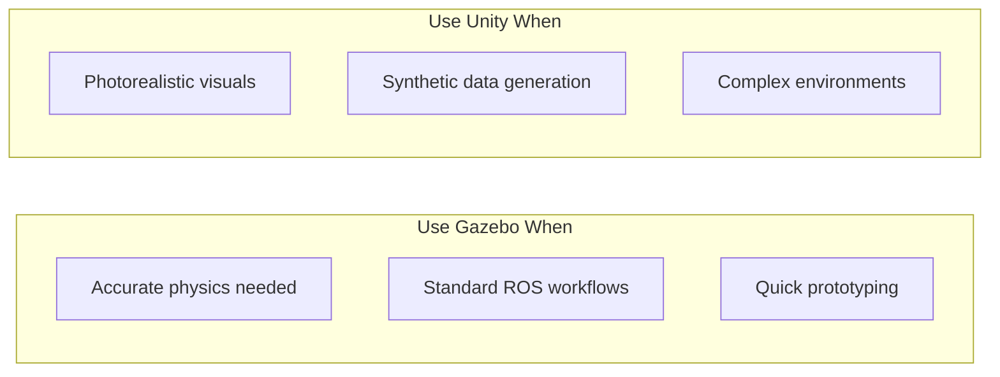
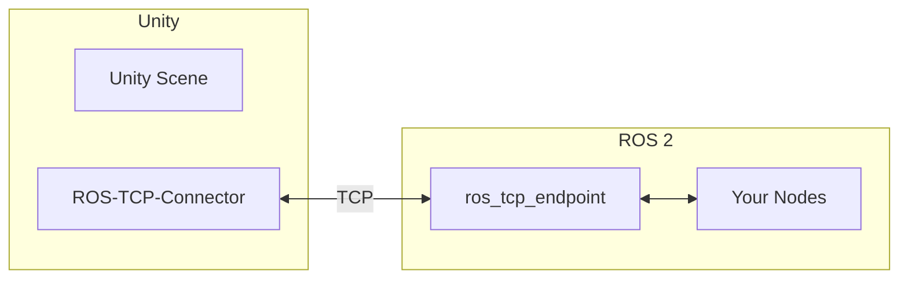

# Unity Simulation

<div className="learning-objectives">

## Learning Objectives

By the end of this chapter, you will be able to:

- Understand when to use Unity vs. Gazebo
- Set up Unity with ROS 2 integration
- Create robot environments in Unity
- Generate synthetic training data

</div>

<div className="prerequisites">

## Prerequisites

Before starting this chapter, ensure you have:

- **Chapter**: Completed [Simulated Sensors](./04-sensors)
- **Software**: Unity 2022 LTS or newer
- **Knowledge**: Basic Unity interface familiarity (helpful)

</div>

## Unity vs. Gazebo

Choose the right tool for your needs:

| Aspect | Gazebo | Unity |
|--------|--------|-------|
| **Primary Use** | Physics simulation | Visual simulation |
| **Rendering** | Good | Excellent |
| **Physics** | Excellent | Good (PhysX) |
| **ROS Integration** | Native | Via package |
| **Learning Curve** | Moderate | Steeper |
| **Asset Ecosystem** | Limited | Vast |
| **Performance** | Good | Excellent (GPU) |
| **Cost** | Free | Free + Paid tiers |



## ROS-Unity Integration

Unity's robotics packages provide ROS 2 integration:

### Installation

```bash
# In Unity Package Manager, add packages:
# 1. ROS-TCP-Connector
# 2. URDF-Importer
# 3. Robotics-Navigation (optional)

# Install ROS-TCP-Endpoint on ROS 2 side
sudo apt install ros-humble-ros-tcp-endpoint

# Or build from source
cd ~/ros2_ws/src
git clone https://github.com/Unity-Technologies/ROS-TCP-Endpoint.git
cd .. && colcon build --packages-select ros_tcp_endpoint
```

### Architecture



## Setting Up a Robot

### Import URDF

```csharp title="URDFImporter.cs"
// Unity C# script for URDF import
using Unity.Robotics.UrdfImporter;
using UnityEngine;

public class RobotLoader : MonoBehaviour
{
    public string urdfPath = "Assets/Robots/humanoid/robot.urdf";

    void Start()
    {
        // Import URDF with default settings
        UrdfRobotExtensions.CreateRuntimeUrdf(
            urdfPath,
            new ImportSettings
            {
                chosenAxis = ImportSettings.axisType.yAxis,
                convexMethod = ImportSettings.convexDecomposer.vHACD
            }
        );
    }
}
```

### Add ROS Publishers/Subscribers

```csharp title="ROSSensors.cs"
using RosMessageTypes.Sensor;
using Unity.Robotics.ROSTCPConnector;
using UnityEngine;

public class CameraSensor : MonoBehaviour
{
    public Camera robotCamera;
    public string topicName = "camera/image_raw";
    public int publishRate = 30;

    private ROSConnection ros;
    private RenderTexture renderTexture;
    private Texture2D texture2D;
    private float publishInterval;
    private float timeElapsed;

    void Start()
    {
        ros = ROSConnection.GetOrCreateInstance();
        ros.RegisterPublisher<ImageMsg>(topicName);

        renderTexture = new RenderTexture(640, 480, 24);
        robotCamera.targetTexture = renderTexture;
        texture2D = new Texture2D(640, 480, TextureFormat.RGB24, false);

        publishInterval = 1.0f / publishRate;
    }

    void Update()
    {
        timeElapsed += Time.deltaTime;
        if (timeElapsed >= publishInterval)
        {
            PublishImage();
            timeElapsed = 0;
        }
    }

    void PublishImage()
    {
        // Capture camera render
        RenderTexture.active = renderTexture;
        texture2D.ReadPixels(new Rect(0, 0, 640, 480), 0, 0);
        texture2D.Apply();

        // Create ROS message
        byte[] imageData = texture2D.GetRawTextureData();
        ImageMsg msg = new ImageMsg
        {
            header = new RosMessageTypes.Std.HeaderMsg
            {
                stamp = new RosMessageTypes.BuiltinInterfaces.TimeMsg(),
                frame_id = "camera_link"
            },
            height = 480,
            width = 640,
            encoding = "rgb8",
            is_bigendian = 0,
            step = 640 * 3,
            data = imageData
        };

        ros.Publish(topicName, msg);
    }
}
```

### Receive Commands

```csharp title="ROSController.cs"
using RosMessageTypes.Geometry;
using Unity.Robotics.ROSTCPConnector;
using UnityEngine;

public class DifferentialDrive : MonoBehaviour
{
    public ArticulationBody leftWheel;
    public ArticulationBody rightWheel;
    public float wheelRadius = 0.1f;
    public float wheelBase = 0.5f;

    private ROSConnection ros;
    private Vector2 currentVelocity;

    void Start()
    {
        ros = ROSConnection.GetOrCreateInstance();
        ros.Subscribe<TwistMsg>("cmd_vel", OnCmdVelReceived);
    }

    void OnCmdVelReceived(TwistMsg msg)
    {
        // Convert Twist to wheel velocities
        float linear = (float)msg.linear.x;
        float angular = (float)msg.angular.z;

        float leftSpeed = (linear - angular * wheelBase / 2) / wheelRadius;
        float rightSpeed = (linear + angular * wheelBase / 2) / wheelRadius;

        currentVelocity = new Vector2(leftSpeed, rightSpeed);
    }

    void FixedUpdate()
    {
        // Apply wheel velocities
        SetWheelVelocity(leftWheel, currentVelocity.x);
        SetWheelVelocity(rightWheel, currentVelocity.y);
    }

    void SetWheelVelocity(ArticulationBody wheel, float velocity)
    {
        var drive = wheel.xDrive;
        drive.targetVelocity = velocity * Mathf.Rad2Deg;
        wheel.xDrive = drive;
    }
}
```

## Synthetic Data Generation

Unity excels at generating training data for perception:

### Domain Randomization

```csharp title="DomainRandomization.cs"
using UnityEngine;
using UnityEngine.Perception.Randomization.Parameters;
using UnityEngine.Perception.Randomization.Randomizers;

[Serializable]
public class LightingRandomizer : Randomizer
{
    public FloatParameter intensity = new FloatParameter
    {
        value = new UniformSampler(0.5f, 2.0f)
    };
    public ColorHsvaParameter color = new ColorHsvaParameter();

    public Light[] lights;

    protected override void OnIterationStart()
    {
        foreach (var light in lights)
        {
            light.intensity = intensity.Sample();
            light.color = color.Sample();
        }
    }
}

[Serializable]
public class TextureRandomizer : Randomizer
{
    public Texture2D[] randomTextures;
    public GameObject[] targetObjects;

    protected override void OnIterationStart()
    {
        foreach (var obj in targetObjects)
        {
            var renderer = obj.GetComponent<Renderer>();
            int idx = Random.Range(0, randomTextures.Length);
            renderer.material.mainTexture = randomTextures[idx];
        }
    }
}
```

### Automated Labeling

```csharp title="PerceptionSetup.cs"
using UnityEngine;
using UnityEngine.Perception.GroundTruth;

public class PerceptionSetup : MonoBehaviour
{
    public Camera perceptionCamera;

    void Start()
    {
        // Add labelers for different annotation types
        var cameraLabeler = perceptionCamera.GetComponent<PerceptionCamera>();

        // Bounding box labeler
        cameraLabeler.AddLabeler(new BoundingBox2DLabeler());

        // Semantic segmentation
        cameraLabeler.AddLabeler(new SemanticSegmentationLabeler());

        // Instance segmentation
        cameraLabeler.AddLabeler(new InstanceSegmentationLabeler());

        // Keypoint labeling (for pose estimation)
        cameraLabeler.AddLabeler(new KeypointLabeler());
    }
}
```

### Output Formats

Unity Perception generates:

```text
output/
├── Dataset/
│   ├── captures_000.json
│   ├── captures_001.json
│   └── ...
├── RGB/
│   ├── rgb_0001.png
│   ├── rgb_0002.png
│   └── ...
├── SemanticSegmentation/
│   ├── segmentation_0001.png
│   └── ...
└── annotations/
    ├── bounding_box_2d.json
    └── keypoints.json
```

## Performance Tips

### Physics Settings

```csharp
// Project Settings > Physics
// Fixed Timestep: 0.001 (1ms for humanoids)
// Solver Iterations: 10-20
// Solver Velocity Iterations: 1

// For ArticulationBody (recommended for robots):
// Use reduced coordinate solvers
// Enable GPU physics if available
```

### Rendering Optimization

```csharp
// Use LOD groups for complex environments
// Bake lighting for static scenes
// Use occlusion culling
// Consider URP or HDRP based on needs
```

## Launch Integration

```python title="launch/unity_robot.launch.py"
from launch import LaunchDescription
from launch_ros.actions import Node


def generate_launch_description():
    # ROS-TCP-Endpoint for Unity communication
    tcp_endpoint = Node(
        package='ros_tcp_endpoint',
        executable='default_server_endpoint',
        parameters=[{
            'ROS_IP': '0.0.0.0',
            'ROS_TCP_PORT': 10000,
        }],
        output='screen'
    )

    # Your robot nodes that interact with Unity
    controller = Node(
        package='my_robot_pkg',
        executable='robot_controller',
        parameters=[{'use_sim_time': True}]
    )

    return LaunchDescription([
        tcp_endpoint,
        controller,
    ])
```

<div className="key-takeaways">

## Key Takeaways

- **Unity** excels at visual fidelity and synthetic data generation
- **ROS-TCP-Connector** bridges Unity and ROS 2 via TCP
- **URDF import** is supported via Unity Robotics packages
- **Domain randomization** improves sim-to-real transfer for perception
- **Unity Perception** generates labeled datasets automatically
- Use **ArticulationBody** for physically accurate robot simulation

</div>

## What's Next?

In the next chapter, we'll create complete simulation environments.

## References

1. Unity Technologies. (2024). *Unity Robotics Hub*. https://github.com/Unity-Technologies/Unity-Robotics-Hub
2. Unity Technologies. (2024). *Perception Package*. https://github.com/Unity-Technologies/com.unity.perception
