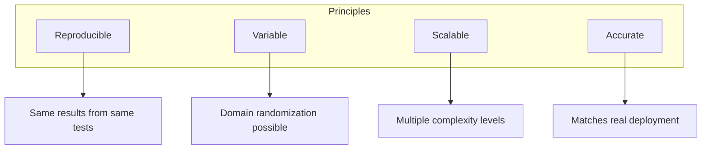

# Simulation Environments

<div className="learning-objectives">

## Learning Objectives

By the end of this chapter, you will be able to:

- Design simulation environments for robot testing
- Create indoor and warehouse environments
- Add dynamic elements (people, objects, doors)
- Use environment templates and asset libraries

</div>

<div className="prerequisites">

## Prerequisites

Before starting this chapter, ensure you have:

- **Chapter**: Completed [Unity Simulation](./05-unity)
- **Software**: Gazebo with model libraries installed
- **Skills**: Basic 3D modeling concepts

</div>

## Environment Design Principles

Good simulation environments should be:



### Complexity Levels

| Level | Description | Use Case |
|-------|-------------|----------|
| **Empty** | Flat ground only | Algorithm testing |
| **Simple** | Basic obstacles | Initial navigation |
| **Moderate** | Furniture, walls | Indoor navigation |
| **Complex** | Full environment | Integration testing |
| **Realistic** | Dynamic elements | Final validation |

## Indoor Environment

```xml title="worlds/apartment.sdf"
<?xml version="1.0" ?>
<sdf version="1.8">
  <world name="apartment">
    <!-- Physics and plugins -->
    <physics type="ode">
      <max_step_size>0.001</max_step_size>
      <real_time_factor>1</real_time_factor>
    </physics>

    <plugin filename="gz-sim-physics-system" name="gz::sim::systems::Physics"/>
    <plugin filename="gz-sim-scene-broadcaster-system" name="gz::sim::systems::SceneBroadcaster"/>
    <plugin filename="gz-sim-user-commands-system" name="gz::sim::systems::UserCommands"/>
    <plugin filename="gz-sim-sensors-system" name="gz::sim::systems::Sensors"/>

    <!-- Lighting -->
    <light type="directional" name="sun">
      <cast_shadows>true</cast_shadows>
      <pose>0 0 10 0 0 0</pose>
      <diffuse>1 1 1 1</diffuse>
      <direction>-0.5 0.1 -0.9</direction>
    </light>

    <!-- Floor -->
    <model name="floor">
      <static>true</static>
      <link name="link">
        <collision name="collision">
          <geometry>
            <plane><normal>0 0 1</normal></plane>
          </geometry>
          <surface>
            <friction>
              <ode><mu>0.8</mu><mu2>0.8</mu2></ode>
            </friction>
          </surface>
        </collision>
        <visual name="visual">
          <geometry>
            <plane><normal>0 0 1</normal><size>10 10</size></plane>
          </geometry>
          <material>
            <ambient>0.8 0.8 0.7 1</ambient>
          </material>
        </visual>
      </link>
    </model>

    <!-- Walls -->
    <include>
      <uri>model://wall</uri>
      <name>wall_north</name>
      <pose>0 5 1.25 0 0 0</pose>
      <static>true</static>
    </include>

    <include>
      <uri>model://wall</uri>
      <name>wall_south</name>
      <pose>0 -5 1.25 0 0 3.14159</pose>
      <static>true</static>
    </include>

    <!-- Furniture -->
    <include>
      <uri>model://table</uri>
      <name>dining_table</name>
      <pose>2 2 0 0 0 0</pose>
    </include>

    <include>
      <uri>model://chair</uri>
      <name>chair_1</name>
      <pose>2.5 2 0 0 0 1.57</pose>
    </include>

    <include>
      <uri>model://couch</uri>
      <name>sofa</name>
      <pose>-2 0 0 0 0 0</pose>
    </include>
  </world>
</sdf>
```

## Warehouse Environment

```xml title="worlds/warehouse.sdf"
<?xml version="1.0" ?>
<sdf version="1.8">
  <world name="warehouse">
    <physics type="ode">
      <max_step_size>0.001</max_step_size>
      <real_time_factor>1</real_time_factor>
    </physics>

    <!-- Industrial lighting -->
    <light type="point" name="overhead_1">
      <pose>5 5 8 0 0 0</pose>
      <diffuse>0.9 0.9 0.85 1</diffuse>
      <attenuation>
        <range>50</range>
        <linear>0.01</linear>
      </attenuation>
    </light>

    <!-- Concrete floor -->
    <model name="floor">
      <static>true</static>
      <link name="link">
        <collision name="collision">
          <geometry><box><size>30 20 0.1</size></box></geometry>
        </collision>
        <visual name="visual">
          <geometry><box><size>30 20 0.1</size></box></geometry>
          <material>
            <ambient>0.5 0.5 0.5 1</ambient>
            <diffuse>0.6 0.6 0.6 1</diffuse>
          </material>
        </visual>
      </link>
    </model>

    <!-- Shelf rows -->
    <include>
      <uri>model://warehouse_shelf</uri>
      <name>shelf_row_a1</name>
      <pose>-8 -5 0 0 0 0</pose>
    </include>
    <include>
      <uri>model://warehouse_shelf</uri>
      <name>shelf_row_a2</name>
      <pose>-8 0 0 0 0 0</pose>
    </include>
    <include>
      <uri>model://warehouse_shelf</uri>
      <name>shelf_row_a3</name>
      <pose>-8 5 0 0 0 0</pose>
    </include>

    <!-- Pallets with boxes -->
    <include>
      <uri>model://pallet_with_boxes</uri>
      <name>pallet_1</name>
      <pose>5 -3 0 0 0 0</pose>
    </include>

    <!-- Forklift (static obstacle) -->
    <include>
      <uri>model://forklift</uri>
      <name>parked_forklift</name>
      <pose>10 0 0 0 0 1.57</pose>
      <static>true</static>
    </include>
  </world>
</sdf>
```

## Dynamic Elements

### Moving Objects

```xml title="Dynamic conveyor belt"
<model name="conveyor">
  <static>false</static>
  <link name="belt">
    <collision name="collision">
      <geometry><box><size>5 0.5 0.1</size></box></geometry>
      <surface>
        <friction>
          <ode><mu>0.1</mu></ode>  <!-- Low friction for sliding -->
        </friction>
      </surface>
    </collision>
    <!-- Visual -->
  </link>

  <plugin filename="gz-sim-conveyor-belt-system"
          name="gz::sim::systems::ConveyorBelt">
    <link_name>belt</link_name>
    <velocity>0.5</velocity>  <!-- m/s -->
  </plugin>
</model>
```

### Doors

```xml title="Automatic door"
<model name="automatic_door">
  <link name="frame">
    <pose>0 0 1.1 0 0 0</pose>
    <visual name="visual">
      <geometry><box><size>1.2 0.1 2.2</size></box></geometry>
    </visual>
    <collision name="collision">
      <geometry><box><size>1.2 0.1 2.2</size></box></geometry>
    </collision>
  </link>

  <link name="door_panel">
    <pose>0 0 1 0 0 0</pose>
    <inertial>
      <mass>20</mass>
    </inertial>
    <visual name="visual">
      <geometry><box><size>0.9 0.05 2.0</size></box></geometry>
    </visual>
    <collision name="collision">
      <geometry><box><size>0.9 0.05 2.0</size></box></geometry>
    </collision>
  </link>

  <joint name="door_slide" type="prismatic">
    <parent>frame</parent>
    <child>door_panel</child>
    <axis>
      <xyz>1 0 0</xyz>
      <limit>
        <lower>0</lower>
        <upper>0.9</upper>
      </limit>
    </axis>
  </joint>

  <!-- Door controller plugin would go here -->
</model>
```

## Procedural Generation

Generate environments programmatically:

```python title="generate_warehouse.py"
#!/usr/bin/env python3
"""Generate warehouse world with configurable shelving."""

import xml.etree.ElementTree as ET
import random


def generate_warehouse(
    rows: int = 4,
    shelves_per_row: int = 5,
    aisle_width: float = 3.0,
    shelf_spacing: float = 2.5
) -> str:
    """Generate SDF world for warehouse."""

    root = ET.Element('sdf', version='1.8')
    world = ET.SubElement(root, 'world', name='warehouse')

    # Physics
    physics = ET.SubElement(world, 'physics', type='ode')
    ET.SubElement(physics, 'max_step_size').text = '0.001'
    ET.SubElement(physics, 'real_time_factor').text = '1'

    # Floor
    floor = create_floor_model(30, 20)
    world.append(floor)

    # Generate shelf rows
    for row in range(rows):
        y_pos = (row - rows/2 + 0.5) * aisle_width

        for shelf in range(shelves_per_row):
            x_pos = (shelf - shelves_per_row/2 + 0.5) * shelf_spacing

            include = ET.SubElement(world, 'include')
            ET.SubElement(include, 'uri').text = 'model://warehouse_shelf'
            ET.SubElement(include, 'name').text = f'shelf_{row}_{shelf}'
            ET.SubElement(include, 'pose').text = f'{x_pos} {y_pos} 0 0 0 0'

    # Random pallets
    for i in range(10):
        x = random.uniform(-12, 12)
        y = random.uniform(-8, 8)
        yaw = random.uniform(0, 6.28)

        include = ET.SubElement(world, 'include')
        ET.SubElement(include, 'uri').text = 'model://pallet'
        ET.SubElement(include, 'name').text = f'pallet_{i}'
        ET.SubElement(include, 'pose').text = f'{x} {y} 0 0 0 {yaw}'

    return ET.tostring(root, encoding='unicode')


def create_floor_model(width: float, depth: float) -> ET.Element:
    """Create floor model element."""
    model = ET.Element('model', name='floor')
    ET.SubElement(model, 'static').text = 'true'

    link = ET.SubElement(model, 'link', name='link')

    collision = ET.SubElement(link, 'collision', name='collision')
    geom = ET.SubElement(collision, 'geometry')
    box = ET.SubElement(geom, 'box')
    ET.SubElement(box, 'size').text = f'{width} {depth} 0.1'

    visual = ET.SubElement(link, 'visual', name='visual')
    geom = ET.SubElement(visual, 'geometry')
    box = ET.SubElement(geom, 'box')
    ET.SubElement(box, 'size').text = f'{width} {depth} 0.1'

    return model


if __name__ == '__main__':
    world_sdf = generate_warehouse(rows=4, shelves_per_row=6)
    with open('warehouse_generated.sdf', 'w') as f:
        f.write('<?xml version="1.0" ?>\n')
        f.write(world_sdf)
```

## Asset Libraries

### Gazebo Fuel

Access community models:

```bash
# Search for models
gz fuel search table

# Download a model
gz fuel download -u "https://fuel.gazebosim.org/1.0/OpenRobotics/models/Table"

# Use in world file
<include>
  <uri>https://fuel.gazebosim.org/1.0/OpenRobotics/models/Table</uri>
</include>
```

### Creating Custom Models

```xml title="models/box/model.sdf"
<?xml version="1.0" ?>
<sdf version="1.8">
  <model name="cardboard_box">
    <link name="link">
      <inertial>
        <mass>2.0</mass>
        <inertia>
          <ixx>0.02</ixx>
          <iyy>0.02</iyy>
          <izz>0.02</izz>
        </inertia>
      </inertial>
      <collision name="collision">
        <geometry>
          <box><size>0.3 0.3 0.3</size></box>
        </geometry>
        <surface>
          <friction>
            <ode><mu>0.6</mu></ode>
          </friction>
        </surface>
      </collision>
      <visual name="visual">
        <geometry>
          <box><size>0.3 0.3 0.3</size></box>
        </geometry>
        <material>
          <ambient>0.8 0.6 0.4 1</ambient>
        </material>
      </visual>
    </link>
  </model>
</sdf>
```

<div className="key-takeaways">

## Key Takeaways

- Design environments at **multiple complexity levels** for progressive testing
- Use **static models** for fixed obstacles to improve performance
- Add **dynamic elements** (doors, conveyors) for realistic scenarios
- **Procedural generation** creates varied test environments efficiently
- **Gazebo Fuel** provides community models and assets
- Always include proper **collision and friction** properties

</div>

## What's Next?

You've completed Module 2! In Module 3, we'll explore NVIDIA Isaac for GPU-accelerated robotics.

## References

1. Gazebo. (2024). *World Building Tutorial*. https://gazebosim.org/docs/garden/building_robot
2. Gazebo Fuel. (2024). *Model Repository*. https://app.gazebosim.org/fuel/models
