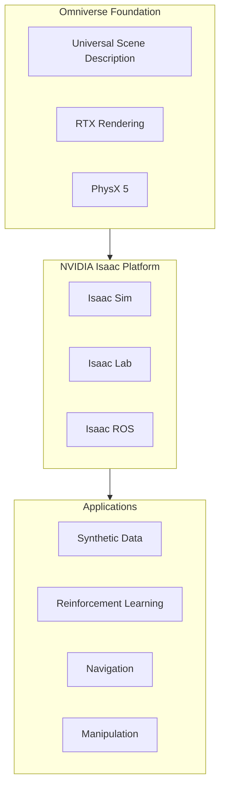
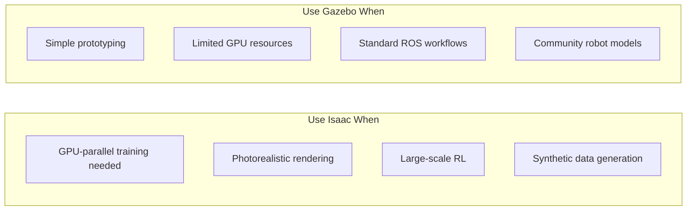

# NVIDIA Isaac Platform

<div className="learning-objectives">

## Learning Objectives

By the end of this chapter, you will be able to:

- Understand the NVIDIA Isaac ecosystem components
- Set up Isaac Sim for robotics simulation
- Navigate the Omniverse platform
- Identify when to use Isaac vs. other simulators

</div>

<div className="prerequisites">

## Prerequisites

Before starting this chapter, ensure you have:

- **Module 2**: Completed [Simulation Environments](../module2-simulation/06-environments)
- **Hardware**: NVIDIA RTX GPU (20-series or newer recommended)
- **Software**: Ubuntu 22.04 LTS, NVIDIA drivers 525+

</div>

## The Isaac Ecosystem

NVIDIA Isaac is a comprehensive platform for robotics:



### Component Overview

| Component | Purpose | Key Features |
|-----------|---------|--------------|
| **Isaac Sim** | Physics simulation | RTX rendering, PhysX 5, USD scenes |
| **Isaac Lab** | RL training | GPU-parallel envs, curriculum learning |
| **Isaac ROS** | Deployment | Optimized perception, Nav2 integration |
| **Omniverse** | Platform | USD, collaboration, extensions |

## Hardware Requirements

### Minimum Specifications

```yaml
GPU: NVIDIA RTX 2070 or equivalent
  - VRAM: 8GB minimum
  - Compute: CUDA 11.4+

CPU: Intel i7 / AMD Ryzen 7
  - Cores: 8+ recommended
  - RAM: 32GB minimum

Storage: NVMe SSD
  - Space: 50GB+ for Isaac Sim
  - Speed: Affects scene loading
```

### Recommended for Training

```yaml
GPU: NVIDIA RTX 4090 or A100
  - VRAM: 24GB+ for large batches
  - Multiple GPUs for parallel training

CPU: High core count
  - Cores: 16+ for data processing
  - RAM: 64GB+ for complex scenes

Storage: High-speed NVMe
  - Space: 500GB+ for datasets
```

## Installation

### Isaac Sim via Omniverse

```bash
# 1. Download Omniverse Launcher
# https://www.nvidia.com/en-us/omniverse/download/

# 2. Install via launcher:
# - Open Omniverse Launcher
# - Go to "Exchange" tab
# - Search "Isaac Sim"
# - Click "Install" (4.2.0 or latest)

# 3. Verify installation
~/.local/share/ov/pkg/isaac-sim-*/isaac-sim.sh --help
```

### Isaac Lab Setup

```bash
# Clone Isaac Lab
git clone https://github.com/isaac-sim/IsaacLab.git
cd IsaacLab

# Create conda environment
conda create -n isaaclab python=3.10 -y
conda activate isaaclab

# Install Isaac Lab
./isaaclab.sh --install

# Verify installation
python -c "import omni.isaac.lab; print('Isaac Lab ready')"
```

### Isaac ROS (for Deployment)

```bash
# Add NVIDIA apt repository
sudo apt-key adv --fetch-keys https://isaac.download.nvidia.com/isaac-ros/repos.key
echo "deb https://isaac.download.nvidia.com/isaac-ros/ubuntu/main focal main" | \
  sudo tee /etc/apt/sources.list.d/isaac-ros.list

# Install Isaac ROS packages
sudo apt update
sudo apt install ros-humble-isaac-ros-common
sudo apt install ros-humble-isaac-ros-visual-slam
sudo apt install ros-humble-isaac-ros-nvblox
```

## Isaac Sim Basics

### Launching Isaac Sim

```bash
# Launch with default settings
~/.local/share/ov/pkg/isaac-sim-*/isaac-sim.sh

# Launch in headless mode (for training)
~/.local/share/ov/pkg/isaac-sim-*/isaac-sim.sh --headless

# Launch with specific extensions
~/.local/share/ov/pkg/isaac-sim-*/isaac-sim.sh \
  --ext-folder /path/to/extensions
```

### USD Scene Structure

Universal Scene Description (USD) is the foundation:

```python
"""Basic USD scene manipulation in Isaac Sim."""

from omni.isaac.core import World
from omni.isaac.core.prims import XFormPrim
from pxr import Usd, UsdGeom

# Create simulation world
world = World(stage_units_in_meters=1.0)

# Add ground plane
world.scene.add_default_ground_plane()

# Create a simple object
cube_prim = world.scene.add(
    XFormPrim(
        prim_path="/World/Cube",
        name="my_cube",
        position=[0, 0, 0.5],
        scale=[0.5, 0.5, 0.5]
    )
)

# Access USD stage directly
stage = world.stage
prim = stage.GetPrimAtPath("/World/Cube")

# Add physics
from omni.isaac.core.utils.physics import set_rigid_body_properties
set_rigid_body_properties(
    prim_path="/World/Cube",
    mass=1.0,
    linear_damping=0.1
)
```

### Loading Robot Models

```python
"""Load and configure a robot in Isaac Sim."""

from omni.isaac.core import World
from omni.isaac.core.robots import Robot
from omni.isaac.core.utils.nucleus import get_assets_root_path

# Initialize world
world = World()

# Get asset path
assets_root = get_assets_root_path()
robot_usd = f"{assets_root}/Isaac/Robots/Humanoid/humanoid.usd"

# Add robot to scene
robot = world.scene.add(
    Robot(
        prim_path="/World/Robot",
        name="humanoid",
        usd_path=robot_usd,
        position=[0, 0, 1.0]
    )
)

# Initialize simulation
world.reset()

# Get robot state
joint_positions = robot.get_joint_positions()
joint_velocities = robot.get_joint_velocities()

print(f"Joints: {robot.num_dof}")
print(f"Positions: {joint_positions}")
```

## When to Use Isaac

### Isaac Sim vs. Gazebo



### Decision Matrix

| Factor | Choose Isaac | Choose Gazebo |
|--------|--------------|---------------|
| **Training scale** | 1000s parallel envs | Single env |
| **GPU available** | RTX 20+ series | Integrated/CPU |
| **Rendering needs** | Photorealistic | Functional |
| **ROS integration** | Isaac ROS | Native |
| **Learning curve** | Steeper | Moderate |
| **Cost** | Free (hardware req) | Free |

## Basic Simulation Loop

```python
"""Basic Isaac Sim simulation loop."""

from omni.isaac.core import World
from omni.isaac.core.robots import Robot
import numpy as np

class IsaacSimulation:
    """Wrapper for Isaac Sim simulation."""

    def __init__(self, headless: bool = False):
        self.world = World(
            stage_units_in_meters=1.0,
            physics_dt=1/60,
            rendering_dt=1/60
        )
        self.robot = None

    def setup_scene(self, robot_usd: str):
        """Initialize the simulation scene."""
        # Add ground
        self.world.scene.add_default_ground_plane()

        # Add robot
        self.robot = self.world.scene.add(
            Robot(
                prim_path="/World/Robot",
                name="robot",
                usd_path=robot_usd
            )
        )

        # Reset to initialize
        self.world.reset()

    def step(self, actions: np.ndarray) -> dict:
        """Execute one simulation step."""
        # Apply actions to robot
        self.robot.set_joint_position_targets(actions)

        # Step physics
        self.world.step(render=True)

        # Get observations
        obs = {
            "joint_pos": self.robot.get_joint_positions(),
            "joint_vel": self.robot.get_joint_velocities(),
            "root_pos": self.robot.get_world_pose()[0],
            "root_quat": self.robot.get_world_pose()[1],
        }

        return obs

    def reset(self):
        """Reset simulation to initial state."""
        self.world.reset()
        return self.step(np.zeros(self.robot.num_dof))


# Usage
if __name__ == "__main__":
    sim = IsaacSimulation()
    sim.setup_scene("/path/to/robot.usd")

    for _ in range(1000):
        actions = np.random.randn(sim.robot.num_dof) * 0.1
        obs = sim.step(actions)
```

## Extension System

Isaac Sim uses Omniverse extensions:

```python
"""Creating a custom Isaac Sim extension."""

import omni.ext
from omni.isaac.core import World

class MyRobotExtension(omni.ext.IExt):
    """Custom extension for robot control."""

    def on_startup(self, ext_id):
        """Called when extension starts."""
        print(f"[MyRobot] Starting extension: {ext_id}")

        # Register UI elements
        self._window = None
        self._build_ui()

    def on_shutdown(self):
        """Called when extension stops."""
        print("[MyRobot] Shutting down")
        if self._window:
            self._window.destroy()

    def _build_ui(self):
        """Build extension UI."""
        import omni.ui as ui

        self._window = ui.Window("My Robot Control", width=300, height=200)
        with self._window.frame:
            with ui.VStack():
                ui.Label("Robot Controller")
                ui.Button("Reset Robot", clicked_fn=self._reset_robot)
                ui.Button("Start Walking", clicked_fn=self._start_walking)

    def _reset_robot(self):
        """Reset robot to initial pose."""
        world = World.instance()
        if world:
            world.reset()

    def _start_walking(self):
        """Start robot walking behavior."""
        # Implement walking logic
        pass
```

<div className="key-takeaways">

## Key Takeaways

- **Isaac platform** includes Sim (simulation), Lab (RL), and ROS (deployment)
- **Omniverse** provides USD scenes, RTX rendering, and PhysX physics
- **GPU requirements**: RTX 20-series minimum, 4090/A100 for training
- **USD** is the universal scene format for Isaac
- Choose **Isaac** for GPU-parallel training and photorealistic rendering
- Choose **Gazebo** for quick prototyping and standard ROS workflows

</div>

## What's Next?

In the next chapter, we'll explore synthetic data generation with Isaac Sim.

## References

1. NVIDIA. (2024). *Isaac Sim Documentation*. https://docs.omniverse.nvidia.com/isaacsim/
2. NVIDIA. (2024). *Isaac Lab*. https://isaac-sim.github.io/IsaacLab/
3. Pixar. (2024). *Universal Scene Description*. https://openusd.org/
