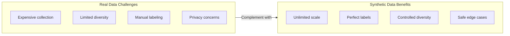
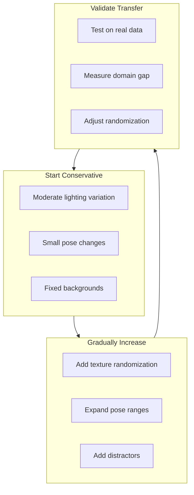

# Synthetic Data Generation

<div className="learning-objectives">

## Learning Objectives

By the end of this chapter, you will be able to:

- Use Isaac Sim Replicator for data generation
- Configure domain randomization strategies
- Generate labeled datasets for object detection
- Export data in standard ML formats

</div>

<div className="prerequisites">

## Prerequisites

Before starting this chapter, ensure you have:

- **Chapter**: Completed [Isaac Overview](./01-isaac-overview)
- **Software**: Isaac Sim with Replicator extension
- **Knowledge**: Basic understanding of ML dataset formats

</div>

## Why Synthetic Data?

Real-world data collection is expensive and limited:



### Use Cases

| Application | Real Data Challenge | Synthetic Solution |
|-------------|--------------------|--------------------|
| Object detection | Manual bounding boxes | Auto-labeled |
| Pose estimation | Marker-based capture | Ground truth poses |
| Segmentation | Pixel-level labels | Perfect masks |
| Depth estimation | Expensive sensors | Perfect depth maps |
| Rare events | Hard to capture | Easy to simulate |

## Isaac Replicator

Replicator is Isaac Sim's data generation framework:

```python
"""Basic Replicator setup for synthetic data generation."""

import omni.replicator.core as rep
from omni.isaac.core import World

# Initialize world
world = World()

# Create camera
camera = rep.create.camera(
    position=(2, 2, 2),
    look_at=(0, 0, 0),
    focal_length=35
)

# Create render product
render_product = rep.create.render_product(camera, (640, 480))

# Configure output
writer = rep.WriterRegistry.get("BasicWriter")
writer.initialize(
    output_dir="/tmp/synthetic_data",
    rgb=True,
    bounding_box_2d_tight=True,
    semantic_segmentation=True,
    distance_to_camera=True
)
writer.attach(render_product)
```

### Supported Annotations

```python
"""Available annotation types in Replicator."""

writer.initialize(
    output_dir="/tmp/data",

    # RGB and depth
    rgb=True,
    distance_to_camera=True,  # Depth
    distance_to_image_plane=True,  # Alternative depth

    # Detection annotations
    bounding_box_2d_tight=True,
    bounding_box_2d_loose=True,
    bounding_box_3d=True,

    # Segmentation
    semantic_segmentation=True,
    instance_segmentation=True,

    # Pose and geometry
    skeleton_data=True,  # For humanoids
    normals=True,
    pointcloud=True,

    # Motion
    motion_vectors=True,

    # Metadata
    occlusion=True,
)
```

## Domain Randomization

Vary scene parameters to improve model generalization:

### Lighting Randomization

```python
"""Randomize lighting conditions."""

import omni.replicator.core as rep

def randomize_lighting():
    """Create varied lighting conditions."""

    # Create randomizable lights
    lights = rep.create.light(
        light_type="Dome",
        rotation=rep.distribution.uniform((0, 0, 0), (360, 360, 360)),
        intensity=rep.distribution.uniform(500, 2000),
        temperature=rep.distribution.uniform(4000, 8000)
    )

    # Add directional light
    sun = rep.create.light(
        light_type="Distant",
        rotation=rep.distribution.uniform((30, 0, 0), (60, 360, 0)),
        intensity=rep.distribution.uniform(1000, 5000)
    )

    return lights, sun


# Register randomizer
with rep.trigger.on_frame(num_frames=100):
    randomize_lighting()
```

### Object Randomization

```python
"""Randomize object appearance and placement."""

import omni.replicator.core as rep

def setup_object_randomization():
    """Configure object variations."""

    # Get objects to randomize
    objects = rep.get.prims(path_pattern="/World/Objects/*")

    with objects:
        # Position randomization
        rep.modify.pose(
            position=rep.distribution.uniform(
                (-2, -2, 0.1),
                (2, 2, 0.1)
            ),
            rotation=rep.distribution.uniform(
                (0, 0, 0),
                (0, 0, 360)
            )
        )

        # Scale randomization
        rep.modify.pose(
            scale=rep.distribution.uniform(0.8, 1.2)
        )

    return objects


def randomize_materials():
    """Randomize object materials."""

    objects = rep.get.prims(semantics=[("class", "target_object")])

    with objects:
        rep.randomizer.materials(
            materials=[
                "/World/Materials/Metal",
                "/World/Materials/Plastic",
                "/World/Materials/Wood",
                "/World/Materials/Rubber"
            ]
        )
```

### Texture Randomization

```python
"""Randomize textures for domain randomization."""

import omni.replicator.core as rep

def setup_texture_randomization():
    """Apply random textures to surfaces."""

    # Background surfaces
    backgrounds = rep.get.prims(
        semantics=[("class", "background")]
    )

    # Texture paths
    textures = [
        "/World/Textures/concrete_01",
        "/World/Textures/wood_floor",
        "/World/Textures/tile_white",
        "/World/Textures/carpet_gray",
    ]

    with backgrounds:
        rep.randomizer.texture(textures=textures)


def setup_color_randomization():
    """Randomize object colors."""

    objects = rep.get.prims(
        semantics=[("class", "distractor")]
    )

    with objects:
        rep.randomizer.color(
            colors=rep.distribution.uniform(
                (0.2, 0.2, 0.2),
                (1.0, 1.0, 1.0)
            )
        )
```

## Complete Data Generation Pipeline

```python
"""Complete synthetic data generation pipeline."""

import omni.replicator.core as rep
from omni.isaac.core import World
from omni.isaac.core.utils.nucleus import get_assets_root_path
import numpy as np

class SyntheticDataGenerator:
    """Generate synthetic training data with Replicator."""

    def __init__(self, output_dir: str, num_frames: int = 1000):
        self.output_dir = output_dir
        self.num_frames = num_frames
        self.world = World()

    def setup_scene(self):
        """Create base scene with objects."""
        # Add ground
        self.world.scene.add_default_ground_plane()

        # Add target objects
        assets_root = get_assets_root_path()

        # Add warehouse items
        objects = [
            f"{assets_root}/Isaac/Props/YCB/Axis_Aligned/003_cracker_box.usd",
            f"{assets_root}/Isaac/Props/YCB/Axis_Aligned/004_sugar_box.usd",
            f"{assets_root}/Isaac/Props/YCB/Axis_Aligned/005_tomato_soup_can.usd",
        ]

        for i, obj_path in enumerate(objects):
            rep.create.from_usd(
                obj_path,
                semantics=[("class", "target_object")],
                position=(i * 0.3, 0, 0.1)
            )

        # Add distractors
        for i in range(10):
            rep.create.cube(
                position=rep.distribution.uniform((-2, -2, 0.1), (2, 2, 0.5)),
                scale=rep.distribution.uniform(0.05, 0.2),
                semantics=[("class", "distractor")]
            )

    def setup_cameras(self):
        """Configure camera positions."""
        # Multiple camera views
        self.cameras = []

        # Top-down view
        cam_top = rep.create.camera(
            position=(0, 0, 3),
            rotation=(-90, 0, 0),
            focal_length=24
        )
        self.cameras.append(cam_top)

        # Angled view
        cam_angle = rep.create.camera(
            position=(2, 2, 1.5),
            look_at=(0, 0, 0),
            focal_length=35
        )
        self.cameras.append(cam_angle)

        # Robot eye view
        cam_robot = rep.create.camera(
            position=(1, 0, 1.2),
            look_at=(0, 0, 0.3),
            focal_length=50
        )
        self.cameras.append(cam_robot)

    def setup_randomizers(self):
        """Configure domain randomization."""

        # Lighting randomization
        with rep.trigger.on_frame():
            rep.create.light(
                light_type="Dome",
                rotation=rep.distribution.uniform((0, 0, 0), (0, 360, 0)),
                intensity=rep.distribution.uniform(500, 2000)
            )

        # Object randomization
        objects = rep.get.prims(semantics=[("class", "target_object")])
        with rep.trigger.on_frame():
            with objects:
                rep.modify.pose(
                    position=rep.distribution.uniform(
                        (-1, -1, 0.1), (1, 1, 0.1)
                    ),
                    rotation=rep.distribution.uniform(
                        (0, 0, 0), (0, 0, 360)
                    )
                )

        # Distractor randomization
        distractors = rep.get.prims(semantics=[("class", "distractor")])
        with rep.trigger.on_frame():
            with distractors:
                rep.modify.pose(
                    position=rep.distribution.uniform(
                        (-2, -2, 0.1), (2, 2, 0.5)
                    )
                )
                rep.randomizer.color(
                    colors=rep.distribution.uniform((0, 0, 0), (1, 1, 1))
                )

    def setup_writer(self):
        """Configure data output."""
        # Create render products for each camera
        self.render_products = []
        for i, cam in enumerate(self.cameras):
            rp = rep.create.render_product(cam, (640, 480))
            self.render_products.append(rp)

        # Configure writer
        writer = rep.WriterRegistry.get("BasicWriter")
        writer.initialize(
            output_dir=self.output_dir,
            rgb=True,
            bounding_box_2d_tight=True,
            bounding_box_3d=True,
            semantic_segmentation=True,
            instance_segmentation=True,
            distance_to_camera=True,
            normals=True
        )

        for rp in self.render_products:
            writer.attach(rp)

    def generate(self):
        """Run data generation."""
        self.setup_scene()
        self.setup_cameras()
        self.setup_randomizers()
        self.setup_writer()

        # Run generation
        rep.orchestrator.run_until_complete(
            num_frames=self.num_frames
        )

        print(f"Generated {self.num_frames} frames to {self.output_dir}")


# Usage
if __name__ == "__main__":
    generator = SyntheticDataGenerator(
        output_dir="/tmp/synthetic_dataset",
        num_frames=5000
    )
    generator.generate()
```

## Output Formats

### COCO Format Export

```python
"""Export synthetic data to COCO format."""

import json
from pathlib import Path

def convert_to_coco(replicator_output: str, output_path: str):
    """Convert Replicator output to COCO format."""

    coco_data = {
        "info": {
            "description": "Synthetic Dataset",
            "version": "1.0",
            "year": 2024,
        },
        "licenses": [],
        "images": [],
        "annotations": [],
        "categories": []
    }

    # Load Replicator annotations
    ann_dir = Path(replicator_output) / "bounding_box_2d_tight"

    for ann_file in ann_dir.glob("*.json"):
        with open(ann_file) as f:
            frame_data = json.load(f)

        # Convert to COCO format
        image_id = len(coco_data["images"])
        coco_data["images"].append({
            "id": image_id,
            "file_name": f"rgb/{ann_file.stem}.png",
            "width": 640,
            "height": 480
        })

        for bbox in frame_data:
            ann_id = len(coco_data["annotations"])
            coco_data["annotations"].append({
                "id": ann_id,
                "image_id": image_id,
                "category_id": bbox["semanticId"],
                "bbox": [
                    bbox["x_min"],
                    bbox["y_min"],
                    bbox["x_max"] - bbox["x_min"],
                    bbox["y_max"] - bbox["y_min"]
                ],
                "area": (bbox["x_max"] - bbox["x_min"]) *
                        (bbox["y_max"] - bbox["y_min"]),
                "iscrowd": 0
            })

    # Write COCO JSON
    with open(output_path, "w") as f:
        json.dump(coco_data, f, indent=2)

    return coco_data
```

### KITTI Format Export

```python
"""Export to KITTI format for 3D detection."""

from pathlib import Path
import numpy as np

def convert_to_kitti(replicator_output: str, output_dir: str):
    """Convert Replicator output to KITTI format."""

    output_path = Path(output_dir)
    (output_path / "image_2").mkdir(parents=True, exist_ok=True)
    (output_path / "label_2").mkdir(parents=True, exist_ok=True)
    (output_path / "calib").mkdir(parents=True, exist_ok=True)

    # Load 3D bounding boxes
    bbox_dir = Path(replicator_output) / "bounding_box_3d"

    for frame_idx, bbox_file in enumerate(sorted(bbox_dir.glob("*.json"))):
        with open(bbox_file) as f:
            bboxes = json.load(f)

        # Write KITTI label
        label_path = output_path / "label_2" / f"{frame_idx:06d}.txt"
        with open(label_path, "w") as f:
            for bbox in bboxes:
                # KITTI format: type truncated occluded alpha bbox dimensions location rotation
                line = f"{bbox['class']} 0 0 0 "
                line += f"{bbox['x_min']} {bbox['y_min']} {bbox['x_max']} {bbox['y_max']} "
                line += f"{bbox['height']} {bbox['width']} {bbox['length']} "
                line += f"{bbox['x']} {bbox['y']} {bbox['z']} "
                line += f"{bbox['rotation_y']}\n"
                f.write(line)
```

## Best Practices

### Domain Randomization Strategy



### Dataset Composition

```python
"""Recommended dataset composition."""

dataset_config = {
    # Total frames
    "total_frames": 10000,

    # View distribution
    "views": {
        "top_down": 0.3,  # 30% top-down
        "angled": 0.4,    # 40% angled
        "eye_level": 0.3  # 30% robot POV
    },

    # Lighting conditions
    "lighting": {
        "bright": 0.3,
        "normal": 0.4,
        "dim": 0.2,
        "mixed": 0.1
    },

    # Object counts per frame
    "object_counts": {
        "min": 3,
        "max": 15,
        "target_ratio": 0.3  # 30% target objects
    },

    # Occlusion levels
    "occlusion": {
        "none": 0.3,
        "partial": 0.5,
        "heavy": 0.2
    }
}
```

<div className="key-takeaways">

## Key Takeaways

- **Synthetic data** provides unlimited, perfectly-labeled training samples
- **Replicator** is Isaac Sim's framework for automated data generation
- **Domain randomization** improves sim-to-real transfer
- Randomize **lighting**, **textures**, **poses**, and **distractors**
- Export to standard formats (**COCO**, **KITTI**) for ML pipelines
- Start with **conservative randomization** and increase gradually

</div>

## What's Next?

In the next chapter, we'll explore perception pipelines using Isaac ROS.

## References

1. NVIDIA. (2024). *Replicator Documentation*. https://docs.omniverse.nvidia.com/extensions/latest/ext_replicator.html
2. Tobin, J. et al. (2017). *Domain Randomization for Transferring Deep Neural Networks*. IROS.
3. Tremblay, J. et al. (2018). *Training Deep Networks with Synthetic Data*. CVPR Workshop.
