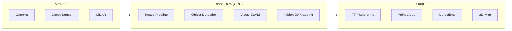

# Isaac ROS Perception

<div className="learning-objectives">

## Learning Objectives

By the end of this chapter, you will be able to:

- Deploy Isaac ROS perception packages
- Use GPU-accelerated image processing
- Implement real-time object detection
- Configure visual SLAM with Isaac ROS

</div>

<div className="prerequisites">

## Prerequisites

Before starting this chapter, ensure you have:

- **Chapter**: Completed [Synthetic Data](./02-synthetic-data)
- **Hardware**: NVIDIA Jetson or GPU workstation
- **Software**: ROS 2 Humble, Isaac ROS packages installed

</div>

## Isaac ROS Architecture

Isaac ROS provides GPU-accelerated nodes for perception:



### Package Categories

| Category | Packages | Purpose |
|----------|----------|---------|
| **Image** | isaac_ros_image_pipeline | Rectification, resize, color |
| **Detection** | isaac_ros_detectnet | 2D object detection |
| **Segmentation** | isaac_ros_unet | Semantic segmentation |
| **Depth** | isaac_ros_dnn_stereo_depth | Stereo depth estimation |
| **SLAM** | isaac_ros_visual_slam | Visual odometry and SLAM |
| **3D Mapping** | isaac_ros_nvblox | GPU-accelerated 3D mapping |
| **Pose** | isaac_ros_pose_estimation | 6-DOF pose estimation |

## Installation

### Isaac ROS Common

```bash
# Create ROS 2 workspace
mkdir -p ~/isaac_ros_ws/src
cd ~/isaac_ros_ws/src

# Clone Isaac ROS common
git clone https://github.com/NVIDIA-ISAAC-ROS/isaac_ros_common.git

# Clone perception packages
git clone https://github.com/NVIDIA-ISAAC-ROS/isaac_ros_image_pipeline.git
git clone https://github.com/NVIDIA-ISAAC-ROS/isaac_ros_object_detection.git
git clone https://github.com/NVIDIA-ISAAC-ROS/isaac_ros_visual_slam.git
git clone https://github.com/NVIDIA-ISAAC-ROS/isaac_ros_nvblox.git

# Build with colcon
cd ~/isaac_ros_ws
colcon build --symlink-install
source install/setup.bash
```

### Docker Development

```bash
# Use Isaac ROS dev container (recommended)
cd ~/isaac_ros_ws/src/isaac_ros_common
./scripts/run_dev.sh

# Inside container, build packages
colcon build --symlink-install
```

## Image Pipeline

### GPU-Accelerated Image Processing

```python title="launch/image_pipeline.launch.py"
from launch import LaunchDescription
from launch_ros.actions import ComposableNodeContainer
from launch_ros.descriptions import ComposableNode


def generate_launch_description():
    """Launch GPU-accelerated image pipeline."""

    container = ComposableNodeContainer(
        name='image_pipeline_container',
        namespace='',
        package='rclcpp_components',
        executable='component_container_mt',
        composable_node_descriptions=[
            # Rectification node (GPU)
            ComposableNode(
                package='isaac_ros_image_proc',
                plugin='nvidia::isaac_ros::image_proc::RectifyNode',
                name='rectify_node',
                parameters=[{
                    'output_width': 640,
                    'output_height': 480,
                }],
                remappings=[
                    ('image_raw', '/camera/image_raw'),
                    ('camera_info', '/camera/camera_info'),
                    ('image_rect', '/camera/image_rect'),
                ]
            ),
            # Resize node (GPU)
            ComposableNode(
                package='isaac_ros_image_proc',
                plugin='nvidia::isaac_ros::image_proc::ResizeNode',
                name='resize_node',
                parameters=[{
                    'output_width': 416,
                    'output_height': 416,
                    'keep_aspect_ratio': True,
                }],
                remappings=[
                    ('image', '/camera/image_rect'),
                    ('camera_info', '/camera/camera_info'),
                    ('resize/image', '/camera/image_resized'),
                    ('resize/camera_info', '/camera/camera_info_resized'),
                ]
            ),
        ],
        output='screen',
    )

    return LaunchDescription([container])
```

### Color Space Conversion

```python title="Color conversion node"
ComposableNode(
    package='isaac_ros_image_proc',
    plugin='nvidia::isaac_ros::image_proc::ImageFormatConverterNode',
    name='format_converter',
    parameters=[{
        'encoding_desired': 'rgb8',
        'image_width': 640,
        'image_height': 480,
    }],
    remappings=[
        ('image_raw', '/camera/image_raw'),
        ('image', '/camera/image_rgb'),
    ]
)
```

## Object Detection

### DetectNet Deployment

```python title="launch/detectnet.launch.py"
from launch import LaunchDescription
from launch_ros.actions import ComposableNodeContainer
from launch_ros.descriptions import ComposableNode


def generate_launch_description():
    """Launch DetectNet object detection."""

    container = ComposableNodeContainer(
        name='detectnet_container',
        namespace='',
        package='rclcpp_components',
        executable='component_container_mt',
        composable_node_descriptions=[
            # TensorRT encoder
            ComposableNode(
                package='isaac_ros_dnn_image_encoder',
                plugin='nvidia::isaac_ros::dnn_inference::DnnImageEncoderNode',
                name='dnn_image_encoder',
                parameters=[{
                    'input_image_width': 640,
                    'input_image_height': 480,
                    'network_image_width': 640,
                    'network_image_height': 480,
                    'image_mean': [0.5, 0.5, 0.5],
                    'image_stddev': [0.5, 0.5, 0.5],
                }],
                remappings=[
                    ('image', '/camera/image_rect'),
                    ('encoded_tensor', '/tensor_pub'),
                ]
            ),
            # TensorRT inference
            ComposableNode(
                package='isaac_ros_tensor_rt',
                plugin='nvidia::isaac_ros::dnn_inference::TensorRTNode',
                name='tensor_rt_node',
                parameters=[{
                    'model_file_path': '/models/detectnet/model.onnx',
                    'engine_file_path': '/models/detectnet/model.engine',
                    'input_tensor_names': ['input_tensor'],
                    'input_binding_names': ['input'],
                    'output_tensor_names': ['output_cov', 'output_bbox'],
                    'output_binding_names': ['output_cov/Sigmoid', 'output_bbox/BiasAdd'],
                    'verbose': False,
                }]
            ),
            # DetectNet decoder
            ComposableNode(
                package='isaac_ros_detectnet',
                plugin='nvidia::isaac_ros::detectnet::DetectNetDecoderNode',
                name='detectnet_decoder',
                parameters=[{
                    'label_list': ['person', 'robot', 'box', 'pallet'],
                    'confidence_threshold': 0.5,
                    'nms_threshold': 0.45,
                }]
            ),
        ],
        output='screen',
    )

    return LaunchDescription([container])
```

### Processing Detections

```python title="Detection subscriber node"
import rclpy
from rclpy.node import Node
from vision_msgs.msg import Detection2DArray


class DetectionProcessor(Node):
    """Process object detections from Isaac ROS."""

    def __init__(self):
        super().__init__('detection_processor')

        self.subscription = self.create_subscription(
            Detection2DArray,
            '/detectnet/detections',
            self.detection_callback,
            10
        )

        self.get_logger().info('Detection processor started')

    def detection_callback(self, msg: Detection2DArray):
        """Handle incoming detections."""
        for detection in msg.detections:
            # Get detection info
            bbox = detection.bbox
            results = detection.results

            if results:
                class_id = results[0].hypothesis.class_id
                score = results[0].hypothesis.score

                self.get_logger().info(
                    f'Detected {class_id} at '
                    f'({bbox.center.position.x:.0f}, {bbox.center.position.y:.0f}) '
                    f'with confidence {score:.2f}'
                )


def main():
    rclpy.init()
    node = DetectionProcessor()
    rclpy.spin(node)
    rclpy.shutdown()
```

## Visual SLAM

### Isaac ROS Visual SLAM

```python title="launch/visual_slam.launch.py"
from launch import LaunchDescription
from launch_ros.actions import Node


def generate_launch_description():
    """Launch Isaac ROS Visual SLAM."""

    visual_slam_node = Node(
        package='isaac_ros_visual_slam',
        executable='isaac_ros_visual_slam_node',
        name='visual_slam',
        parameters=[{
            # Camera parameters
            'denoise_input_images': True,
            'rectified_images': True,
            'enable_ground_constraint_in_odometry': True,
            'enable_ground_constraint_in_slam': True,

            # Performance tuning
            'enable_debug_mode': False,
            'enable_slam_visualization': True,
            'enable_observations_view': True,
            'enable_landmarks_view': True,

            # Map management
            'map_frame': 'map',
            'odom_frame': 'odom',
            'base_frame': 'base_link',

            # Image topics
            'image_jitter_threshold_ms': 35.0,
        }],
        remappings=[
            ('stereo_camera/left/image', '/camera/left/image_rect'),
            ('stereo_camera/left/camera_info', '/camera/left/camera_info'),
            ('stereo_camera/right/image', '/camera/right/image_rect'),
            ('stereo_camera/right/camera_info', '/camera/right/camera_info'),
            ('visual_slam/tracking/odometry', '/odom'),
        ],
        output='screen',
    )

    return LaunchDescription([visual_slam_node])
```

### Monocular Visual SLAM

```python
"""Monocular SLAM configuration."""

monocular_slam_params = {
    # Use monocular mode
    'enable_rectified_pose': True,
    'enable_localization_n_mapping': True,

    # Scale estimation (for monocular)
    'enable_imu_fusion': True,  # Helps with scale
    'gyro_noise_density': 0.000244,
    'gyro_random_walk': 0.000019393,
    'accel_noise_density': 0.001862,
    'accel_random_walk': 0.003,

    # Loop closure
    'enable_loop_closure': True,
    'loop_closure_threshold': 0.5,
}
```

## 3D Mapping with nvblox

### Real-time 3D Reconstruction

```python title="launch/nvblox_mapping.launch.py"
from launch import LaunchDescription
from launch_ros.actions import Node


def generate_launch_description():
    """Launch nvblox 3D mapping."""

    nvblox_node = Node(
        package='nvblox_ros',
        executable='nvblox_node',
        name='nvblox',
        parameters=[{
            # Voxel parameters
            'voxel_size': 0.05,  # 5cm voxels
            'esdf_2d_height': 1.0,  # Height for 2D costmap slice

            # Update rates
            'mesh_update_rate_hz': 5.0,
            'esdf_update_rate_hz': 10.0,
            'color_update_rate_hz': 5.0,

            # Memory management
            'max_tsdf_update_hz': 20.0,
            'max_color_update_hz': 5.0,
            'max_mesh_update_hz': 5.0,

            # Integration parameters
            'tsdf_integrator_max_integration_distance_m': 5.0,
            'tsdf_integrator_truncation_distance_vox': 4.0,

            # Decay (for dynamic scenes)
            'tsdf_decay_factor': 0.95,
        }],
        remappings=[
            ('depth/image', '/camera/depth/image_rect'),
            ('depth/camera_info', '/camera/depth/camera_info'),
            ('color/image', '/camera/color/image_rect'),
            ('color/camera_info', '/camera/color/camera_info'),
        ],
        output='screen',
    )

    return LaunchDescription([nvblox_node])
```

### Integration with Nav2

```python
"""nvblox costmap layer for Nav2."""

costmap_config = {
    'local_costmap': {
        'plugins': ['nvblox_layer', 'inflation_layer'],
        'nvblox_layer': {
            'plugin': 'nvblox::NvbloxCostmapLayer',
            'enabled': True,
            'nav2_costmap_global_frame': 'odom',
            'nvblox_map_slice_height': 0.3,  # Slice height for 2D
            'nvblox_map_update_frequency': 10.0,
        }
    }
}
```

## Performance Optimization

### GPU Memory Management

```python
"""Optimize GPU memory for perception."""

optimization_config = {
    # Use TensorRT for inference
    'use_tensorrt': True,
    'tensorrt_precision': 'fp16',  # FP16 for speed
    'tensorrt_workspace_size': 1 << 30,  # 1GB workspace

    # Batch processing
    'batch_size': 1,  # Single image for real-time
    'enable_cuda_graphs': True,

    # Memory pools
    'enable_memory_pool': True,
    'pool_size_mb': 512,
}
```

### Node Composition

```python
"""Use composable nodes for zero-copy."""

# Composable nodes share memory
composable_pipeline = ComposableNodeContainer(
    name='perception_container',
    namespace='',
    package='rclcpp_components',
    executable='component_container_mt',  # Multi-threaded
    composable_node_descriptions=[
        # All nodes in same process = zero-copy between them
        image_proc_node,
        encoder_node,
        inference_node,
        decoder_node,
    ]
)
```

### Benchmarking

```bash
# Monitor GPU usage
nvidia-smi dmon -s u -d 1

# Profile with Nsight Systems
nsys profile --trace=cuda,nvtx ros2 launch my_perception.launch.py

# Check topic rates
ros2 topic hz /detectnet/detections
ros2 topic hz /visual_slam/tracking/odometry
```

## Complete Perception Stack

```python title="launch/full_perception.launch.py"
"""Complete Isaac ROS perception stack."""

from launch import LaunchDescription
from launch_ros.actions import ComposableNodeContainer, Node
from launch_ros.descriptions import ComposableNode


def generate_launch_description():
    """Launch full perception pipeline."""

    # GPU-accelerated image processing and detection
    perception_container = ComposableNodeContainer(
        name='perception_container',
        namespace='',
        package='rclcpp_components',
        executable='component_container_mt',
        composable_node_descriptions=[
            # Image rectification
            ComposableNode(
                package='isaac_ros_image_proc',
                plugin='nvidia::isaac_ros::image_proc::RectifyNode',
                name='rectify',
            ),
            # Object detection
            ComposableNode(
                package='isaac_ros_detectnet',
                plugin='nvidia::isaac_ros::detectnet::DetectNetDecoderNode',
                name='detectnet',
            ),
        ],
    )

    # Visual SLAM (separate process for isolation)
    vslam_node = Node(
        package='isaac_ros_visual_slam',
        executable='isaac_ros_visual_slam_node',
        name='vslam',
    )

    # 3D mapping
    nvblox_node = Node(
        package='nvblox_ros',
        executable='nvblox_node',
        name='nvblox',
    )

    return LaunchDescription([
        perception_container,
        vslam_node,
        nvblox_node,
    ])
```

<div className="key-takeaways">

## Key Takeaways

- **Isaac ROS** provides GPU-accelerated perception nodes
- Use **composable nodes** for zero-copy data transfer
- **DetectNet** provides real-time object detection via TensorRT
- **Visual SLAM** estimates pose from camera images
- **nvblox** creates real-time 3D maps on GPU
- Profile with **nvidia-smi** and **Nsight** for optimization

</div>

## What's Next?

In the next chapter, we'll integrate Isaac ROS with Nav2 for autonomous navigation.

## References

1. NVIDIA. (2024). *Isaac ROS Documentation*. https://nvidia-isaac-ros.github.io/
2. NVIDIA. (2024). *nvblox*. https://github.com/nvidia-isaac/nvblox
3. Millane, A. et al. (2024). *nvblox: GPU-Accelerated Signed Distance Fields*. IEEE RA-L.
