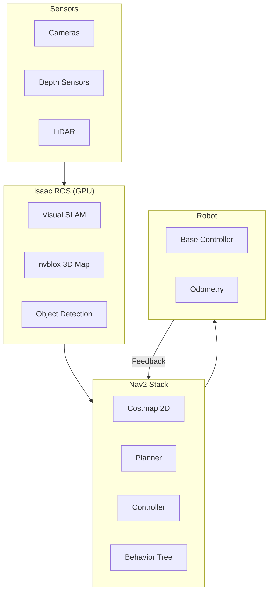
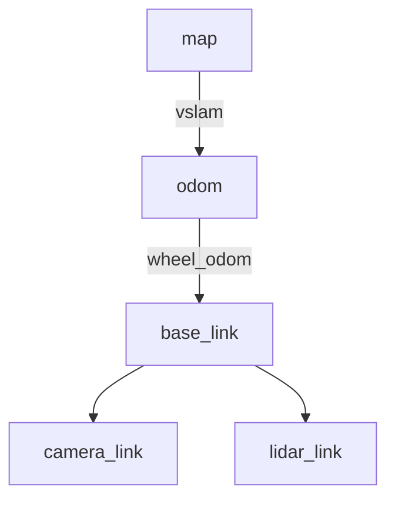

# Navigation with Isaac ROS

<div className="learning-objectives">

## Learning Objectives

By the end of this chapter, you will be able to:

- Integrate Isaac ROS perception with Nav2
- Configure GPU-accelerated costmaps
- Implement obstacle avoidance with nvblox
- Deploy navigation on physical robots

</div>

<div className="prerequisites">

## Prerequisites

Before starting this chapter, ensure you have:

- **Chapter**: Completed [Isaac ROS Perception](./03-perception)
- **Module 1**: Understanding of Nav2 basics
- **Software**: Nav2 and Isaac ROS installed

</div>

## Isaac ROS + Nav2 Architecture

Combine GPU perception with Nav2 planning:



## Setup and Configuration

### Package Installation

```bash
# Install Nav2
sudo apt install ros-humble-navigation2
sudo apt install ros-humble-nav2-bringup

# Isaac ROS Nav2 integration
cd ~/isaac_ros_ws/src
git clone https://github.com/NVIDIA-ISAAC-ROS/isaac_ros_nvblox.git

# Build
cd ~/isaac_ros_ws
colcon build --packages-select isaac_ros_nvblox_nav2
source install/setup.bash
```

### Transform Tree



```python title="TF configuration"
tf_config = {
    'frames': {
        'map_frame': 'map',
        'odom_frame': 'odom',
        'base_frame': 'base_link',
        'sensor_frames': ['camera_link', 'lidar_link']
    },
    'publishers': {
        'map_to_odom': 'isaac_ros_visual_slam',
        'odom_to_base': 'robot_localization or wheel_odom'
    }
}
```

## Costmap Configuration

### nvblox Costmap Layer

```yaml title="config/nav2_params.yaml"
local_costmap:
  local_costmap:
    ros__parameters:
      update_frequency: 10.0
      publish_frequency: 5.0
      global_frame: odom
      robot_base_frame: base_link
      rolling_window: true
      width: 5
      height: 5
      resolution: 0.05

      plugins: ["nvblox_layer", "inflation_layer"]

      nvblox_layer:
        plugin: "nvblox::NvbloxCostmapLayer"
        enabled: True
        nvblox_map_slice_height: 0.3
        nvblox_costmap_update_frequency: 10.0

      inflation_layer:
        plugin: "nav2_costmap_2d::InflationLayer"
        cost_scaling_factor: 3.0
        inflation_radius: 0.55

global_costmap:
  global_costmap:
    ros__parameters:
      update_frequency: 1.0
      publish_frequency: 1.0
      global_frame: map
      robot_base_frame: base_link
      resolution: 0.1
      track_unknown_space: true

      plugins: ["static_layer", "nvblox_layer", "inflation_layer"]

      static_layer:
        plugin: "nav2_costmap_2d::StaticLayer"
        map_subscribe_transient_local: True

      nvblox_layer:
        plugin: "nvblox::NvbloxCostmapLayer"
        enabled: True

      inflation_layer:
        plugin: "nav2_costmap_2d::InflationLayer"
        cost_scaling_factor: 3.0
        inflation_radius: 0.7
```

### Obstacle Detection Layer

```yaml title="Detection-based obstacles"
local_costmap:
  local_costmap:
    ros__parameters:
      plugins: ["nvblox_layer", "detection_layer", "inflation_layer"]

      detection_layer:
        plugin: "nav2_costmap_2d::ObstacleLayer"
        enabled: True
        observation_sources: detection_source

        detection_source:
          topic: /detectnet/detections
          data_type: "Detection2DArray"
          marking: true
          clearing: true
          obstacle_max_range: 5.0
          obstacle_min_range: 0.2
```

## Visual SLAM Integration

### Localization with Isaac VSLAM

```python title="launch/nav2_isaac_vslam.launch.py"
from launch import LaunchDescription
from launch_ros.actions import Node
from launch.actions import IncludeLaunchDescription
from launch.launch_description_sources import PythonLaunchDescriptionSource
import os


def generate_launch_description():
    """Launch Nav2 with Isaac ROS Visual SLAM."""

    # Visual SLAM for localization
    vslam_node = Node(
        package='isaac_ros_visual_slam',
        executable='isaac_ros_visual_slam_node',
        name='visual_slam',
        parameters=[{
            'enable_ground_constraint_in_odometry': True,
            'enable_ground_constraint_in_slam': True,
            'enable_localization_n_mapping': True,
            'map_frame': 'map',
            'odom_frame': 'odom',
            'base_frame': 'base_link',
        }],
        remappings=[
            ('visual_slam/tracking/odometry', '/odom'),
        ],
        output='screen',
    )

    # Nav2 bringup
    nav2_launch = IncludeLaunchDescription(
        PythonLaunchDescriptionSource([
            os.path.join(
                get_package_share_directory('nav2_bringup'),
                'launch', 'navigation_launch.py'
            )
        ]),
        launch_arguments={
            'use_sim_time': 'false',
            'params_file': '/path/to/nav2_params.yaml',
        }.items()
    )

    return LaunchDescription([
        vslam_node,
        nav2_launch,
    ])
```

### Fusing Multiple Odometry Sources

```python title="Robot localization config"
"""Fuse Visual SLAM with wheel odometry."""

from launch_ros.actions import Node

ekf_node = Node(
    package='robot_localization',
    executable='ekf_node',
    name='ekf_filter_node',
    parameters=[{
        'frequency': 50.0,
        'sensor_timeout': 0.1,
        'two_d_mode': False,
        'map_frame': 'map',
        'odom_frame': 'odom',
        'base_link_frame': 'base_link',
        'world_frame': 'odom',

        # Wheel odometry
        'odom0': '/wheel_odom',
        'odom0_config': [
            True, True, False,   # x, y, z
            False, False, True,  # roll, pitch, yaw
            True, True, False,   # vx, vy, vz
            False, False, True,  # vroll, vpitch, vyaw
            False, False, False  # ax, ay, az
        ],

        # Visual SLAM odometry
        'odom1': '/visual_slam/tracking/odometry',
        'odom1_config': [
            True, True, True,    # x, y, z
            True, True, True,    # roll, pitch, yaw
            False, False, False, # vx, vy, vz
            False, False, False, # vroll, vpitch, vyaw
            False, False, False  # ax, ay, az
        ],

        # IMU
        'imu0': '/imu/data',
        'imu0_config': [
            False, False, False,  # x, y, z
            True, True, True,     # roll, pitch, yaw
            False, False, False,  # vx, vy, vz
            True, True, True,     # vroll, vpitch, vyaw
            True, True, True      # ax, ay, az
        ],
    }]
)
```

## Path Planning

### Planner Configuration

```yaml title="Nav2 planner config"
planner_server:
  ros__parameters:
    expected_planner_frequency: 20.0
    planner_plugins: ["GridBased"]

    GridBased:
      plugin: "nav2_navfn_planner/NavfnPlanner"
      tolerance: 0.5
      use_astar: true
      allow_unknown: true

# For large environments, consider Smac planners
smoother_server:
  ros__parameters:
    smoother_plugins: ["simple_smoother"]
    simple_smoother:
      plugin: "nav2_smoother::SimpleSmoother"
      tolerance: 1.0e-10
      max_its: 1000
```

### Dynamic Obstacle Avoidance

```yaml title="Controller for dynamic obstacles"
controller_server:
  ros__parameters:
    controller_frequency: 20.0
    controller_plugins: ["FollowPath"]

    FollowPath:
      plugin: "dwb_core::DWBLocalPlanner"
      debug_trajectory_details: True
      min_vel_x: 0.0
      min_vel_y: 0.0
      max_vel_x: 0.5
      max_vel_y: 0.0
      max_vel_theta: 1.0
      min_speed_xy: 0.0
      max_speed_xy: 0.5
      min_speed_theta: 0.0
      acc_lim_x: 2.5
      acc_lim_y: 0.0
      acc_lim_theta: 3.2
      decel_lim_x: -2.5
      decel_lim_y: 0.0
      decel_lim_theta: -3.2

      # Trajectory scoring
      critics: ["RotateToGoal", "Oscillation", "BaseObstacle", "GoalAlign", "PathAlign", "PathDist", "GoalDist"]

      BaseObstacle.scale: 0.02
      PathAlign.scale: 32.0
      PathAlign.forward_point_distance: 0.1
      GoalAlign.scale: 24.0
      GoalAlign.forward_point_distance: 0.1
      PathDist.scale: 32.0
      GoalDist.scale: 24.0
      RotateToGoal.scale: 32.0
```

## Complete Navigation Stack

```python title="launch/full_navigation.launch.py"
"""Complete Isaac ROS + Nav2 navigation stack."""

from launch import LaunchDescription
from launch_ros.actions import Node, ComposableNodeContainer
from launch_ros.descriptions import ComposableNode
from launch.actions import IncludeLaunchDescription
from launch.launch_description_sources import PythonLaunchDescriptionSource
from ament_index_python.packages import get_package_share_directory
import os


def generate_launch_description():
    """Launch complete navigation system."""

    # Isaac ROS perception container
    perception = ComposableNodeContainer(
        name='perception_container',
        namespace='',
        package='rclcpp_components',
        executable='component_container_mt',
        composable_node_descriptions=[
            # Image rectification
            ComposableNode(
                package='isaac_ros_image_proc',
                plugin='nvidia::isaac_ros::image_proc::RectifyNode',
                name='rectify_left',
                remappings=[
                    ('image_raw', '/camera/left/image_raw'),
                    ('image_rect', '/camera/left/image_rect'),
                ]
            ),
            ComposableNode(
                package='isaac_ros_image_proc',
                plugin='nvidia::isaac_ros::image_proc::RectifyNode',
                name='rectify_right',
                remappings=[
                    ('image_raw', '/camera/right/image_raw'),
                    ('image_rect', '/camera/right/image_rect'),
                ]
            ),
        ]
    )

    # Visual SLAM
    vslam = Node(
        package='isaac_ros_visual_slam',
        executable='isaac_ros_visual_slam_node',
        name='vslam',
        parameters=[{
            'enable_localization_n_mapping': True,
            'map_frame': 'map',
            'odom_frame': 'odom',
            'base_frame': 'base_link',
        }],
        remappings=[
            ('stereo_camera/left/image', '/camera/left/image_rect'),
            ('stereo_camera/right/image', '/camera/right/image_rect'),
        ]
    )

    # nvblox for 3D mapping
    nvblox = Node(
        package='nvblox_ros',
        executable='nvblox_node',
        name='nvblox',
        parameters=[{
            'voxel_size': 0.05,
            'esdf_2d_height': 0.5,
        }],
        remappings=[
            ('depth/image', '/camera/depth/image_rect'),
            ('color/image', '/camera/color/image_rect'),
        ]
    )

    # Nav2 navigation stack
    nav2_dir = get_package_share_directory('nav2_bringup')
    nav2 = IncludeLaunchDescription(
        PythonLaunchDescriptionSource(
            os.path.join(nav2_dir, 'launch', 'navigation_launch.py')
        ),
        launch_arguments={
            'use_sim_time': 'false',
            'params_file': '/config/nav2_isaac_params.yaml',
        }.items()
    )

    return LaunchDescription([
        perception,
        vslam,
        nvblox,
        nav2,
    ])
```

## Navigation Actions

### Goal Sending

```python
"""Send navigation goals programmatically."""

import rclpy
from rclpy.node import Node
from rclpy.action import ActionClient
from nav2_msgs.action import NavigateToPose
from geometry_msgs.msg import PoseStamped


class NavigationClient(Node):
    """Client for Nav2 navigation actions."""

    def __init__(self):
        super().__init__('navigation_client')
        self._action_client = ActionClient(
            self, NavigateToPose, 'navigate_to_pose'
        )

    def send_goal(self, x: float, y: float, yaw: float):
        """Send navigation goal."""
        goal_msg = NavigateToPose.Goal()

        goal_msg.pose = PoseStamped()
        goal_msg.pose.header.frame_id = 'map'
        goal_msg.pose.header.stamp = self.get_clock().now().to_msg()

        goal_msg.pose.pose.position.x = x
        goal_msg.pose.pose.position.y = y
        goal_msg.pose.pose.position.z = 0.0

        # Convert yaw to quaternion
        import math
        goal_msg.pose.pose.orientation.z = math.sin(yaw / 2)
        goal_msg.pose.pose.orientation.w = math.cos(yaw / 2)

        self._action_client.wait_for_server()
        future = self._action_client.send_goal_async(
            goal_msg,
            feedback_callback=self.feedback_callback
        )
        future.add_done_callback(self.goal_response_callback)

    def goal_response_callback(self, future):
        """Handle goal acceptance."""
        goal_handle = future.result()
        if not goal_handle.accepted:
            self.get_logger().warn('Goal rejected')
            return

        self.get_logger().info('Goal accepted')
        result_future = goal_handle.get_result_async()
        result_future.add_done_callback(self.result_callback)

    def feedback_callback(self, feedback_msg):
        """Handle navigation feedback."""
        feedback = feedback_msg.feedback
        self.get_logger().info(
            f'Distance remaining: {feedback.distance_remaining:.2f}m'
        )

    def result_callback(self, future):
        """Handle navigation result."""
        result = future.result().result
        self.get_logger().info('Navigation complete')
```

### Waypoint Following

```python
"""Follow sequence of waypoints."""

from nav2_msgs.action import FollowWaypoints
from geometry_msgs.msg import PoseStamped

class WaypointFollower(Node):
    """Follow a sequence of waypoints."""

    def __init__(self):
        super().__init__('waypoint_follower')
        self._action_client = ActionClient(
            self, FollowWaypoints, 'follow_waypoints'
        )

    def follow_waypoints(self, waypoints: list):
        """Follow list of (x, y, yaw) waypoints."""
        goal_msg = FollowWaypoints.Goal()

        for x, y, yaw in waypoints:
            pose = PoseStamped()
            pose.header.frame_id = 'map'
            pose.pose.position.x = x
            pose.pose.position.y = y

            import math
            pose.pose.orientation.z = math.sin(yaw / 2)
            pose.pose.orientation.w = math.cos(yaw / 2)

            goal_msg.poses.append(pose)

        self._action_client.wait_for_server()
        self._action_client.send_goal_async(goal_msg)
```

<div className="key-takeaways">

## Key Takeaways

- **nvblox costmap layer** provides GPU-accelerated obstacle detection
- **Visual SLAM** from Isaac ROS provides map→odom transform
- **Fuse odometry sources** with robot_localization for robustness
- Configure **DWB controller** for dynamic obstacle avoidance
- Use **composable nodes** for efficient perception pipeline
- Navigation actions provide **async goal sending** and feedback

</div>

## What's Next?

In the next chapter, we'll explore reinforcement learning for robot control.

## References

1. NVIDIA. (2024). *Isaac ROS nvblox Nav2*. https://nvidia-isaac-ros.github.io/repositories_and_packages/isaac_ros_nvblox/
2. Nav2. (2024). *Navigation2 Documentation*. https://nav2.org/
3. Macenski, S. et al. (2023). *Nav2: Next-generation navigation framework*. IEEE RA-L.
