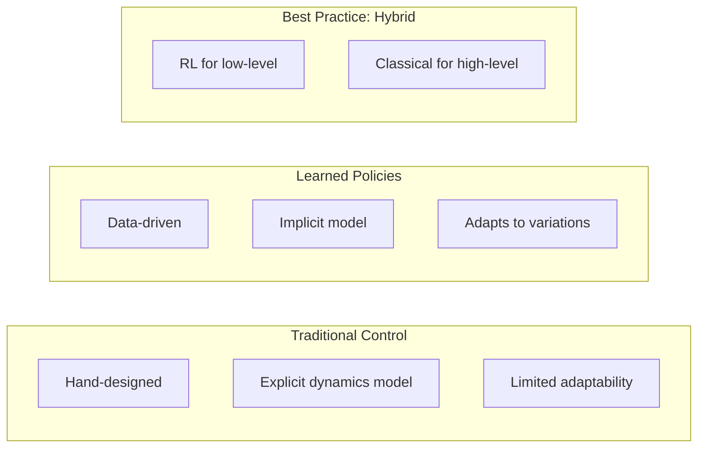
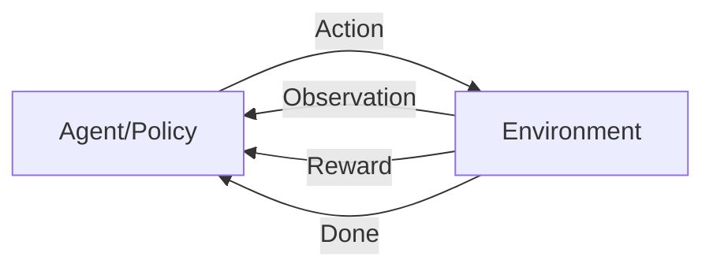

# Reinforcement Learning Basics

<div className="learning-objectives">

## Learning Objectives

By the end of this chapter, you will be able to:

- Understand RL fundamentals for robotics
- Set up Isaac Lab for policy training
- Train locomotion policies for humanoids
- Evaluate and debug trained policies

</div>

<div className="prerequisites">

## Prerequisites

Before starting this chapter, ensure you have:

- **Chapter**: Completed [Navigation with Isaac ROS](./04-nav2)
- **Hardware**: RTX 3080+ GPU with 12GB+ VRAM
- **Knowledge**: Basic machine learning concepts

</div>

## Why RL for Robotics?

Traditional control vs. learned policies:



### When to Use RL

| Use RL | Use Traditional |
|--------|-----------------|
| Complex dynamics (walking) | Well-modeled systems |
| Contact-rich tasks | Safety-critical |
| Unknown environments | Predictable scenarios |
| Adaptive behavior needed | Real-time guarantees |

## RL Fundamentals

### The RL Loop



### Key Concepts

```python
"""Core RL concepts for robotics."""

# State: What the robot observes
state = {
    'joint_positions': [...],     # 12 DOF
    'joint_velocities': [...],    # 12 DOF
    'base_orientation': [...],    # Quaternion
    'base_angular_vel': [...],    # 3D
    'command': [vx, vy, omega],   # Target velocity
}

# Action: What the robot does
action = joint_position_targets  # 12 DOF

# Reward: What we optimize
reward = (
    alive_bonus +
    velocity_tracking_reward +
    orientation_penalty +
    action_smoothness_penalty +
    energy_penalty
)

# Episode: One training sequence
episode_length = 1000  # steps
done = fell_over or reached_max_steps
```

### Policy Gradient Methods

```python
"""PPO - the workhorse of robot RL."""

# PPO (Proximal Policy Optimization)
# - On-policy algorithm
# - Stable training
# - Sample efficient for robotics

# Key hyperparameters
ppo_config = {
    'clip_param': 0.2,          # Policy clip range
    'entropy_coef': 0.01,       # Exploration bonus
    'learning_rate': 3e-4,      # Adam LR
    'num_mini_batches': 4,      # SGD batches
    'num_epochs': 5,            # PPO epochs
    'gamma': 0.99,              # Discount factor
    'lam': 0.95,                # GAE lambda
}
```

## Isaac Lab Setup

### Installation

```bash
# Clone Isaac Lab
git clone https://github.com/isaac-sim/IsaacLab.git
cd IsaacLab

# Create environment
conda create -n isaaclab python=3.10 -y
conda activate isaaclab

# Install dependencies
pip install torch torchvision --index-url https://download.pytorch.org/whl/cu118
pip install -e .

# Verify installation
python -c "import omni.isaac.lab; print('Ready!')"
```

### Project Structure

```
my_rl_project/
├── envs/
│   ├── __init__.py
│   └── humanoid_walk.py      # Environment definition
├── configs/
│   ├── __init__.py
│   └── humanoid_walk_cfg.py  # Configuration
├── train.py                   # Training script
└── play.py                    # Evaluation script
```

## Creating an Environment

### Environment Definition

```python title="envs/humanoid_walk.py"
"""Humanoid walking environment for Isaac Lab."""

import torch
from omni.isaac.lab.envs import ManagerBasedRLEnv
from omni.isaac.lab.managers import (
    ObservationGroupCfg,
    ObservationTermCfg,
    RewardTermCfg,
    TerminationTermCfg,
)
import omni.isaac.lab.envs.mdp as mdp


class HumanoidWalkEnv(ManagerBasedRLEnv):
    """Environment for humanoid walking task."""

    def __init__(self, cfg, render_mode=None):
        super().__init__(cfg, render_mode)

    def _setup_scene(self):
        """Set up the simulation scene."""
        # Add ground plane
        self.cfg.terrain.add_terrain(self.scene)

        # Add robot
        self.robot = self.scene.add_articulation(self.cfg.robot)

    def _get_observations(self) -> dict:
        """Compute observations for the policy."""
        return {
            'policy': torch.cat([
                self.robot.data.joint_pos,
                self.robot.data.joint_vel,
                self.robot.data.root_quat_w,
                self.robot.data.root_ang_vel_w,
                self.commands,
            ], dim=-1)
        }

    def _get_rewards(self) -> torch.Tensor:
        """Compute reward signal."""
        return self._compute_rewards()

    def _get_dones(self) -> tuple[torch.Tensor, torch.Tensor]:
        """Check termination conditions."""
        # Time out
        time_out = self.episode_length_buf >= self.max_episode_length

        # Fell over
        fell = self.robot.data.root_pos_w[:, 2] < 0.3

        return fell, time_out

    def _compute_rewards(self) -> torch.Tensor:
        """Reward computation."""
        # Velocity tracking
        lin_vel_error = torch.sum(
            torch.square(self.commands[:, :2] - self.robot.data.root_lin_vel_w[:, :2]),
            dim=1
        )
        lin_vel_reward = torch.exp(-lin_vel_error / 0.25)

        # Angular velocity tracking
        ang_vel_error = torch.square(
            self.commands[:, 2] - self.robot.data.root_ang_vel_w[:, 2]
        )
        ang_vel_reward = torch.exp(-ang_vel_error / 0.25)

        # Alive bonus
        alive = torch.ones(self.num_envs, device=self.device)

        # Action smoothness
        action_rate = torch.sum(
            torch.square(self.actions - self.last_actions), dim=1
        )

        total_reward = (
            1.0 * lin_vel_reward +
            0.5 * ang_vel_reward +
            0.2 * alive -
            0.01 * action_rate
        )

        return total_reward
```

### Configuration

```python title="configs/humanoid_walk_cfg.py"
"""Configuration for humanoid walking environment."""

from omni.isaac.lab.envs import ManagerBasedRLEnvCfg
from omni.isaac.lab.scene import InteractiveSceneCfg
from omni.isaac.lab.assets import ArticulationCfg
from omni.isaac.lab.terrains import TerrainImporterCfg
from dataclasses import dataclass


@dataclass
class HumanoidWalkEnvCfg(ManagerBasedRLEnvCfg):
    """Configuration for humanoid walk environment."""

    # Scene
    scene: InteractiveSceneCfg = InteractiveSceneCfg(
        num_envs=4096,
        env_spacing=2.5,
    )

    # Robot configuration
    robot: ArticulationCfg = ArticulationCfg(
        prim_path="/World/envs/env_.*/Robot",
        spawn=SpawnerCfg(
            usd_path="path/to/humanoid.usd",
            activate_contact_sensors=True,
        ),
        init_state=ArticulationCfg.InitialStateCfg(
            pos=(0.0, 0.0, 1.0),
            joint_pos={".*": 0.0},
        ),
        actuators={
            "legs": ImplicitActuatorCfg(
                joint_names_expr=[".*_hip_.*", ".*_knee_.*", ".*_ankle_.*"],
                stiffness=100.0,
                damping=10.0,
            ),
        },
    )

    # Terrain
    terrain: TerrainImporterCfg = TerrainImporterCfg(
        prim_path="/World/ground",
        terrain_type="plane",
    )

    # Simulation
    sim: SimCfg = SimCfg(
        dt=0.005,
        render_interval=4,
    )

    # Episode
    episode_length_s: float = 20.0

    # Observations
    observations: ObservationsCfg = ObservationsCfg(
        policy=ObservationGroupCfg(
            terms={
                "joint_pos": ObservationTermCfg(func=mdp.joint_pos),
                "joint_vel": ObservationTermCfg(func=mdp.joint_vel),
                "base_quat": ObservationTermCfg(func=mdp.root_quat_w),
                "base_ang_vel": ObservationTermCfg(func=mdp.root_ang_vel_w),
                "commands": ObservationTermCfg(func=mdp.generated_commands),
            }
        )
    )

    # Rewards
    rewards: RewardsCfg = RewardsCfg(
        terms={
            "track_lin_vel": RewardTermCfg(
                func=mdp.track_lin_vel_xy_exp,
                weight=1.0,
                params={"std": 0.25},
            ),
            "track_ang_vel": RewardTermCfg(
                func=mdp.track_ang_vel_z_exp,
                weight=0.5,
                params={"std": 0.25},
            ),
            "alive": RewardTermCfg(func=mdp.is_alive, weight=0.2),
            "action_rate": RewardTermCfg(
                func=mdp.action_rate_l2,
                weight=-0.01,
            ),
        }
    )

    # Terminations
    terminations: TerminationsCfg = TerminationsCfg(
        terms={
            "time_out": TerminationTermCfg(func=mdp.time_out, time_out=True),
            "base_contact": TerminationTermCfg(
                func=mdp.illegal_contact,
                params={"threshold": 1.0, "body_names": ["torso"]},
            ),
        }
    )
```

## Training

### Training Script

```python title="train.py"
"""Train humanoid walking policy with PPO."""

import argparse
from omni.isaac.lab.app import AppLauncher

# Launch Isaac Sim
parser = argparse.ArgumentParser()
parser.add_argument("--num_envs", type=int, default=4096)
parser.add_argument("--headless", action="store_true")
args = parser.parse_args()

app_launcher = AppLauncher(args)
simulation_app = app_launcher.app

# Now import Isaac Lab modules
from omni.isaac.lab_tasks.utils import get_checkpoint_path
from omni.isaac.lab_tasks.utils.wrappers.rsl_rl import RslRlVecEnvWrapper

from rsl_rl.runners import OnPolicyRunner

from envs.humanoid_walk import HumanoidWalkEnv
from configs.humanoid_walk_cfg import HumanoidWalkEnvCfg


def main():
    """Train the policy."""
    # Create environment
    env_cfg = HumanoidWalkEnvCfg()
    env_cfg.scene.num_envs = args.num_envs
    env = HumanoidWalkEnv(cfg=env_cfg)

    # Wrap for RSL-RL
    env = RslRlVecEnvWrapper(env)

    # Training configuration
    train_cfg = {
        "algorithm": {
            "class_name": "PPO",
            "clip_param": 0.2,
            "entropy_coef": 0.01,
            "gamma": 0.99,
            "lam": 0.95,
            "learning_rate": 3e-4,
            "max_grad_norm": 1.0,
            "num_learning_epochs": 5,
            "num_mini_batches": 4,
            "schedule": "adaptive",
            "use_clipped_value_loss": True,
            "value_loss_coef": 1.0,
        },
        "policy": {
            "class_name": "ActorCritic",
            "activation": "elu",
            "actor_hidden_dims": [512, 256, 128],
            "critic_hidden_dims": [512, 256, 128],
            "init_noise_std": 1.0,
        },
        "runner": {
            "algorithm_class_name": "PPO",
            "checkpoint": -1,
            "experiment_name": "humanoid_walk",
            "load_run": -1,
            "log_interval": 1,
            "max_iterations": 1500,
            "num_steps_per_env": 24,
            "policy_class_name": "ActorCritic",
            "resume": False,
            "save_interval": 50,
        },
    }

    # Create runner
    runner = OnPolicyRunner(env, train_cfg, log_dir="logs", device="cuda")

    # Train
    runner.learn(num_learning_iterations=1500)

    # Save final policy
    runner.save("logs/final_policy.pt")

    env.close()


if __name__ == "__main__":
    main()
    simulation_app.close()
```

### Running Training

```bash
# Train with GPU parallelism
python train.py --num_envs 4096 --headless

# Monitor with TensorBoard
tensorboard --logdir logs/

# Resume from checkpoint
python train.py --num_envs 4096 --headless --resume
```

## Evaluation

### Play Script

```python title="play.py"
"""Evaluate trained policy."""

import argparse
import torch
from omni.isaac.lab.app import AppLauncher

parser = argparse.ArgumentParser()
parser.add_argument("--checkpoint", type=str, required=True)
parser.add_argument("--num_envs", type=int, default=16)
args = parser.parse_args()

app_launcher = AppLauncher(args)
simulation_app = app_launcher.app

from envs.humanoid_walk import HumanoidWalkEnv
from configs.humanoid_walk_cfg import HumanoidWalkEnvCfg


def main():
    """Run trained policy."""
    # Create environment
    env_cfg = HumanoidWalkEnvCfg()
    env_cfg.scene.num_envs = args.num_envs
    env = HumanoidWalkEnv(cfg=env_cfg)

    # Load policy
    policy = torch.jit.load(args.checkpoint)
    policy.eval()

    # Run episodes
    obs = env.reset()
    while simulation_app.is_running():
        with torch.no_grad():
            actions = policy(obs['policy'])

        obs, rewards, dones, infos = env.step(actions)

        # Log metrics
        if dones.any():
            print(f"Episode reward: {infos['episode_reward'].mean():.2f}")

    env.close()


if __name__ == "__main__":
    main()
    simulation_app.close()
```

## Reward Engineering

### Common Reward Terms

```python
"""Reward terms for locomotion."""

def velocity_tracking_reward(env, command, actual, std=0.25):
    """Reward for tracking target velocity."""
    error = torch.sum(torch.square(command - actual), dim=-1)
    return torch.exp(-error / std)


def orientation_penalty(env, target_up=torch.tensor([0, 0, 1])):
    """Penalize deviation from upright."""
    # Project gravity onto body frame
    projected_gravity = quat_rotate_inverse(
        env.robot.data.root_quat_w,
        env.gravity_vec
    )
    return torch.sum(torch.square(projected_gravity[:, :2]), dim=-1)


def feet_air_time_reward(env, threshold=0.5):
    """Reward longer air time per step (encourages dynamic gaits)."""
    contact = env.robot.data.feet_contact
    first_contact = (env.feet_air_time > 0) & contact
    air_time_reward = torch.sum(
        (env.feet_air_time - threshold) * first_contact, dim=1
    )
    return air_time_reward


def action_smoothness_penalty(env):
    """Penalize jerky actions."""
    return torch.sum(torch.square(env.actions - env.last_actions), dim=-1)


def joint_torque_penalty(env):
    """Penalize high torques (energy efficiency)."""
    return torch.sum(torch.square(env.robot.data.applied_torque), dim=-1)
```

### Curriculum Learning

```python
"""Progressive difficulty curriculum."""

class CurriculumManager:
    """Manage training curriculum."""

    def __init__(self, env):
        self.env = env
        self.terrain_level = 0
        self.command_range = [0.5, 0.5]  # Start easy

    def update(self, mean_reward: float):
        """Update curriculum based on performance."""
        if mean_reward > 0.8:
            # Increase difficulty
            self.terrain_level = min(self.terrain_level + 1, 5)
            self.command_range[0] *= 1.1
            self.command_range[1] *= 1.1

        elif mean_reward < 0.3:
            # Decrease difficulty
            self.terrain_level = max(self.terrain_level - 1, 0)
            self.command_range[0] *= 0.9
            self.command_range[1] *= 0.9

        # Apply to environment
        self.env.update_terrain_level(self.terrain_level)
        self.env.update_command_range(self.command_range)
```

## Debugging Training

### Common Issues

| Symptom | Likely Cause | Solution |
|---------|--------------|----------|
| Reward plateaus early | Wrong reward scale | Normalize rewards |
| Robot falls immediately | Too aggressive commands | Start with slower commands |
| Unstable training | Learning rate too high | Reduce LR, increase batch |
| No improvement | Sparse rewards | Add shaping rewards |
| Forgetting | Curriculum too fast | Slow curriculum progression |

### Monitoring Tools

```python
"""Training monitoring utilities."""

import wandb

def log_training_metrics(iteration, metrics):
    """Log to Weights & Biases."""
    wandb.log({
        "iteration": iteration,
        "mean_reward": metrics["mean_reward"],
        "mean_episode_length": metrics["mean_ep_len"],
        "policy_loss": metrics["policy_loss"],
        "value_loss": metrics["value_loss"],
        "entropy": metrics["entropy"],
    })


def visualize_policy(env, policy, num_steps=1000):
    """Record policy rollout for visualization."""
    frames = []
    obs = env.reset()

    for _ in range(num_steps):
        with torch.no_grad():
            action = policy(obs['policy'])
        obs, _, _, _ = env.step(action)
        frames.append(env.render())

    return frames
```

<div className="key-takeaways">

## Key Takeaways

- **RL** learns policies from experience, ideal for complex dynamics
- **Isaac Lab** provides GPU-parallel environments (4000+ simultaneous)
- **PPO** is the standard algorithm for robot locomotion
- **Reward engineering** is critical - start with dense rewards
- **Curriculum learning** gradually increases difficulty
- Monitor training with **TensorBoard** and **W&B**

</div>

## What's Next?

In the next chapter, we'll cover sim-to-real transfer for deploying learned policies.

## References

1. NVIDIA. (2024). *Isaac Lab Documentation*. https://isaac-sim.github.io/IsaacLab/
2. Rudin, N. et al. (2022). *Learning to Walk in Minutes Using Massively Parallel Deep RL*. CoRL.
3. Schulman, J. et al. (2017). *Proximal Policy Optimization Algorithms*. arXiv.
