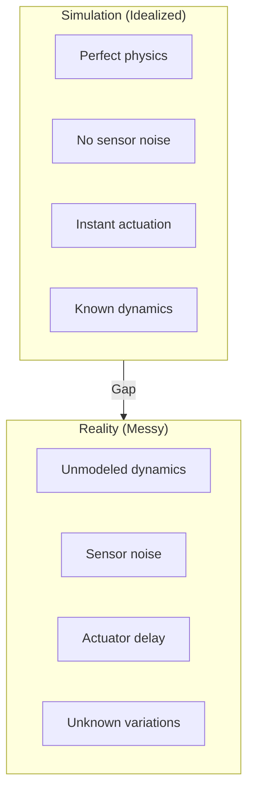
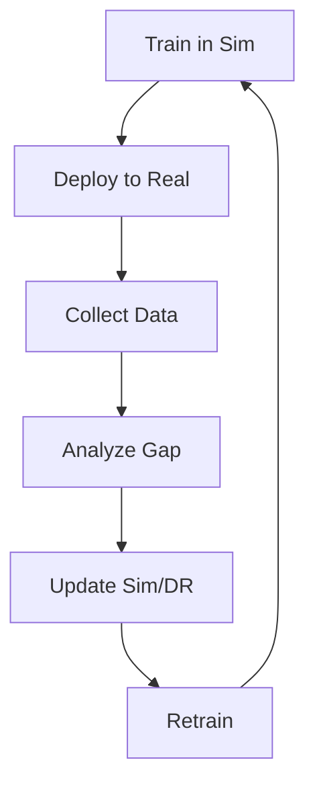

# Sim-to-Real Transfer

<div className="learning-objectives">

## Learning Objectives

By the end of this chapter, you will be able to:

- Understand the sim-to-real gap and its causes
- Apply domain randomization techniques
- Deploy policies to physical robots
- Debug transfer failures systematically

</div>

<div className="prerequisites">

## Prerequisites

Before starting this chapter, ensure you have:

- **Chapter**: Completed [RL Basics](./05-rl-basics)
- **Hardware**: Access to a physical robot for testing
- **Knowledge**: Trained policy from previous chapter

</div>

## The Sim-to-Real Gap

Why policies trained in simulation fail on real robots:



### Gap Sources

| Category | Simulation | Reality |
|----------|------------|---------|
| **Physics** | Simplified contact | Complex friction |
| **Sensors** | Perfect data | Noise, dropout |
| **Actuators** | Instant response | Delay, saturation |
| **Environment** | Controlled | Variable conditions |
| **Robot state** | Known perfectly | Estimated |

## Domain Randomization

Train on varied simulations to cover real-world distribution:

### Parameter Randomization

```python title="Domain randomization config"
"""Domain randomization for sim-to-real transfer."""

from dataclasses import dataclass
from omni.isaac.lab.envs import ManagerBasedRLEnvCfg


@dataclass
class DomainRandomizationCfg:
    """Configuration for domain randomization."""

    # Physics randomization
    physics: PhysicsRandomizationCfg = PhysicsRandomizationCfg(
        # Friction
        friction_range=[0.5, 1.5],  # Multiply default

        # Restitution (bounciness)
        restitution_range=[0.0, 0.2],

        # Contact stiffness
        contact_stiffness_range=[0.8, 1.2],
    )

    # Robot dynamics
    robot: RobotRandomizationCfg = RobotRandomizationCfg(
        # Mass variations
        mass_range=[0.9, 1.1],  # ±10%

        # Center of mass offset
        com_offset_range=[-0.02, 0.02],  # ±2cm

        # Joint properties
        joint_friction_range=[0.5, 2.0],
        joint_damping_range=[0.8, 1.2],

        # Motor strength
        motor_strength_range=[0.9, 1.1],
    )

    # Sensor noise
    sensors: SensorRandomizationCfg = SensorRandomizationCfg(
        # Joint encoder noise
        joint_pos_noise=[0.0, 0.01],  # rad
        joint_vel_noise=[0.0, 0.1],   # rad/s

        # IMU noise
        imu_accel_noise=[0.0, 0.1],   # m/s²
        imu_gyro_noise=[0.0, 0.01],   # rad/s

        # Latency
        observation_latency_range=[0.0, 0.02],  # seconds
    )

    # Actuator modeling
    actuators: ActuatorRandomizationCfg = ActuatorRandomizationCfg(
        # Response delay
        delay_range=[0.0, 0.02],  # seconds

        # Position tracking error
        position_offset_range=[-0.02, 0.02],  # rad

        # Torque limits
        torque_limit_range=[0.8, 1.0],
    )
```

### Applying Randomization

```python title="Randomization in environment"
"""Apply domain randomization during training."""

import torch
from typing import Dict


class RandomizedEnv(ManagerBasedRLEnv):
    """Environment with domain randomization."""

    def __init__(self, cfg):
        super().__init__(cfg)
        self.dr_cfg = cfg.domain_randomization

    def reset(self, env_ids=None):
        """Reset with randomized parameters."""
        if env_ids is None:
            env_ids = torch.arange(self.num_envs, device=self.device)

        # Randomize physics
        self._randomize_physics(env_ids)

        # Randomize robot properties
        self._randomize_robot(env_ids)

        return super().reset(env_ids)

    def _randomize_physics(self, env_ids):
        """Randomize ground friction."""
        friction_scale = torch.empty(len(env_ids), device=self.device).uniform_(
            self.dr_cfg.physics.friction_range[0],
            self.dr_cfg.physics.friction_range[1]
        )
        # Apply to ground contact
        self.scene.set_friction(env_ids, friction_scale)

    def _randomize_robot(self, env_ids):
        """Randomize robot dynamics."""
        # Mass scaling
        mass_scale = torch.empty(len(env_ids), device=self.device).uniform_(
            self.dr_cfg.robot.mass_range[0],
            self.dr_cfg.robot.mass_range[1]
        )
        self.robot.set_mass_scale(env_ids, mass_scale)

        # Joint friction
        joint_friction = torch.empty(
            len(env_ids), self.robot.num_dof, device=self.device
        ).uniform_(
            self.dr_cfg.robot.joint_friction_range[0],
            self.dr_cfg.robot.joint_friction_range[1]
        )
        self.robot.set_joint_friction(env_ids, joint_friction)

    def _apply_sensor_noise(self, obs: Dict) -> Dict:
        """Add noise to observations."""
        noisy_obs = {}

        for key, value in obs.items():
            if key == "joint_pos":
                noise = torch.randn_like(value) * self.dr_cfg.sensors.joint_pos_noise[1]
                noisy_obs[key] = value + noise
            elif key == "joint_vel":
                noise = torch.randn_like(value) * self.dr_cfg.sensors.joint_vel_noise[1]
                noisy_obs[key] = value + noise
            else:
                noisy_obs[key] = value

        return noisy_obs

    def _apply_action_delay(self, actions: torch.Tensor) -> torch.Tensor:
        """Simulate actuator delay."""
        if not hasattr(self, 'action_history'):
            self.action_history = []

        self.action_history.append(actions.clone())

        # Random delay (in steps)
        delay_steps = int(self.dr_cfg.actuators.delay_range[1] / self.cfg.sim.dt)

        if len(self.action_history) > delay_steps:
            delayed_actions = self.action_history.pop(0)
        else:
            delayed_actions = actions

        return delayed_actions
```

## System Identification

Measure real robot to improve simulation:

### Motor Identification

```python title="Motor system identification"
"""Identify motor dynamics from real robot data."""

import numpy as np
from scipy.optimize import minimize


class MotorIdentification:
    """Identify motor model parameters."""

    def __init__(self):
        self.data = {'command': [], 'position': [], 'velocity': [], 'time': []}

    def collect_data(self, robot, test_trajectory):
        """Collect motor response data."""
        for cmd in test_trajectory:
            robot.set_position_target(cmd)
            time.sleep(0.01)

            self.data['command'].append(cmd)
            self.data['position'].append(robot.get_position())
            self.data['velocity'].append(robot.get_velocity())
            self.data['time'].append(time.time())

    def fit_pd_model(self):
        """Fit PD controller model."""
        def model(params, cmd, pos, vel):
            kp, kd, delay = params
            # Delayed command
            cmd_delayed = np.roll(cmd, int(delay * 100))
            # PD output
            torque = kp * (cmd_delayed - pos) - kd * vel
            return torque

        def loss(params):
            predicted = model(params, self.data['command'],
                            self.data['position'], self.data['velocity'])
            actual = np.diff(self.data['velocity']) / 0.01  # acceleration
            return np.mean((predicted[:-1] - actual) ** 2)

        result = minimize(loss, x0=[100, 10, 0.01],
                         bounds=[(0, 500), (0, 50), (0, 0.1)])
        return result.x  # [kp, kd, delay]

    def update_simulation(self, sim_config, params):
        """Update simulation with identified parameters."""
        sim_config.actuators.stiffness = params[0]
        sim_config.actuators.damping = params[1]
        sim_config.actuators.delay = params[2]
```

### Inertia Measurement

```python
"""Measure and update inertia parameters."""

def measure_swing_inertia(robot, joint_name):
    """Measure limb inertia via swing test."""
    # Move joint to horizontal
    robot.set_joint_position(joint_name, 0.0)
    time.sleep(1.0)

    # Release and measure oscillation
    robot.disable_motor(joint_name)
    positions = []
    times = []

    for _ in range(500):
        positions.append(robot.get_joint_position(joint_name))
        times.append(time.time())
        time.sleep(0.01)

    # Fit damped oscillation
    # θ(t) = A * exp(-γt) * cos(ωt + φ)
    # Inertia I = mgL / ω²
    omega = estimate_frequency(times, positions)
    inertia = robot.link_mass * 9.81 * robot.link_length / (omega ** 2)

    return inertia
```

## Deployment Pipeline

### Export Policy for Deployment

```python title="Export trained policy"
"""Export policy for real robot deployment."""

import torch


def export_policy(checkpoint_path: str, output_path: str):
    """Export policy to deployable format."""
    # Load trained model
    checkpoint = torch.load(checkpoint_path)
    policy = checkpoint['model']

    # Trace for deployment
    example_obs = torch.zeros(1, policy.obs_dim)
    traced_policy = torch.jit.trace(policy, example_obs)

    # Optimize for inference
    traced_policy = torch.jit.optimize_for_inference(traced_policy)

    # Save
    traced_policy.save(output_path)
    print(f"Exported policy to {output_path}")


def export_to_onnx(checkpoint_path: str, output_path: str):
    """Export to ONNX for cross-platform deployment."""
    checkpoint = torch.load(checkpoint_path)
    policy = checkpoint['model']

    example_obs = torch.zeros(1, policy.obs_dim)

    torch.onnx.export(
        policy,
        example_obs,
        output_path,
        input_names=['observation'],
        output_names=['action'],
        dynamic_axes={
            'observation': {0: 'batch_size'},
            'action': {0: 'batch_size'}
        },
        opset_version=11
    )
```

### ROS 2 Policy Node

```python title="ROS 2 deployment node"
"""ROS 2 node for deploying learned policy."""

import rclpy
from rclpy.node import Node
import torch
import numpy as np

from sensor_msgs.msg import JointState, Imu
from std_msgs.msg import Float64MultiArray


class PolicyDeploymentNode(Node):
    """Deploy learned policy on real robot."""

    def __init__(self):
        super().__init__('policy_deployment')

        # Load policy
        policy_path = self.declare_parameter('policy_path', '').value
        self.policy = torch.jit.load(policy_path)
        self.policy.eval()

        # State buffers
        self.joint_pos = np.zeros(12)
        self.joint_vel = np.zeros(12)
        self.base_quat = np.array([0, 0, 0, 1])
        self.base_ang_vel = np.zeros(3)

        # Subscribers
        self.joint_sub = self.create_subscription(
            JointState, '/joint_states', self.joint_callback, 10
        )
        self.imu_sub = self.create_subscription(
            Imu, '/imu/data', self.imu_callback, 10
        )

        # Publisher
        self.action_pub = self.create_publisher(
            Float64MultiArray, '/joint_position_controller/commands', 10
        )

        # Control timer (50 Hz)
        self.timer = self.create_timer(0.02, self.control_callback)

        # Command input
        self.command = np.array([0.5, 0.0, 0.0])  # [vx, vy, omega]

        self.get_logger().info('Policy deployment node started')

    def joint_callback(self, msg: JointState):
        """Update joint state."""
        self.joint_pos = np.array(msg.position)
        self.joint_vel = np.array(msg.velocity)

    def imu_callback(self, msg: Imu):
        """Update IMU state."""
        self.base_quat = np.array([
            msg.orientation.x,
            msg.orientation.y,
            msg.orientation.z,
            msg.orientation.w
        ])
        self.base_ang_vel = np.array([
            msg.angular_velocity.x,
            msg.angular_velocity.y,
            msg.angular_velocity.z
        ])

    def control_callback(self):
        """Run policy inference and publish action."""
        # Build observation
        obs = np.concatenate([
            self.joint_pos,
            self.joint_vel,
            self.base_quat,
            self.base_ang_vel,
            self.command
        ])

        # Run policy
        obs_tensor = torch.tensor(obs, dtype=torch.float32).unsqueeze(0)
        with torch.no_grad():
            action = self.policy(obs_tensor).squeeze().numpy()

        # Scale action to position targets
        position_targets = self.joint_pos + action * 0.5

        # Safety clamps
        position_targets = np.clip(position_targets, -3.14, 3.14)

        # Publish
        msg = Float64MultiArray()
        msg.data = position_targets.tolist()
        self.action_pub.publish(msg)


def main():
    rclpy.init()
    node = PolicyDeploymentNode()
    rclpy.spin(node)
    rclpy.shutdown()
```

## Safety Considerations

### Gradual Deployment

```python
"""Safe deployment with gradual activation."""

class SafeDeployment:
    """Gradually increase policy authority."""

    def __init__(self, policy, default_action):
        self.policy = policy
        self.default_action = default_action
        self.blend_factor = 0.0  # Start with 0% policy
        self.max_blend_rate = 0.1  # Increase by 10% per second

    def step(self, obs, dt):
        """Compute blended action."""
        # Get policy action
        policy_action = self.policy(obs)

        # Blend with default (safe) action
        action = (
            self.blend_factor * policy_action +
            (1 - self.blend_factor) * self.default_action
        )

        return action

    def increase_authority(self, dt):
        """Gradually give more authority to policy."""
        self.blend_factor = min(
            1.0,
            self.blend_factor + self.max_blend_rate * dt
        )

    def emergency_stop(self):
        """Reset to default behavior."""
        self.blend_factor = 0.0
```

### Watchdog and Limits

```python
"""Safety watchdog for policy deployment."""

class SafetyWatchdog:
    """Monitor robot state and intervene if needed."""

    def __init__(self, config):
        self.config = config
        self.violation_count = 0

    def check(self, robot_state) -> bool:
        """Check safety constraints. Returns True if safe."""
        violations = []

        # Joint limits
        if np.any(np.abs(robot_state.joint_pos) > self.config.joint_limit):
            violations.append("Joint limit exceeded")

        # Velocity limits
        if np.any(np.abs(robot_state.joint_vel) > self.config.velocity_limit):
            violations.append("Velocity limit exceeded")

        # Orientation (falling)
        pitch = euler_from_quat(robot_state.base_quat)[1]
        if abs(pitch) > self.config.max_pitch:
            violations.append("Excessive pitch")

        # Torque limits
        if np.any(np.abs(robot_state.torques) > self.config.torque_limit):
            violations.append("Torque limit exceeded")

        if violations:
            self.violation_count += 1
            for v in violations:
                print(f"SAFETY: {v}")

            if self.violation_count > self.config.max_violations:
                return False  # Trigger emergency stop

        else:
            self.violation_count = max(0, self.violation_count - 1)

        return True
```

## Debugging Transfer Failures

### Diagnostic Tools

```python
"""Tools for debugging sim-to-real transfer."""

class TransferDiagnostics:
    """Compare simulation and real robot behavior."""

    def __init__(self):
        self.sim_data = []
        self.real_data = []

    def record_sim(self, obs, action, next_obs):
        """Record simulation trajectory."""
        self.sim_data.append({
            'obs': obs.copy(),
            'action': action.copy(),
            'next_obs': next_obs.copy()
        })

    def record_real(self, obs, action, next_obs):
        """Record real robot trajectory."""
        self.real_data.append({
            'obs': obs.copy(),
            'action': action.copy(),
            'next_obs': next_obs.copy()
        })

    def compute_dynamics_mismatch(self):
        """Compute difference in state transitions."""
        mismatches = []

        for sim, real in zip(self.sim_data, self.real_data):
            # Same action, different outcome
            if np.allclose(sim['action'], real['action'], atol=0.01):
                delta_sim = sim['next_obs'] - sim['obs']
                delta_real = real['next_obs'] - real['obs']
                mismatch = np.abs(delta_sim - delta_real)
                mismatches.append(mismatch)

        return np.mean(mismatches, axis=0)

    def identify_problematic_states(self, threshold=0.1):
        """Find states where sim and real diverge most."""
        problematic = []

        for i, (sim, real) in enumerate(zip(self.sim_data, self.real_data)):
            delta_sim = sim['next_obs'] - sim['obs']
            delta_real = real['next_obs'] - real['obs']

            if np.max(np.abs(delta_sim - delta_real)) > threshold:
                problematic.append({
                    'index': i,
                    'state': sim['obs'],
                    'action': sim['action'],
                    'sim_delta': delta_sim,
                    'real_delta': delta_real
                })

        return problematic
```

### Iterative Refinement



<div className="key-takeaways">

## Key Takeaways

- **Sim-to-real gap** comes from physics, sensors, actuators, and environment
- **Domain randomization** trains policies robust to variations
- **System identification** measures real robot to improve simulation
- **Export policies** as TorchScript or ONNX for deployment
- Implement **safety systems**: watchdogs, limits, gradual activation
- **Debug systematically**: compare sim vs real trajectories

</div>

## What's Next?

You've completed Module 3! In Module 4, we'll explore Vision-Language-Action models for intelligent robot control.

## References

1. Tobin, J. et al. (2017). *Domain Randomization for Transferring DNNs from Simulation to the Real World*. IROS.
2. Peng, X.B. et al. (2018). *Sim-to-Real Robot Learning from Pixels with Progressive Nets*. CoRL.
3. Lee, J. et al. (2020). *Learning Quadrupedal Locomotion over Challenging Terrain*. Science Robotics.
