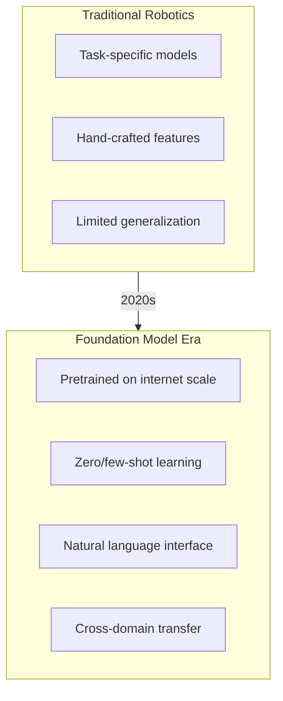
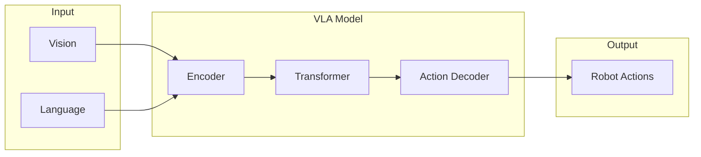
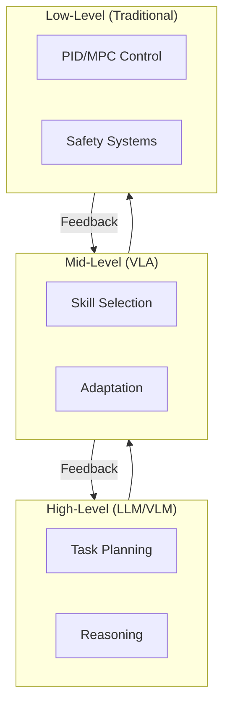

# Foundation Models for Robotics

<div className="learning-objectives">

## Learning Objectives

By the end of this chapter, you will be able to:

- Understand foundation models and their role in robotics
- Compare different model architectures for embodied AI
- Evaluate when to use foundation models vs. specialized systems
- Set up inference infrastructure for large models

</div>

<div className="prerequisites">

## Prerequisites

Before starting this chapter, ensure you have:

- **Module 3**: Completed [Sim-to-Real Transfer](../module3-isaac/06-sim-to-real)
- **Hardware**: GPU with 16GB+ VRAM for model inference
- **Knowledge**: Basic understanding of neural networks

</div>

## The Foundation Model Revolution

Foundation models are transforming robotics:



### What Are Foundation Models?

| Property | Description | Robotics Impact |
|----------|-------------|-----------------|
| **Scale** | Billions of parameters | Rich representations |
| **Pretraining** | Web-scale data | World knowledge |
| **Generalization** | Zero-shot capabilities | Novel tasks |
| **Multimodal** | Text, images, video | Unified perception |

## Model Categories

### Large Language Models (LLMs)

```python
"""Using LLMs for robot task planning."""

from openai import OpenAI

client = OpenAI()

def plan_robot_task(task_description: str, robot_capabilities: list) -> list:
    """Use LLM to decompose task into executable steps."""

    system_prompt = f"""You are a robot task planner.
    Available capabilities: {robot_capabilities}

    Given a task, decompose it into a sequence of executable actions.
    Each action must be one of the available capabilities.
    Format: One action per line, with parameters in parentheses.
    """

    response = client.chat.completions.create(
        model="gpt-4",
        messages=[
            {"role": "system", "content": system_prompt},
            {"role": "user", "content": f"Task: {task_description}"}
        ],
        temperature=0.2
    )

    # Parse response into action list
    plan = response.choices[0].message.content.strip().split('\n')
    return plan


# Example usage
capabilities = [
    "move_to(location)",
    "pick(object)",
    "place(object, location)",
    "open(container)",
    "close(container)",
    "scan_area()"
]

task = "Get the red cup from the kitchen cabinet and bring it to the living room table"
plan = plan_robot_task(task, capabilities)
print(plan)
# Output:
# move_to(kitchen)
# open(cabinet)
# scan_area()
# pick(red_cup)
# close(cabinet)
# move_to(living_room)
# place(red_cup, table)
```

### Vision-Language Models (VLMs)

```python
"""Using VLMs for scene understanding."""

import torch
from transformers import AutoProcessor, LlavaForConditionalGeneration
from PIL import Image


class RobotVisionLanguage:
    """VLM-based scene understanding for robots."""

    def __init__(self, model_name="llava-hf/llava-1.5-7b-hf"):
        self.processor = AutoProcessor.from_pretrained(model_name)
        self.model = LlavaForConditionalGeneration.from_pretrained(
            model_name,
            torch_dtype=torch.float16,
            device_map="auto"
        )

    def describe_scene(self, image: Image.Image) -> str:
        """Generate natural language description of scene."""
        prompt = "USER: <image>\nDescribe what you see in this image from a robot's perspective. Focus on objects, their positions, and any obstacles.\nASSISTANT:"

        inputs = self.processor(prompt, image, return_tensors="pt").to("cuda")

        output = self.model.generate(
            **inputs,
            max_new_tokens=200,
            do_sample=False
        )

        response = self.processor.decode(output[0], skip_special_tokens=True)
        return response.split("ASSISTANT:")[-1].strip()

    def find_object(self, image: Image.Image, object_name: str) -> dict:
        """Locate specific object in image."""
        prompt = f"USER: <image>\nWhere is the {object_name} in this image? Describe its location relative to other objects and estimate its position (left/center/right, near/far).\nASSISTANT:"

        inputs = self.processor(prompt, image, return_tensors="pt").to("cuda")

        output = self.model.generate(
            **inputs,
            max_new_tokens=100,
            do_sample=False
        )

        response = self.processor.decode(output[0], skip_special_tokens=True)
        return {
            "object": object_name,
            "description": response.split("ASSISTANT:")[-1].strip()
        }

    def assess_grasp(self, image: Image.Image, object_name: str) -> dict:
        """Assess graspability of object."""
        prompt = f"USER: <image>\nAnalyze the {object_name} for grasping. Consider: 1) Is it reachable? 2) What grasp type would work (pinch, wrap, etc.)? 3) Any obstacles?\nASSISTANT:"

        inputs = self.processor(prompt, image, return_tensors="pt").to("cuda")

        output = self.model.generate(
            **inputs,
            max_new_tokens=150,
            do_sample=False
        )

        return {
            "analysis": output
        }
```

### Vision-Language-Action Models (VLAs)



## Model Selection

### Comparison Matrix

| Model Type | Input | Output | Best For |
|------------|-------|--------|----------|
| **LLM** | Text | Text | Planning, reasoning |
| **VLM** | Image + Text | Text | Scene understanding |
| **VLA** | Image + Text | Actions | Direct control |
| **Diffusion** | State | Trajectory | Motion generation |

### Decision Framework

```python
"""Framework for selecting appropriate model."""

def select_model(task_requirements: dict) -> str:
    """Select best model type for task."""

    needs_vision = task_requirements.get('visual_input', False)
    needs_action = task_requirements.get('direct_control', False)
    needs_reasoning = task_requirements.get('complex_reasoning', False)
    latency_critical = task_requirements.get('low_latency', False)

    if needs_action and needs_vision:
        if latency_critical:
            return "lightweight_vla"  # RT-1, Octo
        else:
            return "full_vla"  # OpenVLA, RT-2

    elif needs_vision and needs_reasoning:
        return "vlm"  # LLaVA, GPT-4V

    elif needs_reasoning and not needs_vision:
        return "llm"  # GPT-4, Claude

    else:
        return "specialized"  # Traditional CV/control


# Example
task = {
    'visual_input': True,
    'direct_control': True,
    'complex_reasoning': False,
    'low_latency': True
}
model = select_model(task)  # Returns "lightweight_vla"
```

## Inference Infrastructure

### Local Deployment

```python
"""Set up local inference for foundation models."""

import torch
from transformers import AutoModelForCausalLM, AutoTokenizer


class LocalModelServer:
    """Local inference server for foundation models."""

    def __init__(self, model_name: str, quantization: str = "4bit"):
        self.model_name = model_name

        # Quantization config for memory efficiency
        if quantization == "4bit":
            from transformers import BitsAndBytesConfig
            bnb_config = BitsAndBytesConfig(
                load_in_4bit=True,
                bnb_4bit_use_double_quant=True,
                bnb_4bit_quant_type="nf4",
                bnb_4bit_compute_dtype=torch.bfloat16
            )
            self.model = AutoModelForCausalLM.from_pretrained(
                model_name,
                quantization_config=bnb_config,
                device_map="auto"
            )
        else:
            self.model = AutoModelForCausalLM.from_pretrained(
                model_name,
                torch_dtype=torch.float16,
                device_map="auto"
            )

        self.tokenizer = AutoTokenizer.from_pretrained(model_name)
        self.model.eval()

    @torch.inference_mode()
    def generate(self, prompt: str, max_tokens: int = 100) -> str:
        """Generate response from prompt."""
        inputs = self.tokenizer(prompt, return_tensors="pt").to(self.model.device)

        outputs = self.model.generate(
            **inputs,
            max_new_tokens=max_tokens,
            do_sample=False,
            pad_token_id=self.tokenizer.eos_token_id
        )

        return self.tokenizer.decode(outputs[0], skip_special_tokens=True)


# Memory requirements
MODEL_MEMORY = {
    "7B": {"fp16": 14, "4bit": 4},   # GB VRAM
    "13B": {"fp16": 26, "4bit": 8},
    "70B": {"fp16": 140, "4bit": 40},
}
```

### API-Based Inference

```python
"""API-based inference for cloud models."""

import aiohttp
import asyncio
from typing import Optional


class CloudModelClient:
    """Async client for cloud model APIs."""

    def __init__(self, api_key: str, endpoint: str):
        self.api_key = api_key
        self.endpoint = endpoint
        self.session: Optional[aiohttp.ClientSession] = None

    async def __aenter__(self):
        self.session = aiohttp.ClientSession(
            headers={"Authorization": f"Bearer {self.api_key}"}
        )
        return self

    async def __aexit__(self, *args):
        await self.session.close()

    async def query(self, prompt: str, image_url: Optional[str] = None) -> str:
        """Query cloud model."""
        payload = {
            "model": "gpt-4-vision-preview",
            "messages": [{
                "role": "user",
                "content": [
                    {"type": "text", "text": prompt}
                ]
            }],
            "max_tokens": 300
        }

        if image_url:
            payload["messages"][0]["content"].append({
                "type": "image_url",
                "image_url": {"url": image_url}
            })

        async with self.session.post(self.endpoint, json=payload) as resp:
            result = await resp.json()
            return result["choices"][0]["message"]["content"]


# Usage with ROS 2
async def vision_callback(image_msg):
    """Process image with cloud VLM."""
    async with CloudModelClient(API_KEY, ENDPOINT) as client:
        # Convert ROS image to URL or base64
        image_url = upload_image(image_msg)
        response = await client.query(
            "What objects can the robot interact with?",
            image_url
        )
        return response
```

## Integration Patterns

### Hierarchical Control



```python
"""Hierarchical control with foundation models."""

class HierarchicalController:
    """Multi-level control with foundation models."""

    def __init__(self, llm, vla, low_level_controller):
        self.llm = llm  # For task planning
        self.vla = vla  # For skill execution
        self.controller = low_level_controller  # For safety

    async def execute_task(self, task: str, observation: dict):
        """Execute task through hierarchy."""
        # High level: Plan with LLM
        plan = await self.llm.plan(task)

        for step in plan:
            # Mid level: Execute with VLA
            while not step.is_complete():
                action = self.vla.predict(
                    observation['image'],
                    step.instruction
                )

                # Low level: Apply with safety checks
                safe_action = self.controller.apply_safety(action)
                observation = self.controller.execute(safe_action)

                # Check for replanning
                if self.needs_replan(observation):
                    break

        return observation
```

<div className="key-takeaways">

## Key Takeaways

- **Foundation models** bring web-scale knowledge to robotics
- **LLMs** excel at planning and reasoning about tasks
- **VLMs** provide natural language scene understanding
- **VLAs** directly output robot actions from visual input
- Choose models based on **latency**, **capability**, and **hardware**
- **Hierarchical architectures** combine strengths of different models

</div>

## What's Next?

In the next chapter, we'll dive deep into Vision-Language-Action models.

## References

1. Brohan, A. et al. (2023). *RT-2: Vision-Language-Action Models Transfer Web Knowledge to Robotic Control*. arXiv.
2. Team, O. et al. (2024). *Octo: An Open-Source Generalist Robot Policy*. arXiv.
3. Driess, D. et al. (2023). *PaLM-E: An Embodied Multimodal Language Model*. ICML.
