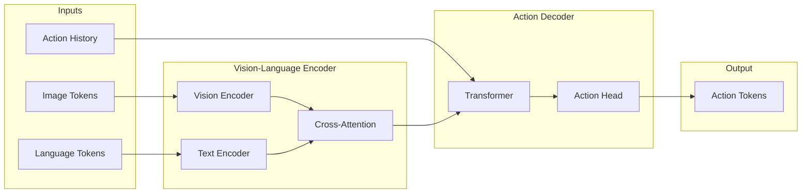
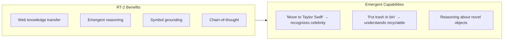
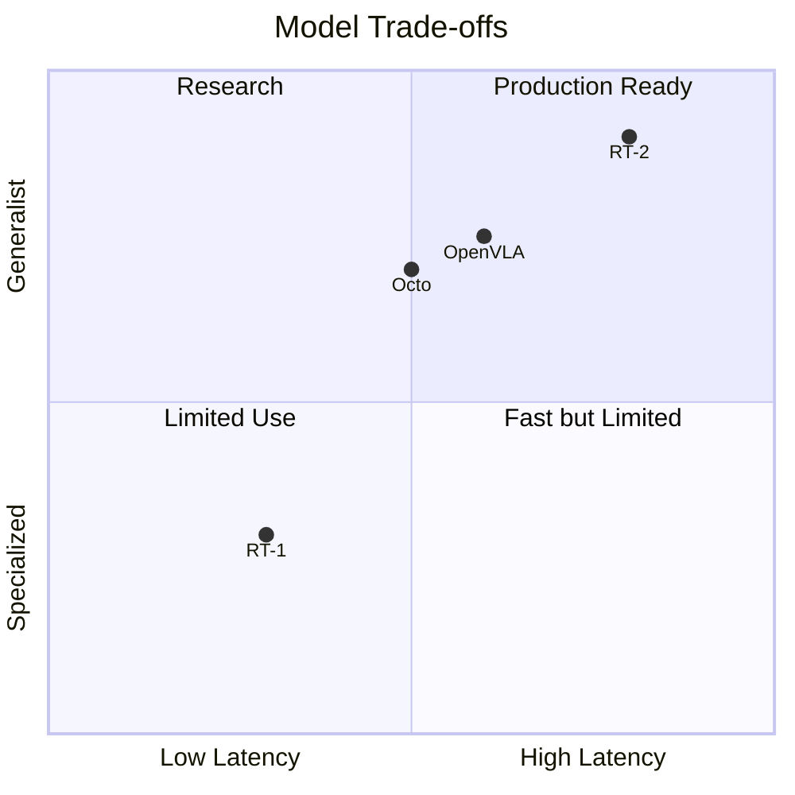

# VLA Architectures

<div className="learning-objectives">

## Learning Objectives

By the end of this chapter, you will be able to:

- Understand VLA model architectures and their components
- Compare RT-1, RT-2, Octo, and OpenVLA approaches
- Choose appropriate VLA for your application
- Implement VLA inference pipelines

</div>

<div className="prerequisites">

## Prerequisites

Before starting this chapter, ensure you have:

- **Chapter**: Completed [Foundation Models](./01-foundation-models)
- **Hardware**: GPU with 16GB+ VRAM
- **Knowledge**: Transformer architecture basics

</div>

## VLA Architecture Overview

Vision-Language-Action models map visual observations and language to robot actions:



## RT-1: Robotics Transformer

Google's first large-scale robot transformer:

### Architecture

```python
"""RT-1 architecture overview."""

import torch
import torch.nn as nn


class RT1(nn.Module):
    """Simplified RT-1 architecture."""

    def __init__(
        self,
        image_size: int = 300,
        num_actions: int = 11,  # 7 arm + 3 base + 1 gripper
        action_bins: int = 256,
        hidden_dim: int = 512,
        num_layers: int = 8,
    ):
        super().__init__()

        # EfficientNet image encoder (pretrained)
        self.image_encoder = EfficientNetEncoder(
            output_dim=hidden_dim
        )

        # FiLM conditioning for language
        self.language_encoder = USEEncoder()  # Universal Sentence Encoder
        self.film_layers = nn.ModuleList([
            FiLMLayer(hidden_dim) for _ in range(num_layers)
        ])

        # TokenLearner for reducing spatial tokens
        self.token_learner = TokenLearner(
            num_tokens=8,
            input_dim=hidden_dim
        )

        # Transformer decoder
        self.transformer = nn.TransformerDecoder(
            nn.TransformerDecoderLayer(
                d_model=hidden_dim,
                nhead=8,
                dim_feedforward=hidden_dim * 4
            ),
            num_layers=num_layers
        )

        # Action tokenization (discretized)
        self.action_head = nn.Linear(hidden_dim, num_actions * action_bins)
        self.num_actions = num_actions
        self.action_bins = action_bins

    def forward(self, images: torch.Tensor, language: str,
                action_history: torch.Tensor) -> torch.Tensor:
        """
        Args:
            images: (B, T, C, H, W) - Image sequence
            language: Task instruction string
            action_history: (B, T-1, num_actions) - Previous actions

        Returns:
            action_logits: (B, num_actions, action_bins)
        """
        B, T = images.shape[:2]

        # Encode images
        image_features = []
        for t in range(T):
            feat = self.image_encoder(images[:, t])  # (B, H*W, D)
            image_features.append(feat)
        image_features = torch.stack(image_features, dim=1)  # (B, T, H*W, D)

        # Language conditioning via FiLM
        lang_embedding = self.language_encoder(language)  # (B, D)
        for film in self.film_layers:
            image_features = film(image_features, lang_embedding)

        # Reduce tokens with TokenLearner
        tokens = self.token_learner(image_features)  # (B, T, 8, D)
        tokens = tokens.view(B, T * 8, -1)  # (B, T*8, D)

        # Transformer processing
        output = self.transformer(
            tgt=tokens,
            memory=tokens
        )

        # Action prediction (from last token)
        action_logits = self.action_head(output[:, -1])
        action_logits = action_logits.view(B, self.num_actions, self.action_bins)

        return action_logits

    def predict_action(self, images, language, action_history):
        """Get continuous action from discretized prediction."""
        logits = self.forward(images, language, action_history)
        action_indices = logits.argmax(dim=-1)  # (B, num_actions)

        # Convert bins to continuous values [-1, 1]
        actions = (action_indices.float() / self.action_bins) * 2 - 1
        return actions
```

### RT-1 Key Features

| Feature | Description |
|---------|-------------|
| **TokenLearner** | Reduces spatial tokens from 81 to 8 |
| **FiLM conditioning** | Efficient language-image fusion |
| **Discretized actions** | 256 bins per action dimension |
| **6-image history** | Temporal context via stacking |

## RT-2: Vision-Language-Action

RT-2 uses pretrained VLMs as the backbone:

```python
"""RT-2 architecture concept."""

class RT2(nn.Module):
    """RT-2: VLM backbone with action outputs."""

    def __init__(self, vlm_name: str = "PaLI-X"):
        super().__init__()

        # Load pretrained VLM (frozen or fine-tuned)
        self.vlm = load_vlm(vlm_name)

        # Action tokenization added to vocabulary
        # Actions represented as text tokens: "1 128 45 200 180 90 255"
        self.action_vocab_start = self.vlm.vocab_size
        self.vlm.resize_token_embeddings(
            self.vlm.vocab_size + 256 * 7  # 256 bins * 7 action dims
        )

    def forward(self, image: torch.Tensor, instruction: str):
        """
        Generate action as text tokens.

        Args:
            image: Robot camera image
            instruction: Task instruction

        Returns:
            action: Decoded action values
        """
        # Format prompt
        prompt = f"<image> {instruction} Output the robot action:"

        # Generate action tokens autoregressively
        output_tokens = self.vlm.generate(
            image=image,
            prompt=prompt,
            max_new_tokens=7,  # 7 action dimensions
            constrain_to_action_vocab=True
        )

        # Decode tokens to action values
        action = self.decode_action_tokens(output_tokens)
        return action

    def decode_action_tokens(self, tokens):
        """Convert action tokens to continuous values."""
        action_indices = tokens - self.action_vocab_start
        actions = action_indices.float() / 256.0 * 2 - 1
        return actions
```

### RT-2 Advantages



## Octo: Open-Source Generalist

Octo is an open-source generalist robot policy:

```python
"""Octo model usage."""

from octo.model.octo_model import OctoModel
import numpy as np


class OctoController:
    """Controller using Octo for manipulation."""

    def __init__(self, checkpoint_path: str = "hf://rail-berkeley/octo-small"):
        # Load pretrained Octo
        self.model = OctoModel.load_pretrained(checkpoint_path)

    def predict_action(
        self,
        images: dict,
        task: str,
        observation_history: list = None
    ) -> np.ndarray:
        """
        Predict action from observations.

        Args:
            images: Dict with camera names as keys
                   e.g., {"primary": img1, "wrist": img2}
            task: Language instruction
            observation_history: Previous observations

        Returns:
            action: Robot action array
        """
        # Format observation
        observation = {
            "image_primary": images.get("primary"),
            "image_wrist": images.get("wrist"),
            "pad_mask": np.array([True]),
        }

        # Create task specification
        task_spec = self.model.create_tasks(texts=[task])

        # Predict action
        action = self.model.sample_actions(
            observation,
            task_spec,
            rng=jax.random.PRNGKey(0)
        )

        return np.array(action[0])

    def run_episode(self, env, task: str, max_steps: int = 100):
        """Run full episode with Octo."""
        obs = env.reset()
        observations = []

        for step in range(max_steps):
            # Get images from observation
            images = {
                "primary": obs["image"],
                "wrist": obs.get("wrist_image")
            }

            # Predict action
            action = self.predict_action(images, task, observations)

            # Execute
            obs, reward, done, info = env.step(action)
            observations.append(obs)

            if done:
                break

        return observations
```

### Octo Architecture Details

```python
"""Octo architecture components."""

class OctoArchitecture:
    """Octo model components."""

    # Vision encoders
    vision_encoder = {
        "type": "ViT",
        "variant": "B/16",  # or S/16 for small
        "pretrained": "DINO",
        "frozen": False,
    }

    # Language encoder
    language_encoder = {
        "type": "T5",
        "variant": "base",
        "frozen": True,
    }

    # Transformer backbone
    transformer = {
        "layers": 12,  # or 24 for large
        "heads": 12,
        "dim": 768,
        "mlp_ratio": 4,
    }

    # Action head (diffusion-based)
    action_head = {
        "type": "diffusion",
        "steps": 10,
        "action_dim": 7,
        "horizon": 4,  # Predict 4 future actions
    }
```

## OpenVLA

Open-source VLA based on Llama:

```python
"""OpenVLA usage example."""

from transformers import AutoModelForVision2Seq, AutoProcessor
import torch


class OpenVLAController:
    """Controller using OpenVLA."""

    def __init__(self, model_id: str = "openvla/openvla-7b"):
        self.processor = AutoProcessor.from_pretrained(
            model_id,
            trust_remote_code=True
        )
        self.model = AutoModelForVision2Seq.from_pretrained(
            model_id,
            torch_dtype=torch.bfloat16,
            device_map="auto",
            trust_remote_code=True
        )

    def predict_action(self, image, instruction: str) -> np.ndarray:
        """Predict action from image and instruction."""
        # Format prompt
        prompt = f"In: What action should the robot take to {instruction}?\nOut:"

        # Process inputs
        inputs = self.processor(prompt, image).to(
            self.model.device,
            dtype=torch.bfloat16
        )

        # Generate action
        action_tokens = self.model.generate(
            **inputs,
            max_new_tokens=7,
            do_sample=False
        )

        # Decode to numpy array
        action = self.processor.decode(
            action_tokens[0],
            unnormalize=True
        )

        return action


# Usage
controller = OpenVLAController()
action = controller.predict_action(
    image=camera_image,
    instruction="pick up the red block"
)
```

## Model Comparison

### Architecture Comparison

| Model | Backbone | Action Type | Size | Open Source |
|-------|----------|-------------|------|-------------|
| **RT-1** | EfficientNet | Discretized | 35M | No |
| **RT-2** | PaLI-X | Text tokens | 55B | No |
| **Octo** | ViT + T5 | Diffusion | 93M | Yes |
| **OpenVLA** | Llama-2 | Discretized | 7B | Yes |

### Performance Trade-offs



### Inference Speed

```python
"""Benchmark VLA inference times."""

import time

def benchmark_vla(model, image, instruction, num_runs=100):
    """Measure inference latency."""
    # Warmup
    for _ in range(10):
        model.predict_action(image, instruction)

    # Benchmark
    latencies = []
    for _ in range(num_runs):
        start = time.perf_counter()
        model.predict_action(image, instruction)
        latencies.append(time.perf_counter() - start)

    return {
        "mean_ms": np.mean(latencies) * 1000,
        "std_ms": np.std(latencies) * 1000,
        "p99_ms": np.percentile(latencies, 99) * 1000
    }


# Typical results (RTX 4090)
BENCHMARK_RESULTS = {
    "RT-1": {"mean_ms": 15, "hz": 66},
    "Octo-small": {"mean_ms": 25, "hz": 40},
    "Octo-base": {"mean_ms": 45, "hz": 22},
    "OpenVLA-7B": {"mean_ms": 80, "hz": 12},
    "RT-2-55B": {"mean_ms": 500, "hz": 2},
}
```

## Choosing a VLA

### Decision Matrix

```python
"""Decision framework for VLA selection."""

def recommend_vla(requirements: dict) -> str:
    """Recommend VLA based on requirements."""

    latency_ms = requirements.get("max_latency_ms", 100)
    generalization = requirements.get("generalization", "medium")
    open_source = requirements.get("open_source", True)
    compute_budget = requirements.get("gpu_memory_gb", 16)

    if not open_source:
        if latency_ms < 20:
            return "RT-1"
        elif generalization == "high":
            return "RT-2"

    if open_source:
        if latency_ms < 30 and compute_budget < 8:
            return "Octo-small"
        elif latency_ms < 50:
            return "Octo-base"
        elif generalization == "high":
            return "OpenVLA"

    return "Octo-base"  # Default


# Example usage
requirements = {
    "max_latency_ms": 50,
    "generalization": "high",
    "open_source": True,
    "gpu_memory_gb": 24
}
model = recommend_vla(requirements)  # Returns "OpenVLA"
```

<div className="key-takeaways">

## Key Takeaways

- **RT-1** pioneered large-scale robot transformers with efficient tokenization
- **RT-2** leverages pretrained VLMs for emergent capabilities
- **Octo** provides open-source generalist policy with diffusion actions
- **OpenVLA** brings Llama-scale VLM benefits to robotics
- Trade-offs exist between **latency**, **generalization**, and **compute**
- Choose based on task requirements: speed vs. capability

</div>

## What's Next?

In the next chapter, we'll cover fine-tuning VLAs for your specific robot and tasks.

## References

1. Brohan, A. et al. (2022). *RT-1: Robotics Transformer for Real-World Control at Scale*. arXiv.
2. Brohan, A. et al. (2023). *RT-2: Vision-Language-Action Models Transfer Web Knowledge to Robotic Control*. arXiv.
3. Team, O. et al. (2024). *Octo: An Open-Source Generalist Robot Policy*. arXiv.
4. Kim, M. et al. (2024). *OpenVLA: An Open-Source Vision-Language-Action Model*. arXiv.
