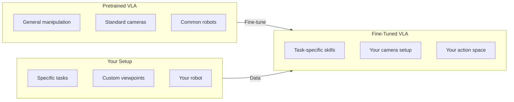

# Fine-Tuning VLAs

<div className="learning-objectives">

## Learning Objectives

By the end of this chapter, you will be able to:

- Collect and format robot demonstration data
- Apply efficient fine-tuning techniques (LoRA, QLoRA)
- Train VLAs on custom robot tasks
- Evaluate and iterate on fine-tuned models

</div>

<div className="prerequisites">

## Prerequisites

Before starting this chapter, ensure you have:

- **Chapter**: Completed [VLA Architectures](./02-vla-architectures)
- **Hardware**: GPU with 24GB+ VRAM for training
- **Data**: Robot demonstration dataset (or ability to collect)

</div>

## Why Fine-Tune?

Pretrained VLAs need adaptation for your specific setup:



### When to Fine-Tune

| Scenario | Approach |
|----------|----------|
| New robot morphology | Fine-tune action head |
| Different camera setup | Fine-tune vision encoder |
| New task types | Full fine-tuning or LoRA |
| Domain shift (lighting, objects) | Light fine-tuning |
| Same robot, similar tasks | Few-shot prompting first |

## Data Collection

### Demonstration Recording

```python
"""Record robot demonstrations for fine-tuning."""

import h5py
import numpy as np
from datetime import datetime
from pathlib import Path


class DemonstrationRecorder:
    """Record robot demonstrations in standard format."""

    def __init__(self, save_dir: str, robot_name: str):
        self.save_dir = Path(save_dir)
        self.save_dir.mkdir(parents=True, exist_ok=True)
        self.robot_name = robot_name
        self.episodes = []

    def start_episode(self, task: str):
        """Start recording new episode."""
        self.current_episode = {
            'task': task,
            'observations': [],
            'actions': [],
            'timestamps': [],
            'metadata': {
                'robot': self.robot_name,
                'start_time': datetime.now().isoformat()
            }
        }

    def record_step(self, observation: dict, action: np.ndarray):
        """Record single timestep."""
        self.current_episode['observations'].append({
            'image': observation['image'].copy(),
            'state': observation.get('state', np.array([])),
            'wrist_image': observation.get('wrist_image')
        })
        self.current_episode['actions'].append(action.copy())
        self.current_episode['timestamps'].append(datetime.now().timestamp())

    def end_episode(self, success: bool):
        """Finalize and save episode."""
        self.current_episode['metadata']['success'] = success
        self.current_episode['metadata']['length'] = len(
            self.current_episode['actions']
        )

        # Save to HDF5
        episode_id = len(self.episodes)
        filepath = self.save_dir / f"episode_{episode_id:04d}.hdf5"

        with h5py.File(filepath, 'w') as f:
            # Task
            f.attrs['task'] = self.current_episode['task']
            f.attrs['success'] = success

            # Observations
            obs_group = f.create_group('observations')
            images = np.stack([o['image'] for o in self.current_episode['observations']])
            obs_group.create_dataset('images', data=images, compression='gzip')

            if self.current_episode['observations'][0].get('wrist_image') is not None:
                wrist = np.stack([o['wrist_image'] for o in self.current_episode['observations']])
                obs_group.create_dataset('wrist_images', data=wrist, compression='gzip')

            # Actions
            actions = np.stack(self.current_episode['actions'])
            f.create_dataset('actions', data=actions)

            # Timestamps
            f.create_dataset('timestamps',
                           data=self.current_episode['timestamps'])

        self.episodes.append(filepath)
        print(f"Saved episode {episode_id} ({len(actions)} steps, success={success})")


# Usage
recorder = DemonstrationRecorder("./demos", "franka_panda")

recorder.start_episode("pick up the red block")
for step in demonstration:
    recorder.record_step(step['obs'], step['action'])
recorder.end_episode(success=True)
```

### Data Format (RLDS)

```python
"""Convert demos to RLDS format for Octo/OpenVLA."""

import tensorflow_datasets as tfds
import tensorflow as tf


def create_rlds_dataset(demo_dir: str, output_dir: str):
    """Convert HDF5 demos to RLDS format."""

    def episode_generator():
        """Generate episodes in RLDS format."""
        for hdf5_path in Path(demo_dir).glob("*.hdf5"):
            with h5py.File(hdf5_path, 'r') as f:
                images = f['observations/images'][:]
                actions = f['actions'][:]
                task = f.attrs['task']

                steps = []
                for i in range(len(actions)):
                    steps.append({
                        'observation': {
                            'image': images[i],
                        },
                        'action': actions[i],
                        'language_instruction': task,
                        'is_first': i == 0,
                        'is_last': i == len(actions) - 1,
                        'is_terminal': i == len(actions) - 1,
                    })

                yield {'steps': steps}

    # Define features
    features = tfds.features.FeaturesDict({
        'steps': tfds.features.Dataset({
            'observation': tfds.features.FeaturesDict({
                'image': tfds.features.Image(shape=(256, 256, 3)),
            }),
            'action': tfds.features.Tensor(shape=(7,), dtype=tf.float32),
            'language_instruction': tfds.features.Text(),
            'is_first': tf.bool,
            'is_last': tf.bool,
            'is_terminal': tf.bool,
        })
    })

    # Build dataset
    ds = tf.data.Dataset.from_generator(
        episode_generator,
        output_signature=features
    )

    # Save
    tf.data.Dataset.save(ds, output_dir)
    return ds
```

## Fine-Tuning Techniques

### Full Fine-Tuning

```python
"""Full fine-tuning of VLA model."""

import torch
from torch.utils.data import DataLoader
from transformers import get_cosine_schedule_with_warmup


class VLAFineTuner:
    """Fine-tune VLA on custom dataset."""

    def __init__(self, model, dataset, config):
        self.model = model
        self.dataset = dataset
        self.config = config

        # Optimizer
        self.optimizer = torch.optim.AdamW(
            model.parameters(),
            lr=config['learning_rate'],
            weight_decay=config['weight_decay']
        )

        # Dataloader
        self.dataloader = DataLoader(
            dataset,
            batch_size=config['batch_size'],
            shuffle=True,
            num_workers=4
        )

        # Scheduler
        total_steps = len(self.dataloader) * config['num_epochs']
        self.scheduler = get_cosine_schedule_with_warmup(
            self.optimizer,
            num_warmup_steps=int(0.1 * total_steps),
            num_training_steps=total_steps
        )

    def train_epoch(self):
        """Train for one epoch."""
        self.model.train()
        total_loss = 0

        for batch in self.dataloader:
            # Forward pass
            outputs = self.model(
                images=batch['images'].cuda(),
                language=batch['language'],
                actions=batch['actions'].cuda()
            )
            loss = outputs.loss

            # Backward pass
            self.optimizer.zero_grad()
            loss.backward()
            torch.nn.utils.clip_grad_norm_(self.model.parameters(), 1.0)
            self.optimizer.step()
            self.scheduler.step()

            total_loss += loss.item()

        return total_loss / len(self.dataloader)

    def train(self):
        """Full training loop."""
        for epoch in range(self.config['num_epochs']):
            loss = self.train_epoch()
            print(f"Epoch {epoch}: loss = {loss:.4f}")

            # Checkpoint
            if (epoch + 1) % self.config['save_interval'] == 0:
                self.save_checkpoint(epoch)

    def save_checkpoint(self, epoch):
        """Save model checkpoint."""
        torch.save({
            'epoch': epoch,
            'model_state_dict': self.model.state_dict(),
            'optimizer_state_dict': self.optimizer.state_dict(),
        }, f"checkpoint_epoch_{epoch}.pt")


# Configuration
config = {
    'learning_rate': 1e-5,
    'weight_decay': 0.01,
    'batch_size': 32,
    'num_epochs': 100,
    'save_interval': 10,
}
```

### LoRA Fine-Tuning

```python
"""LoRA fine-tuning for efficient adaptation."""

from peft import LoraConfig, get_peft_model, TaskType


def setup_lora_finetuning(model, rank: int = 16, alpha: int = 32):
    """Configure LoRA for VLA fine-tuning."""

    lora_config = LoraConfig(
        r=rank,                      # Rank of update matrices
        lora_alpha=alpha,            # Scaling factor
        target_modules=[             # Which layers to adapt
            "q_proj", "k_proj", "v_proj",  # Attention
            "o_proj",
            "gate_proj", "up_proj", "down_proj",  # MLP
        ],
        lora_dropout=0.05,
        bias="none",
        task_type=TaskType.CAUSAL_LM,
    )

    # Wrap model with LoRA
    peft_model = get_peft_model(model, lora_config)

    # Print trainable parameters
    trainable = sum(p.numel() for p in peft_model.parameters() if p.requires_grad)
    total = sum(p.numel() for p in peft_model.parameters())
    print(f"Trainable: {trainable:,} / {total:,} ({100*trainable/total:.2f}%)")

    return peft_model


# Usage
model = load_openvla("openvla/openvla-7b")
lora_model = setup_lora_finetuning(model, rank=16)

# Train only LoRA parameters (much faster)
finetuner = VLAFineTuner(lora_model, dataset, config)
finetuner.train()
```

### QLoRA (Quantized LoRA)

```python
"""QLoRA for fine-tuning with limited VRAM."""

from transformers import BitsAndBytesConfig
from peft import prepare_model_for_kbit_training


def setup_qlora_finetuning(model_name: str, rank: int = 16):
    """Configure QLoRA for memory-efficient fine-tuning."""

    # 4-bit quantization config
    bnb_config = BitsAndBytesConfig(
        load_in_4bit=True,
        bnb_4bit_use_double_quant=True,
        bnb_4bit_quant_type="nf4",
        bnb_4bit_compute_dtype=torch.bfloat16
    )

    # Load quantized model
    model = AutoModelForVision2Seq.from_pretrained(
        model_name,
        quantization_config=bnb_config,
        device_map="auto"
    )

    # Prepare for k-bit training
    model = prepare_model_for_kbit_training(model)

    # Add LoRA
    lora_config = LoraConfig(
        r=rank,
        lora_alpha=rank * 2,
        target_modules=["q_proj", "k_proj", "v_proj", "o_proj"],
        lora_dropout=0.05,
        bias="none",
    )

    model = get_peft_model(model, lora_config)

    return model


# Memory comparison
MEMORY_REQUIREMENTS = {
    "Full fine-tuning 7B": "56 GB",
    "LoRA fine-tuning 7B": "28 GB",
    "QLoRA fine-tuning 7B": "12 GB",  # Fits on RTX 3090
}
```

## Training Pipeline

### Complete Training Script

```python
"""Complete VLA fine-tuning pipeline."""

import argparse
from pathlib import Path
import wandb
from tqdm import tqdm


def main(args):
    # Initialize logging
    wandb.init(project="vla-finetuning", config=vars(args))

    # Load dataset
    print("Loading dataset...")
    dataset = RLDSDataset(
        args.data_path,
        image_size=args.image_size,
        action_horizon=args.action_horizon
    )
    train_loader = DataLoader(
        dataset,
        batch_size=args.batch_size,
        shuffle=True,
        num_workers=args.num_workers
    )

    # Load model
    print("Loading model...")
    if args.use_qlora:
        model = setup_qlora_finetuning(args.model_name, rank=args.lora_rank)
    elif args.use_lora:
        base_model = load_model(args.model_name)
        model = setup_lora_finetuning(base_model, rank=args.lora_rank)
    else:
        model = load_model(args.model_name)

    # Optimizer
    optimizer = torch.optim.AdamW(
        filter(lambda p: p.requires_grad, model.parameters()),
        lr=args.learning_rate,
        weight_decay=args.weight_decay
    )

    # Training loop
    global_step = 0
    for epoch in range(args.num_epochs):
        model.train()
        epoch_loss = 0

        pbar = tqdm(train_loader, desc=f"Epoch {epoch}")
        for batch in pbar:
            # Move to GPU
            images = batch['images'].cuda()
            actions = batch['actions'].cuda()
            language = batch['language']

            # Forward
            loss = model.compute_loss(images, language, actions)

            # Backward
            optimizer.zero_grad()
            loss.backward()
            torch.nn.utils.clip_grad_norm_(model.parameters(), args.grad_clip)
            optimizer.step()

            # Logging
            epoch_loss += loss.item()
            global_step += 1

            wandb.log({
                "loss": loss.item(),
                "lr": optimizer.param_groups[0]['lr'],
                "epoch": epoch,
                "step": global_step
            })

            pbar.set_postfix(loss=f"{loss.item():.4f}")

        # Epoch logging
        avg_loss = epoch_loss / len(train_loader)
        print(f"Epoch {epoch}: avg_loss = {avg_loss:.4f}")

        # Save checkpoint
        if (epoch + 1) % args.save_every == 0:
            save_path = Path(args.output_dir) / f"checkpoint_epoch_{epoch}.pt"
            if args.use_lora or args.use_qlora:
                model.save_pretrained(save_path)
            else:
                torch.save(model.state_dict(), save_path)

    # Final save
    final_path = Path(args.output_dir) / "final_model"
    model.save_pretrained(final_path)
    print(f"Saved final model to {final_path}")


if __name__ == "__main__":
    parser = argparse.ArgumentParser()
    parser.add_argument("--model_name", default="openvla/openvla-7b")
    parser.add_argument("--data_path", required=True)
    parser.add_argument("--output_dir", default="./outputs")
    parser.add_argument("--batch_size", type=int, default=8)
    parser.add_argument("--learning_rate", type=float, default=2e-5)
    parser.add_argument("--num_epochs", type=int, default=50)
    parser.add_argument("--use_lora", action="store_true")
    parser.add_argument("--use_qlora", action="store_true")
    parser.add_argument("--lora_rank", type=int, default=16)
    parser.add_argument("--grad_clip", type=float, default=1.0)
    parser.add_argument("--weight_decay", type=float, default=0.01)
    parser.add_argument("--image_size", type=int, default=224)
    parser.add_argument("--action_horizon", type=int, default=4)
    parser.add_argument("--num_workers", type=int, default=4)
    parser.add_argument("--save_every", type=int, default=10)

    args = parser.parse_args()
    main(args)
```

## Evaluation

### Success Rate Evaluation

```python
"""Evaluate fine-tuned VLA on real robot."""

class VLAEvaluator:
    """Evaluate VLA performance on tasks."""

    def __init__(self, model, env, tasks: list):
        self.model = model
        self.env = env
        self.tasks = tasks

    def evaluate_task(self, task: str, num_episodes: int = 10):
        """Evaluate single task."""
        successes = 0
        episode_lengths = []

        for ep in range(num_episodes):
            obs = self.env.reset()
            done = False
            steps = 0

            while not done and steps < 100:
                action = self.model.predict(obs['image'], task)
                obs, reward, done, info = self.env.step(action)
                steps += 1

            if info.get('success', False):
                successes += 1
            episode_lengths.append(steps)

        return {
            'task': task,
            'success_rate': successes / num_episodes,
            'avg_length': np.mean(episode_lengths)
        }

    def full_evaluation(self, episodes_per_task: int = 10):
        """Evaluate all tasks."""
        results = []
        for task in self.tasks:
            result = self.evaluate_task(task, episodes_per_task)
            results.append(result)
            print(f"{task}: {result['success_rate']*100:.1f}%")

        overall = np.mean([r['success_rate'] for r in results])
        print(f"\nOverall: {overall*100:.1f}%")
        return results
```

<div className="key-takeaways">

## Key Takeaways

- **Collect demonstrations** in standardized formats (HDF5, RLDS)
- **LoRA/QLoRA** enable fine-tuning with limited GPU memory
- Fine-tune **selectively**: action head only vs. full model
- Use **cosine scheduling** with warmup for stable training
- **Evaluate on real robot** - simulation results can be misleading
- Start with **few demonstrations** and iterate

</div>

## What's Next?

In the next chapter, we'll deploy fine-tuned VLAs on physical robots.

## References

1. Hu, E.J. et al. (2021). *LoRA: Low-Rank Adaptation of Large Language Models*. ICLR.
2. Dettmers, T. et al. (2023). *QLoRA: Efficient Finetuning of Quantized LLMs*. NeurIPS.
3. Team, O. (2024). *Octo Fine-tuning Guide*. https://octo-models.github.io/
