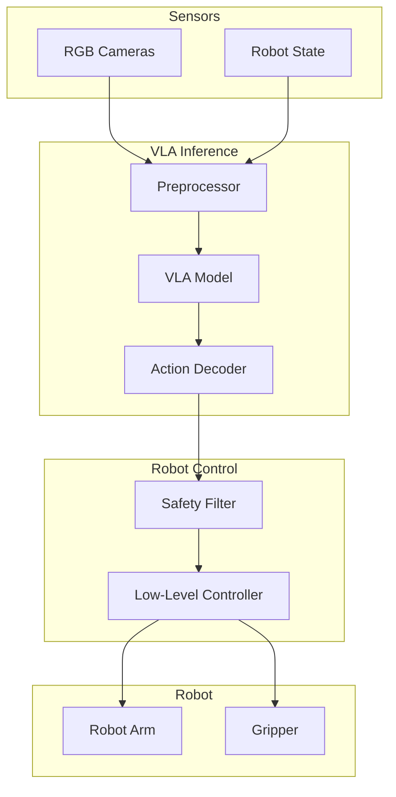

# VLA Deployment

<div className="learning-objectives">

## Learning Objectives

By the end of this chapter, you will be able to:

- Deploy VLA models on robot hardware
- Integrate VLA inference with ROS 2
- Optimize for real-time performance
- Implement safety monitoring for VLA control

</div>

<div className="prerequisites">

## Prerequisites

Before starting this chapter, ensure you have:

- **Chapter**: Completed [Fine-Tuning VLAs](./03-fine-tuning)
- **Hardware**: Robot with compute (workstation or edge device)
- **Software**: ROS 2 Humble, PyTorch/JAX

</div>

## Deployment Architecture

VLA deployment on physical robots:



## ROS 2 Integration

### VLA Action Server

```python title="vla_action_server.py"
"""ROS 2 action server for VLA inference."""

import rclpy
from rclpy.node import Node
from rclpy.action import ActionServer
from rclpy.callback_groups import ReentrantCallbackGroup

import torch
import numpy as np
from PIL import Image
from cv_bridge import CvBridge

from sensor_msgs.msg import Image as ImageMsg
from sensor_msgs.msg import JointState
from std_msgs.msg import String
from vla_interfaces.action import ExecuteTask


class VLAActionServer(Node):
    """ROS 2 action server for VLA-based manipulation."""

    def __init__(self):
        super().__init__('vla_action_server')

        # Parameters
        self.declare_parameter('model_path', '')
        self.declare_parameter('control_frequency', 10.0)
        self.declare_parameter('action_scale', 0.1)

        model_path = self.get_parameter('model_path').value
        self.control_freq = self.get_parameter('control_frequency').value
        self.action_scale = self.get_parameter('action_scale').value

        # Load VLA model
        self.get_logger().info(f'Loading VLA model from {model_path}')
        self.model = self.load_model(model_path)

        # CV bridge for image conversion
        self.bridge = CvBridge()

        # Callback group for concurrent execution
        self.cb_group = ReentrantCallbackGroup()

        # State subscribers
        self.image_sub = self.create_subscription(
            ImageMsg,
            '/camera/image_raw',
            self.image_callback,
            10,
            callback_group=self.cb_group
        )
        self.joint_sub = self.create_subscription(
            JointState,
            '/joint_states',
            self.joint_callback,
            10,
            callback_group=self.cb_group
        )

        # Action publisher
        self.action_pub = self.create_publisher(
            JointState,
            '/joint_position_controller/command',
            10
        )

        # Action server
        self._action_server = ActionServer(
            self,
            ExecuteTask,
            'execute_vla_task',
            self.execute_callback,
            callback_group=self.cb_group
        )

        # State
        self.current_image = None
        self.current_joints = None

        self.get_logger().info('VLA action server ready')

    def load_model(self, model_path: str):
        """Load VLA model."""
        from openvla import OpenVLA

        model = OpenVLA.from_pretrained(model_path)
        model.eval()
        model.cuda()
        return model

    def image_callback(self, msg: ImageMsg):
        """Store latest camera image."""
        cv_image = self.bridge.imgmsg_to_cv2(msg, 'rgb8')
        self.current_image = Image.fromarray(cv_image)

    def joint_callback(self, msg: JointState):
        """Store latest joint state."""
        self.current_joints = np.array(msg.position)

    async def execute_callback(self, goal_handle):
        """Execute VLA task."""
        task = goal_handle.request.task_instruction
        max_steps = goal_handle.request.max_steps
        self.get_logger().info(f'Executing task: {task}')

        # Control loop
        rate = self.create_rate(self.control_freq)
        step = 0
        success = False

        while step < max_steps and rclpy.ok():
            # Check for cancellation
            if goal_handle.is_cancel_requested:
                goal_handle.canceled()
                return ExecuteTask.Result(success=False)

            # Get VLA action
            if self.current_image is not None:
                action = self.get_vla_action(task)

                # Apply action
                self.apply_action(action)

                # Publish feedback
                feedback = ExecuteTask.Feedback()
                feedback.current_step = step
                feedback.action_taken = action.tolist()
                goal_handle.publish_feedback(feedback)

            step += 1
            rate.sleep()

            # Check completion (task-specific)
            if self.check_completion(task):
                success = True
                break

        # Result
        goal_handle.succeed()
        result = ExecuteTask.Result()
        result.success = success
        result.total_steps = step
        return result

    @torch.inference_mode()
    def get_vla_action(self, task: str) -> np.ndarray:
        """Get action from VLA model."""
        # Preprocess image
        image = self.current_image.resize((224, 224))

        # Run inference
        action = self.model.predict(image, task)

        # Scale action
        action = action * self.action_scale

        return action

    def apply_action(self, action: np.ndarray):
        """Apply action to robot."""
        msg = JointState()
        msg.header.stamp = self.get_clock().now().to_msg()
        msg.name = ['joint1', 'joint2', 'joint3', 'joint4', 'joint5', 'joint6']

        # Convert delta action to absolute position
        if self.current_joints is not None:
            target_pos = self.current_joints + action[:6]
            msg.position = target_pos.tolist()
            self.action_pub.publish(msg)

    def check_completion(self, task: str) -> bool:
        """Check if task is complete (implement task-specific logic)."""
        # This would use task-specific completion criteria
        return False


def main():
    rclpy.init()
    node = VLAActionServer()
    rclpy.spin(node)
    rclpy.shutdown()


if __name__ == '__main__':
    main()
```

### Action Interface Definition

```text title="action/ExecuteTask.action"
# Goal
string task_instruction
int32 max_steps 100

---
# Result
bool success
int32 total_steps
string error_message

---
# Feedback
int32 current_step
float64[] action_taken
```

### Launch File

```python title="launch/vla_robot.launch.py"
"""Launch VLA deployment stack."""

from launch import LaunchDescription
from launch_ros.actions import Node
from launch.actions import DeclareLaunchArgument
from launch.substitutions import LaunchConfiguration


def generate_launch_description():
    return LaunchDescription([
        # Arguments
        DeclareLaunchArgument(
            'model_path',
            default_value='/models/vla/finetuned',
            description='Path to VLA model'
        ),
        DeclareLaunchArgument(
            'control_frequency',
            default_value='10.0',
            description='Control loop frequency (Hz)'
        ),

        # VLA action server
        Node(
            package='vla_robot',
            executable='vla_action_server',
            name='vla_server',
            parameters=[{
                'model_path': LaunchConfiguration('model_path'),
                'control_frequency': LaunchConfiguration('control_frequency'),
                'action_scale': 0.1,
            }],
            output='screen',
        ),

        # Safety monitor
        Node(
            package='vla_robot',
            executable='safety_monitor',
            name='safety_monitor',
            parameters=[{
                'max_velocity': 0.5,
                'workspace_bounds': [-0.8, 0.8, -0.8, 0.8, 0.0, 1.2],
            }],
            output='screen',
        ),

        # Camera driver
        Node(
            package='usb_cam',
            executable='usb_cam_node_exe',
            name='camera',
            parameters=[{
                'video_device': '/dev/video0',
                'image_width': 640,
                'image_height': 480,
                'framerate': 30.0,
            }],
        ),
    ])
```

## Performance Optimization

### TensorRT Optimization

```python
"""Optimize VLA with TensorRT."""

import torch
import tensorrt as trt


class TensorRTVLA:
    """TensorRT-optimized VLA inference."""

    def __init__(self, onnx_path: str, fp16: bool = True):
        self.logger = trt.Logger(trt.Logger.WARNING)
        self.engine = self.build_engine(onnx_path, fp16)
        self.context = self.engine.create_execution_context()

        # Allocate buffers
        self.inputs, self.outputs, self.bindings = self.allocate_buffers()

    def build_engine(self, onnx_path: str, fp16: bool):
        """Build TensorRT engine from ONNX."""
        builder = trt.Builder(self.logger)
        network = builder.create_network(
            1 << int(trt.NetworkDefinitionCreationFlag.EXPLICIT_BATCH)
        )
        parser = trt.OnnxParser(network, self.logger)

        # Parse ONNX
        with open(onnx_path, 'rb') as f:
            if not parser.parse(f.read()):
                for error in range(parser.num_errors):
                    print(parser.get_error(error))
                raise RuntimeError("ONNX parsing failed")

        # Build config
        config = builder.create_builder_config()
        config.set_memory_pool_limit(trt.MemoryPoolType.WORKSPACE, 1 << 30)

        if fp16:
            config.set_flag(trt.BuilderFlag.FP16)

        # Build engine
        engine = builder.build_serialized_network(network, config)
        runtime = trt.Runtime(self.logger)
        return runtime.deserialize_cuda_engine(engine)

    def allocate_buffers(self):
        """Allocate GPU buffers."""
        inputs, outputs, bindings = [], [], []

        for i in range(self.engine.num_io_tensors):
            name = self.engine.get_tensor_name(i)
            shape = self.engine.get_tensor_shape(name)
            dtype = trt.nptype(self.engine.get_tensor_dtype(name))
            size = trt.volume(shape)

            # Allocate
            buffer = cuda.mem_alloc(size * dtype().itemsize)
            bindings.append(int(buffer))

            if self.engine.get_tensor_mode(name) == trt.TensorIOMode.INPUT:
                inputs.append({'name': name, 'buffer': buffer, 'shape': shape})
            else:
                outputs.append({'name': name, 'buffer': buffer, 'shape': shape})

        return inputs, outputs, bindings

    def infer(self, image: np.ndarray, text_embedding: np.ndarray):
        """Run TensorRT inference."""
        # Copy inputs to GPU
        cuda.memcpy_htod(self.inputs[0]['buffer'], image)
        cuda.memcpy_htod(self.inputs[1]['buffer'], text_embedding)

        # Execute
        self.context.execute_v2(bindings=self.bindings)

        # Copy output from GPU
        output = np.empty(self.outputs[0]['shape'], dtype=np.float32)
        cuda.memcpy_dtoh(output, self.outputs[0]['buffer'])

        return output


# Speedup comparison
INFERENCE_TIMES = {
    "PyTorch FP32": "80 ms",
    "PyTorch FP16": "45 ms",
    "TensorRT FP16": "15 ms",
    "TensorRT INT8": "8 ms",
}
```

### Batched Inference

```python
"""Batched inference for multiple cameras."""

class BatchedVLAInference:
    """Process multiple camera views in parallel."""

    def __init__(self, model, batch_size: int = 4):
        self.model = model
        self.batch_size = batch_size

    def process_views(self, images: list, task: str) -> list:
        """Process multiple camera views."""
        # Batch images
        batch = torch.stack([
            self.preprocess(img) for img in images
        ])

        # Single forward pass
        with torch.inference_mode():
            actions = self.model.batch_predict(batch, task)

        return actions.cpu().numpy()

    def preprocess(self, image):
        """Preprocess single image."""
        image = image.resize((224, 224))
        tensor = torch.from_numpy(np.array(image)).permute(2, 0, 1).float()
        tensor = tensor / 255.0
        return tensor
```

## Safety Systems

### Safety Monitor

```python title="safety_monitor.py"
"""Safety monitoring for VLA deployment."""

import rclpy
from rclpy.node import Node
import numpy as np

from sensor_msgs.msg import JointState
from std_msgs.msg import Bool


class SafetyMonitor(Node):
    """Monitor and enforce safety constraints."""

    def __init__(self):
        super().__init__('safety_monitor')

        # Parameters
        self.declare_parameter('max_velocity', 1.0)
        self.declare_parameter('max_acceleration', 5.0)
        self.declare_parameter('workspace_bounds', [-1.0, 1.0, -1.0, 1.0, 0.0, 1.5])
        self.declare_parameter('joint_limits', [])

        self.max_vel = self.get_parameter('max_velocity').value
        self.max_acc = self.get_parameter('max_acceleration').value
        self.workspace = self.get_parameter('workspace_bounds').value

        # State tracking
        self.last_joint_pos = None
        self.last_joint_vel = None
        self.last_time = None
        self.violation_count = 0

        # Subscribers
        self.joint_sub = self.create_subscription(
            JointState,
            '/joint_states',
            self.joint_callback,
            10
        )

        self.command_sub = self.create_subscription(
            JointState,
            '/joint_position_controller/command',
            self.command_callback,
            10
        )

        # Publishers
        self.safe_command_pub = self.create_publisher(
            JointState,
            '/joint_position_controller/safe_command',
            10
        )
        self.estop_pub = self.create_publisher(Bool, '/emergency_stop', 10)

        self.get_logger().info('Safety monitor active')

    def joint_callback(self, msg: JointState):
        """Track current robot state."""
        current_time = self.get_clock().now().nanoseconds * 1e-9
        current_pos = np.array(msg.position)
        current_vel = np.array(msg.velocity) if msg.velocity else None

        if self.last_joint_pos is not None and self.last_time is not None:
            dt = current_time - self.last_time
            if dt > 0:
                # Compute velocity if not provided
                if current_vel is None:
                    current_vel = (current_pos - self.last_joint_pos) / dt

                # Check velocity limits
                if np.any(np.abs(current_vel) > self.max_vel):
                    self.handle_violation("Velocity limit exceeded")

                # Check acceleration
                if self.last_joint_vel is not None:
                    accel = (current_vel - self.last_joint_vel) / dt
                    if np.any(np.abs(accel) > self.max_acc):
                        self.handle_violation("Acceleration limit exceeded")

        self.last_joint_pos = current_pos
        self.last_joint_vel = current_vel
        self.last_time = current_time

    def command_callback(self, msg: JointState):
        """Filter and validate commanded actions."""
        target_pos = np.array(msg.position)

        # Apply safety filters
        safe_pos = self.apply_safety_filters(target_pos)

        # Publish safe command
        safe_msg = JointState()
        safe_msg.header = msg.header
        safe_msg.name = msg.name
        safe_msg.position = safe_pos.tolist()
        self.safe_command_pub.publish(safe_msg)

    def apply_safety_filters(self, target_pos: np.ndarray) -> np.ndarray:
        """Apply safety constraints to target position."""
        safe_pos = target_pos.copy()

        if self.last_joint_pos is not None:
            # Rate limiting
            delta = target_pos - self.last_joint_pos
            max_delta = self.max_vel * 0.1  # Assuming 10Hz
            delta = np.clip(delta, -max_delta, max_delta)
            safe_pos = self.last_joint_pos + delta

        # Workspace bounds (would need FK)
        # This is simplified - real implementation needs forward kinematics

        return safe_pos

    def handle_violation(self, reason: str):
        """Handle safety violation."""
        self.violation_count += 1
        self.get_logger().warn(f'Safety violation: {reason}')

        if self.violation_count > 5:
            self.get_logger().error('Multiple violations - triggering E-STOP')
            self.estop_pub.publish(Bool(data=True))


def main():
    rclpy.init()
    node = SafetyMonitor()
    rclpy.spin(node)
    rclpy.shutdown()
```

### Action Filtering

```python
"""Filter VLA actions for safety."""

class ActionFilter:
    """Filter and smooth VLA actions."""

    def __init__(self, config: dict):
        self.max_delta = config['max_action_delta']
        self.smoothing = config['smoothing_factor']
        self.last_action = None

    def filter(self, raw_action: np.ndarray) -> np.ndarray:
        """Apply safety filters to action."""
        action = raw_action.copy()

        # Clip to valid range
        action = np.clip(action, -1.0, 1.0)

        # Rate limiting
        if self.last_action is not None:
            delta = action - self.last_action
            delta = np.clip(delta, -self.max_delta, self.max_delta)
            action = self.last_action + delta

        # Exponential smoothing
        if self.last_action is not None:
            action = (
                self.smoothing * action +
                (1 - self.smoothing) * self.last_action
            )

        self.last_action = action
        return action

    def reset(self):
        """Reset filter state."""
        self.last_action = None
```

## Monitoring and Logging

```python
"""Monitoring VLA deployment."""

import wandb
from dataclasses import dataclass
from typing import Optional


@dataclass
class InferenceMetrics:
    """Metrics for VLA inference."""
    latency_ms: float
    action_norm: float
    confidence: Optional[float]
    task: str


class DeploymentMonitor:
    """Monitor VLA deployment in production."""

    def __init__(self, log_to_wandb: bool = True):
        self.log_to_wandb = log_to_wandb
        if log_to_wandb:
            wandb.init(project="vla-deployment")

        self.metrics_history = []

    def log_inference(self, metrics: InferenceMetrics):
        """Log inference metrics."""
        self.metrics_history.append(metrics)

        if self.log_to_wandb:
            wandb.log({
                'latency_ms': metrics.latency_ms,
                'action_norm': metrics.action_norm,
                'task': metrics.task
            })

        # Alert on high latency
        if metrics.latency_ms > 100:
            print(f"WARNING: High latency: {metrics.latency_ms:.1f}ms")

    def get_summary(self):
        """Get deployment summary."""
        latencies = [m.latency_ms for m in self.metrics_history]
        return {
            'total_inferences': len(self.metrics_history),
            'mean_latency_ms': np.mean(latencies),
            'p99_latency_ms': np.percentile(latencies, 99),
            'max_latency_ms': np.max(latencies)
        }
```

<div className="key-takeaways">

## Key Takeaways

- Deploy VLA as **ROS 2 action server** for task-level control
- Use **TensorRT** for 4-5x inference speedup
- Implement **safety monitors** with velocity/workspace limits
- **Filter actions** with rate limiting and smoothing
- **Log metrics** for production monitoring
- Test extensively in simulation before real robot

</div>

## What's Next?

In the next chapter, we'll explore advanced topics including multi-robot coordination and continual learning.

## References

1. NVIDIA. (2024). *TensorRT Documentation*. https://developer.nvidia.com/tensorrt
2. Brohan, A. et al. (2023). *RT-2: Vision-Language-Action Models*. arXiv.
3. Open Robotics. (2024). *ROS 2 Best Practices*. https://docs.ros.org/
