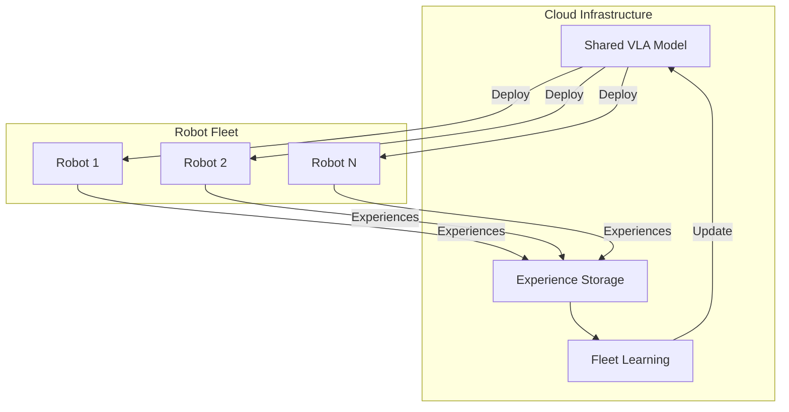
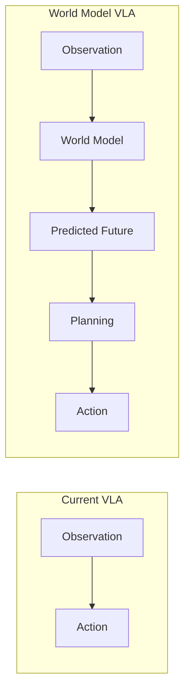

# Advanced Topics

<div className="learning-objectives">

## Learning Objectives

By the end of this chapter, you will be able to:

- Design multi-robot systems with shared VLA models
- Implement continual learning from deployment
- Understand human-robot interaction patterns
- Explore future directions in embodied AI

</div>

<div className="prerequisites">

## Prerequisites

Before starting this chapter, ensure you have:

- **Chapter**: Completed [VLA Deployment](./04-deployment)
- **Knowledge**: Full VLA pipeline from training to deployment

</div>

## Multi-Robot Systems

### Shared Model Architecture



### Fleet Learning

```python
"""Fleet learning for multi-robot VLA systems."""

from dataclasses import dataclass
from typing import List, Dict
import torch
from torch.utils.data import DataLoader, ConcatDataset


@dataclass
class RobotExperience:
    """Experience from a single robot."""
    robot_id: str
    images: torch.Tensor
    actions: torch.Tensor
    language: str
    success: bool
    metadata: Dict


class FleetLearningManager:
    """Manage learning across robot fleet."""

    def __init__(self, model, config: dict):
        self.model = model
        self.config = config
        self.experience_buffer = {}  # robot_id -> experiences

    def collect_experience(self, experience: RobotExperience):
        """Collect experience from robot."""
        robot_id = experience.robot_id

        if robot_id not in self.experience_buffer:
            self.experience_buffer[robot_id] = []

        self.experience_buffer[robot_id].append(experience)

        # Trigger learning if enough data
        total_experiences = sum(
            len(exp) for exp in self.experience_buffer.values()
        )
        if total_experiences >= self.config['min_experiences_for_update']:
            self.update_model()

    def update_model(self):
        """Update model from fleet experiences."""
        # Combine experiences from all robots
        all_experiences = []
        for robot_experiences in self.experience_buffer.values():
            all_experiences.extend(robot_experiences)

        # Filter to successful experiences
        successful = [e for e in all_experiences if e.success]

        if len(successful) < self.config['min_successful']:
            return

        # Create dataset
        dataset = ExperienceDataset(successful)
        dataloader = DataLoader(
            dataset,
            batch_size=self.config['batch_size'],
            shuffle=True
        )

        # Fine-tune model
        self.finetune_step(dataloader)

        # Clear buffer
        self.experience_buffer = {}

    def finetune_step(self, dataloader):
        """Single fine-tuning step."""
        self.model.train()
        optimizer = torch.optim.AdamW(
            self.model.parameters(),
            lr=self.config['learning_rate']
        )

        for batch in dataloader:
            loss = self.model.compute_loss(
                batch['images'],
                batch['language'],
                batch['actions']
            )
            optimizer.zero_grad()
            loss.backward()
            optimizer.step()

        self.model.eval()

    def get_model_for_deployment(self) -> torch.nn.Module:
        """Get current model for deployment."""
        return self.model


class MultiRobotCoordinator:
    """Coordinate task allocation across robots."""

    def __init__(self, robots: List[str], vla_model):
        self.robots = robots
        self.model = vla_model
        self.robot_status = {r: 'idle' for r in robots}

    def allocate_task(self, task: str, context_image) -> str:
        """Allocate task to best available robot."""
        available = [
            r for r, status in self.robot_status.items()
            if status == 'idle'
        ]

        if not available:
            return None

        # Use VLA to assess task suitability
        scores = {}
        for robot in available:
            score = self.assess_robot_capability(robot, task, context_image)
            scores[robot] = score

        # Assign to best robot
        best_robot = max(scores, key=scores.get)
        self.robot_status[best_robot] = 'executing'

        return best_robot

    def assess_robot_capability(self, robot: str, task: str, image) -> float:
        """Assess robot's capability for task."""
        # Could use VLA confidence or specialized capability model
        prompt = f"Can robot {robot} successfully {task}? Rate 0-1."
        confidence = self.model.get_confidence(image, prompt)
        return confidence

    def task_completed(self, robot: str, success: bool):
        """Mark task as completed."""
        self.robot_status[robot] = 'idle'
```

## Continual Learning

### Online Learning Pipeline

```python
"""Continual learning from deployment experiences."""

import numpy as np
from collections import deque


class ContinualLearner:
    """Continual learning with experience replay."""

    def __init__(self, model, buffer_size: int = 10000):
        self.model = model
        self.replay_buffer = deque(maxlen=buffer_size)
        self.learning_rate = 1e-6  # Very small for stability
        self.update_frequency = 100  # Episodes between updates

        # Track performance
        self.episode_count = 0
        self.success_rate = deque(maxlen=100)

    def add_episode(self, episode: dict, success: bool):
        """Add episode to replay buffer."""
        self.replay_buffer.append({
            'images': episode['images'],
            'actions': episode['actions'],
            'language': episode['language'],
            'success': success,
            'priority': 1.0 if success else 0.5
        })

        self.success_rate.append(1 if success else 0)
        self.episode_count += 1

        # Periodic learning
        if self.episode_count % self.update_frequency == 0:
            self.learn_from_buffer()

    def learn_from_buffer(self):
        """Learn from replay buffer."""
        if len(self.replay_buffer) < 50:
            return

        # Sample with priority
        priorities = np.array([e['priority'] for e in self.replay_buffer])
        probs = priorities / priorities.sum()

        batch_indices = np.random.choice(
            len(self.replay_buffer),
            size=min(32, len(self.replay_buffer)),
            replace=False,
            p=probs
        )

        # Prepare batch
        batch = [self.replay_buffer[i] for i in batch_indices]

        # Conservative update
        self.model.train()
        optimizer = torch.optim.AdamW(
            self.model.parameters(),
            lr=self.learning_rate
        )

        for sample in batch:
            loss = self.model.compute_loss(
                sample['images'],
                sample['language'],
                sample['actions']
            )

            optimizer.zero_grad()
            loss.backward()
            torch.nn.utils.clip_grad_norm_(self.model.parameters(), 0.1)
            optimizer.step()

        self.model.eval()

    def get_performance_stats(self) -> dict:
        """Get current performance statistics."""
        return {
            'episode_count': self.episode_count,
            'recent_success_rate': np.mean(self.success_rate) if self.success_rate else 0,
            'buffer_size': len(self.replay_buffer)
        }
```

### Catastrophic Forgetting Prevention

```python
"""Prevent catastrophic forgetting during continual learning."""

class EWCRegularizer:
    """Elastic Weight Consolidation for VLAs."""

    def __init__(self, model, lambda_ewc: float = 1000):
        self.model = model
        self.lambda_ewc = lambda_ewc
        self.fisher_information = {}
        self.optimal_params = {}

    def compute_fisher(self, dataloader):
        """Compute Fisher information matrix diagonal."""
        self.fisher_information = {}

        self.model.eval()
        for name, param in self.model.named_parameters():
            self.fisher_information[name] = torch.zeros_like(param)

        for batch in dataloader:
            self.model.zero_grad()
            loss = self.model.compute_loss(
                batch['images'],
                batch['language'],
                batch['actions']
            )
            loss.backward()

            for name, param in self.model.named_parameters():
                if param.grad is not None:
                    self.fisher_information[name] += param.grad.pow(2)

        # Normalize
        for name in self.fisher_information:
            self.fisher_information[name] /= len(dataloader)

        # Store optimal parameters
        self.optimal_params = {
            name: param.clone()
            for name, param in self.model.named_parameters()
        }

    def ewc_loss(self) -> torch.Tensor:
        """Compute EWC regularization loss."""
        loss = 0
        for name, param in self.model.named_parameters():
            if name in self.fisher_information:
                fisher = self.fisher_information[name]
                optimal = self.optimal_params[name]
                loss += (fisher * (param - optimal).pow(2)).sum()

        return self.lambda_ewc * loss


class ProgressiveNetwork:
    """Progressive neural networks for task expansion."""

    def __init__(self, base_model):
        self.columns = [base_model]  # Frozen base
        self.lateral_connections = []

    def add_task_column(self, new_task_data):
        """Add new column for new task."""
        # Create new column (copy of architecture)
        new_column = self.create_new_column()

        # Freeze previous columns
        for col in self.columns:
            for param in col.parameters():
                param.requires_grad = False

        # Add lateral connections
        laterals = self.create_lateral_connections(len(self.columns))
        self.lateral_connections.append(laterals)

        self.columns.append(new_column)

        # Train new column
        self.train_new_column(new_task_data)
```

## Human-Robot Interaction

### Natural Language Commands

```python
"""Natural language interface for VLA robots."""

class NaturalLanguageInterface:
    """Process natural language commands for robots."""

    def __init__(self, vla_model, llm_model):
        self.vla = vla_model
        self.llm = llm_model

    async def process_command(self, user_input: str, scene_image) -> dict:
        """Process natural language command."""
        # Use LLM to understand and clarify
        clarified = await self.clarify_command(user_input, scene_image)

        # Check feasibility
        feasibility = self.check_feasibility(clarified, scene_image)

        if not feasibility['feasible']:
            return {
                'status': 'clarification_needed',
                'reason': feasibility['reason'],
                'suggestions': feasibility['suggestions']
            }

        # Execute with VLA
        return {
            'status': 'executing',
            'task': clarified,
            'estimated_steps': feasibility['estimated_steps']
        }

    async def clarify_command(self, user_input: str, image) -> str:
        """Use LLM to clarify ambiguous commands."""
        prompt = f"""Given this scene and command, provide a clear robot instruction.

        User command: "{user_input}"

        Provide a specific, unambiguous instruction for the robot.
        Focus on: what object, what action, where to place/move.
        """

        response = await self.llm.generate(prompt, image=image)
        return response

    def check_feasibility(self, task: str, image) -> dict:
        """Check if task is feasible."""
        # Use VLA to assess
        confidence = self.vla.get_task_confidence(image, task)

        return {
            'feasible': confidence > 0.5,
            'confidence': confidence,
            'reason': 'Object not visible' if confidence < 0.3 else None,
            'suggestions': self.get_suggestions(task, image) if confidence < 0.5 else [],
            'estimated_steps': int(50 / confidence) if confidence > 0 else 100
        }


class InteractiveCorrection:
    """Allow human correction during execution."""

    def __init__(self, vla_model):
        self.vla = vla_model
        self.correction_buffer = []

    def apply_correction(self, correction_type: str, data: dict):
        """Apply human correction."""
        if correction_type == 'stop':
            return {'action': 'stop'}

        elif correction_type == 'adjust_target':
            # Human specifies correct target
            new_target = data['target_position']
            return {'action': 'move_to', 'target': new_target}

        elif correction_type == 'retry':
            # Reset and retry with same instruction
            return {'action': 'retry'}

        elif correction_type == 'new_instruction':
            # New verbal instruction
            return {
                'action': 'new_task',
                'instruction': data['instruction']
            }

    def learn_from_correction(self, original_action, correction, context):
        """Learn from human correction."""
        self.correction_buffer.append({
            'context': context,
            'original': original_action,
            'correction': correction
        })

        # Batch learning from corrections
        if len(self.correction_buffer) >= 10:
            self.update_from_corrections()

    def update_from_corrections(self):
        """Update model from accumulated corrections."""
        # Create training data from corrections
        training_data = []
        for item in self.correction_buffer:
            training_data.append({
                'image': item['context']['image'],
                'language': item['context']['instruction'],
                'action': item['correction']  # Use corrected action
            })

        # Fine-tune (with very small learning rate)
        # ... fine-tuning code ...

        self.correction_buffer = []
```

## Future Directions

### World Models



```python
"""World model integration concept."""

class WorldModelVLA:
    """VLA with internal world model for planning."""

    def __init__(self, vla_backbone, world_model):
        self.vla = vla_backbone
        self.world_model = world_model  # Predicts future states

    def plan_with_imagination(self, obs, task, horizon: int = 10):
        """Plan using imagined futures."""
        # Generate candidate action sequences
        candidates = self.generate_action_candidates(obs, task)

        best_sequence = None
        best_score = -float('inf')

        for action_seq in candidates:
            # Imagine future using world model
            imagined_states = self.world_model.rollout(obs, action_seq)

            # Evaluate sequence
            score = self.evaluate_trajectory(imagined_states, task)

            if score > best_score:
                best_score = score
                best_sequence = action_seq

        # Return first action of best sequence
        return best_sequence[0]

    def evaluate_trajectory(self, states, task):
        """Evaluate imagined trajectory."""
        # Check task completion in imagined states
        final_state = states[-1]
        completion_score = self.vla.predict_completion(final_state, task)

        # Penalize unsafe states
        safety_score = sum(self.check_safety(s) for s in states) / len(states)

        return completion_score * safety_score
```

### Emerging Capabilities

| Capability | Status | Impact |
|------------|--------|--------|
| **Zero-shot generalization** | Emerging | New tasks without training |
| **Chain-of-thought reasoning** | Research | Complex task decomposition |
| **Multi-step planning** | Early | Long-horizon tasks |
| **Social interaction** | Research | Human-aware behavior |
| **Self-improvement** | Theoretical | Autonomous learning |

### Research Frontiers

```python
"""Future research directions."""

# 1. Compositional Generalization
# Combine learned skills in novel ways
def compose_skills(skill_a, skill_b, transition_model):
    """Compose two skills into a new behavior."""
    pass

# 2. Hierarchical VLAs
# Multiple levels of abstraction
class HierarchicalVLA:
    def __init__(self):
        self.high_level = HighLevelPlanner()  # Plans subgoals
        self.mid_level = SkillSelector()      # Selects primitives
        self.low_level = ActionGenerator()    # Generates actions

# 3. Embodiment-Agnostic Models
# Transfer across robot morphologies
class UniversalVLA:
    def adapt_to_embodiment(self, robot_config):
        """Adapt model to new robot without full retraining."""
        pass

# 4. Safety-Aware Reasoning
# Intrinsic safety understanding
class SafeVLA:
    def predict_safety(self, action, context):
        """Predict safety of action before execution."""
        pass
```

<div className="key-takeaways">

## Key Takeaways

- **Fleet learning** aggregates experiences across multiple robots
- **Continual learning** adapts models from deployment data
- Use **EWC** or **progressive networks** to prevent forgetting
- **Natural language interfaces** enable intuitive human-robot interaction
- **World models** enable planning through imagination
- Future VLAs will have **compositional** and **hierarchical** capabilities

</div>

## Conclusion

You've completed the Physical AI & Humanoid Robotics book! You now have the knowledge to:

1. Build ROS 2-based robot software stacks
2. Create realistic simulations with Gazebo and Isaac
3. Train policies with GPU-parallel reinforcement learning
4. Deploy vision-language-action models on physical robots

The field is evolving rapidly - stay curious and keep building!

## References

1. Team, G.D. (2024). *Scaling Robot Learning with Semantically Imagined Experience*. arXiv.
2. Ha, D. & Schmidhuber, J. (2018). *World Models*. NeurIPS.
3. Finn, C. et al. (2017). *Model-Agnostic Meta-Learning*. ICML.
4. Kirkpatrick, J. et al. (2017). *Overcoming Catastrophic Forgetting*. PNAS.
