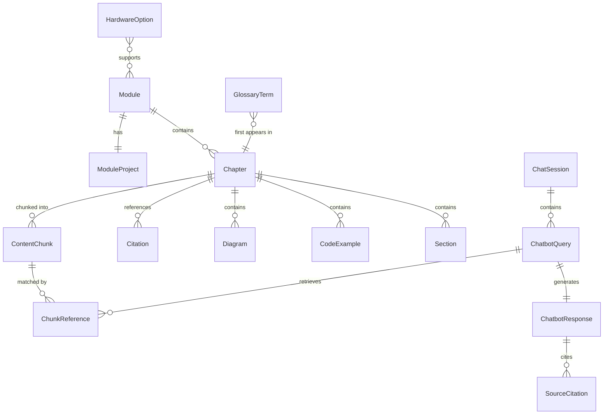

# Data Model: Physical AI & Humanoid Robotics Book

**Feature**: 001-humanoid-robotics-book
**Created**: 2025-12-15
**Status**: Draft

## Overview

This document defines the data models for both the static book content structure and the RAG chatbot system. The models are organized into two domains: Content Domain (book structure) and Chatbot Domain (RAG system).

---

## Content Domain

### Module

Represents a major section of the book containing related chapters and a Module Project.

```typescript
interface Module {
  id: string;                    // e.g., "module1-ros2"
  title: string;                 // e.g., "Module 1: ROS 2 Fundamentals"
  description: string;           // Brief overview of module content
  sidebarPosition: number;       // Order in sidebar (1-4)
  prerequisites: string[];       // IDs of prerequisite modules/chapters
  chapters: Chapter[];           // List of chapters in this module
  moduleProject: ModuleProject;  // Hands-on integration project
  estimatedHours: number;        // Estimated completion time
}
```

### Chapter

Represents an individual lesson within a module.

```typescript
interface Chapter {
  id: string;                    // e.g., "ros2-nodes-topics"
  title: string;                 // Display title
  sidebarLabel: string;          // Sidebar display text (shorter)
  sidebarPosition: number;       // Order within module
  slug: string;                  // URL slug

  // Frontmatter
  description: string;           // Meta description for SEO
  keywords: string[];            // SEO keywords

  // Content Structure
  learningObjectives: string[];  // 3-5 objectives per chapter
  prerequisites: Prerequisite[]; // Required knowledge/setup
  sections: Section[];           // Main content sections
  codeExamples: CodeExample[];   // All code blocks in chapter
  diagrams: Diagram[];           // Mermaid/image diagrams
  keyTakeaways: string[];        // Summary bullet points
  references: Citation[];        // End-of-chapter citations

  // Metadata
  wordCount: number;             // Approximate word count
  lastUpdated: string;           // ISO date
  authors: string[];             // Contributing authors
}
```

### Prerequisite

Describes a requirement before starting a chapter.

```typescript
interface Prerequisite {
  type: "chapter" | "software" | "knowledge" | "hardware";
  description: string;           // Human-readable description
  link?: string;                 // Link to resource or prior chapter
  version?: string;              // For software prerequisites
}
```

### Section

A major section within a chapter (H2 level).

```typescript
interface Section {
  id: string;                    // Anchor ID
  title: string;                 // H2 heading
  content: string;               // MDX content
  subsections: Subsection[];     // H3 level sections
}

interface Subsection {
  id: string;
  title: string;
  content: string;
}
```

### CodeExample

A runnable code block with context.

```typescript
interface CodeExample {
  id: string;                    // Unique identifier
  language: "python" | "yaml" | "xml" | "bash" | "cpp" | "typescript";
  code: string;                  // The actual code
  filename?: string;             // Suggested filename

  // Context
  description: string;           // What this code does
  prerequisites: string[];       // Required packages/setup
  expectedOutput?: string;       // What running this produces

  // Environment
  targetEnvironment: {
    os: string;                  // "Ubuntu 22.04"
    rosDistro?: string;          // "humble"
    pythonVersion?: string;      // "3.10"
    additionalDeps?: string[];   // Extra dependencies
  };

  // Metadata
  tested: boolean;               // Has been verified to run
  testedDate?: string;           // When last tested
  chapterRef: string;            // Which chapter contains this
}
```

### Diagram

Visual content (Mermaid or image).

```typescript
interface Diagram {
  id: string;
  type: "mermaid" | "image";
  title: string;
  caption: string;

  // For Mermaid
  mermaidCode?: string;

  // For images
  src?: string;                  // Path to image file
  alt?: string;                  // Alt text for accessibility
  width?: number;
  height?: number;
}
```

### Citation

A reference to external documentation or research.

```typescript
interface Citation {
  id: string;                    // e.g., "macenski2022"
  type: "academic" | "documentation" | "repository" | "website" | "book";

  // Common fields
  title: string;
  authors?: string[];
  year: number;
  url?: string;
  accessDate?: string;           // ISO date when URL was accessed

  // Academic-specific
  journal?: string;
  volume?: string;
  issue?: string;
  pages?: string;
  doi?: string;

  // Format
  apaFormatted: string;          // Pre-formatted APA citation
}
```

### ModuleProject

A hands-on integration project at the end of each module.

```typescript
interface ModuleProject {
  id: string;                    // e.g., "mp1-pub-sub-demo"
  title: string;                 // "Simple Publisher/Subscriber Humanoid Demo"
  moduleId: string;              // Parent module reference

  // Requirements
  prerequisites: string[];       // Chapter IDs that must be completed
  estimatedHours: number;        // Time to complete
  difficulty: "beginner" | "intermediate" | "advanced";

  // Deliverables
  deliverableDescription: string;
  expectedArtifacts: string[];   // Files/outputs reader will produce
  successCriteria: string[];     // How to verify completion

  // Content
  steps: ProjectStep[];
  codeExamples: CodeExample[];
  hints?: string[];              // Optional hints for stuck readers
}

interface ProjectStep {
  number: number;
  title: string;
  instructions: string;          // MDX content
  checkpoint?: string;           // How to verify this step
}
```

### GlossaryTerm

A technical term with definition.

```typescript
interface GlossaryTerm {
  term: string;                  // The term itself
  definition: string;            // Clear definition
  abbreviation?: string;         // If it's an acronym
  firstUseChapter: string;       // Chapter ID where first introduced
  relatedTerms?: string[];       // Links to related glossary entries
  category: "ros2" | "simulation" | "isaac" | "vla" | "hardware" | "general";
}
```

### HardwareOption

A recommended hardware configuration.

```typescript
interface HardwareOption {
  id: string;
  name: string;                  // e.g., "Jetson Orin Nano Kit"
  tier: "budget" | "mid" | "premium";

  // Components
  components: HardwareComponent[];

  // Pricing
  approximatePrice2025: {
    currency: "USD";
    min: number;
    max: number;
  };

  // Procurement
  vendors: VendorLink[];
  availability: "in-stock" | "backorder" | "limited";

  // Compatibility
  supportedModules: string[];    // Which book modules this supports
  limitations?: string[];        // What can't be done with this tier
}

interface HardwareComponent {
  name: string;
  type: "compute" | "sensor" | "actuator" | "power" | "chassis";
  specifications: Record<string, string>;
}

interface VendorLink {
  name: string;
  url: string;
  region?: string;
}
```

---

## Chatbot Domain

### ChatbotQuery

A user question submitted to the RAG system.

```typescript
interface ChatbotQuery {
  id: string;                    // UUID
  sessionId: string;             // Links queries in same session
  timestamp: string;             // ISO timestamp

  // Query
  queryText: string;             // User's question
  scope: "full" | "selected";    // Full corpus or scoped
  selectedText?: string;         // If scoped, the selected text
  currentPage?: string;          // Page user is viewing

  // Processing
  embedding: number[];           // Query embedding vector (1536 dims)
  retrievedChunks: ChunkReference[];

  // Response
  response: ChatbotResponse;
}
```

### ChatbotResponse

The chatbot's answer to a query.

```typescript
interface ChatbotResponse {
  id: string;
  queryId: string;               // Reference to query
  timestamp: string;

  // Content
  responseText: string;          // The generated answer
  sourceCitations: SourceCitation[];

  // Metadata
  modelUsed: string;             // e.g., "gpt-4o-mini"
  tokensUsed: {
    prompt: number;
    completion: number;
    total: number;
  };
  latencyMs: number;

  // Quality
  isOutOfScope: boolean;         // True if question outside book
  confidence: number;            // 0-1 confidence score
}

interface SourceCitation {
  chunkId: string;
  chapterTitle: string;
  chapterSlug: string;
  sectionTitle?: string;
  relevanceScore: number;        // 0-1 from vector search
}
```

### ContentChunk

A chunk of book content prepared for RAG retrieval.

```typescript
interface ContentChunk {
  id: string;                    // UUID

  // Source
  sourceChapterId: string;
  sourceChapterTitle: string;
  sourceSectionId?: string;
  sourceSectionTitle?: string;

  // Content
  content: string;               // The chunk text
  contentType: "text" | "code" | "diagram-description";
  tokenCount: number;

  // Position
  chunkIndex: number;            // Position in chapter
  startOffset: number;           // Character offset in source
  endOffset: number;

  // Embedding
  embedding: number[];           // 1536-dimensional vector
  embeddingModel: string;        // "text-embedding-3-small"
  embeddedAt: string;            // ISO timestamp

  // Metadata for filtering
  metadata: {
    module: string;
    chapter: string;
    section?: string;
    contentType: string;
    language?: string;           // For code chunks
  };
}

interface ChunkReference {
  chunkId: string;
  score: number;                 // Similarity score
  content: string;               // The chunk content
  metadata: ContentChunk["metadata"];
}
```

### ChatSession

A user's conversation session with the chatbot.

```typescript
interface ChatSession {
  id: string;                    // UUID

  // Timing
  startedAt: string;             // ISO timestamp
  lastActivityAt: string;
  expiresAt: string;             // Session expiry

  // Context
  currentPage?: string;          // Last viewed page
  conversationHistory: ConversationTurn[];

  // Analytics
  queryCount: number;
  avgResponseTimeMs: number;
}

interface ConversationTurn {
  queryId: string;
  responseId: string;
  timestamp: string;
}
```

### EmbeddingJob

Tracks content embedding pipeline runs.

```typescript
interface EmbeddingJob {
  id: string;

  // Timing
  startedAt: string;
  completedAt?: string;
  status: "pending" | "running" | "completed" | "failed";

  // Scope
  targetChapters: string[];      // "all" or specific chapter IDs

  // Results
  chunksProcessed: number;
  chunksTotal: number;
  errorsEncountered: string[];

  // Configuration
  chunkingConfig: {
    maxTokens: number;           // 500
    overlap: number;             // 50
    preserveCodeBlocks: boolean; // true
  };
  embeddingModel: string;        // "text-embedding-3-small"
}
```

---

## Database Schema (Neon Postgres)

### Tables

```sql
-- Sessions table
CREATE TABLE chat_sessions (
    id UUID PRIMARY KEY DEFAULT gen_random_uuid(),
    started_at TIMESTAMPTZ DEFAULT NOW(),
    last_activity_at TIMESTAMPTZ DEFAULT NOW(),
    expires_at TIMESTAMPTZ DEFAULT NOW() + INTERVAL '24 hours',
    current_page VARCHAR(255),
    query_count INTEGER DEFAULT 0,
    avg_response_time_ms FLOAT DEFAULT 0
);

-- Queries table
CREATE TABLE chat_queries (
    id UUID PRIMARY KEY DEFAULT gen_random_uuid(),
    session_id UUID REFERENCES chat_sessions(id),
    timestamp TIMESTAMPTZ DEFAULT NOW(),
    query_text TEXT NOT NULL,
    scope VARCHAR(20) DEFAULT 'full',
    selected_text TEXT,
    current_page VARCHAR(255)
);

-- Responses table
CREATE TABLE chat_responses (
    id UUID PRIMARY KEY DEFAULT gen_random_uuid(),
    query_id UUID REFERENCES chat_queries(id),
    timestamp TIMESTAMPTZ DEFAULT NOW(),
    response_text TEXT NOT NULL,
    model_used VARCHAR(50),
    prompt_tokens INTEGER,
    completion_tokens INTEGER,
    latency_ms INTEGER,
    is_out_of_scope BOOLEAN DEFAULT FALSE,
    confidence FLOAT
);

-- Source citations (many-to-one with responses)
CREATE TABLE response_citations (
    id UUID PRIMARY KEY DEFAULT gen_random_uuid(),
    response_id UUID REFERENCES chat_responses(id),
    chunk_id VARCHAR(255) NOT NULL,
    chapter_title VARCHAR(255),
    chapter_slug VARCHAR(255),
    section_title VARCHAR(255),
    relevance_score FLOAT
);

-- Chunk metadata (mirrors Qdrant for joins)
CREATE TABLE chunk_metadata (
    id VARCHAR(255) PRIMARY KEY,
    chapter_id VARCHAR(255) NOT NULL,
    chapter_title VARCHAR(255),
    section_id VARCHAR(255),
    section_title VARCHAR(255),
    content_type VARCHAR(20),
    token_count INTEGER,
    language VARCHAR(20),
    created_at TIMESTAMPTZ DEFAULT NOW()
);

-- Embedding jobs tracking
CREATE TABLE embedding_jobs (
    id UUID PRIMARY KEY DEFAULT gen_random_uuid(),
    started_at TIMESTAMPTZ DEFAULT NOW(),
    completed_at TIMESTAMPTZ,
    status VARCHAR(20) DEFAULT 'pending',
    chunks_processed INTEGER DEFAULT 0,
    chunks_total INTEGER DEFAULT 0,
    errors JSONB DEFAULT '[]',
    config JSONB NOT NULL
);

-- Indexes
CREATE INDEX idx_sessions_expires ON chat_sessions(expires_at);
CREATE INDEX idx_queries_session ON chat_queries(session_id);
CREATE INDEX idx_queries_timestamp ON chat_queries(timestamp);
CREATE INDEX idx_responses_query ON chat_responses(query_id);
CREATE INDEX idx_citations_response ON response_citations(response_id);
CREATE INDEX idx_chunk_metadata_chapter ON chunk_metadata(chapter_id);
```

---

## Qdrant Collection Schema

### Collection: `book_chunks`

```json
{
  "name": "book_chunks",
  "vectors": {
    "size": 1536,
    "distance": "Cosine"
  },
  "payload_schema": {
    "chunk_id": "keyword",
    "chapter_id": "keyword",
    "chapter_title": "text",
    "section_id": "keyword",
    "section_title": "text",
    "content": "text",
    "content_type": "keyword",
    "module": "keyword",
    "language": "keyword",
    "token_count": "integer",
    "chunk_index": "integer"
  }
}
```

### Indexing Configuration

```json
{
  "indexing_threshold": 10000,
  "payload_indexes": [
    {"field": "module", "type": "keyword"},
    {"field": "chapter_id", "type": "keyword"},
    {"field": "content_type", "type": "keyword"}
  ]
}
```

---

## Entity Relationships



---

## Validation Rules

### Content Validation

1. **Chapter completeness**: Every chapter must have:
   - At least 3 learning objectives
   - At least 1 prerequisite
   - At least 3 key takeaways
   - At least 1 code example (except intro chapters)
   - At least 1 reference

2. **Code example validity**:
   - `tested` must be `true` before publication
   - `targetEnvironment.os` must be "Ubuntu 22.04"
   - `language` must match actual code syntax

3. **Citation requirements**:
   - Minimum 25 unique citations across book
   - 60%+ must be `type: "documentation"`
   - All URLs must be validated before build

### Chatbot Validation

1. **Chunk constraints**:
   - `tokenCount` must be between 100 and 600
   - Code blocks must not be split
   - `embedding` must be exactly 1536 dimensions

2. **Response constraints**:
   - `latencyMs` should be < 5000 for 95th percentile
   - `confidence` below 0.5 should trigger `isOutOfScope`
   - `sourceCitations` must have at least 1 entry (unless out of scope)
