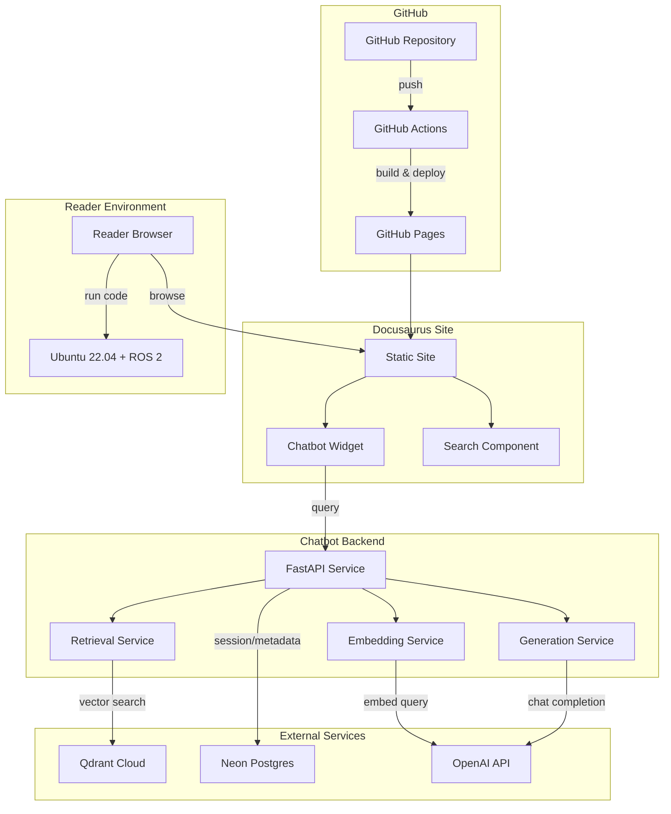

# Implementation Plan: Physical AI & Humanoid Robotics Book

**Branch**: `001-humanoid-robotics-book` | **Date**: 2025-12-15 | **Spec**: [spec.md](./spec.md)
**Input**: Feature specification from `/specs/001-humanoid-robotics-book/spec.md`

## Summary

Build a comprehensive educational book on Physical AI and Humanoid Robotics delivered as a Docusaurus static site hosted on GitHub Pages. The book covers ROS 2, simulation (Gazebo/Unity), NVIDIA Isaac, and Vision-Language-Action (VLA) models, culminating in a capstone project where readers build a voice-controlled humanoid robot. An embedded RAG chatbot provides interactive Q&A on book content.

**Technical Approach**:
- Docusaurus 3.x static site with MDX content, deployed to GitHub Pages
- RAG chatbot: FastAPI backend + Qdrant vector store + Neon Postgres + OpenAI APIs
- Research-concurrent strategy: targeted research during chapter writing
- Four implementation phases: Foundation → Content Modules → Chatbot Integration → Deployment

## Technical Context

**Language/Version**:
- Content: Markdown/MDX (Docusaurus 3.x)
- Chatbot Backend: Python 3.10+
- Robot Code Examples: Python 3.10+ with ROS 2 Humble

**Primary Dependencies**:
- Docusaurus 3.x (React-based static site generator)
- FastAPI (chatbot backend)
- OpenAI API (embeddings, chat completions)
- Qdrant Cloud (vector store)
- Neon Postgres (metadata storage)

**Storage**:
- Qdrant Cloud Free Tier (vector embeddings)
- Neon Serverless Postgres (chatbot metadata, session data)
- GitHub (content source, deployment)

**Testing**:
- Docusaurus: `npm run build` (build validation)
- Chatbot: pytest (API tests), manual query validation
- Code Examples: Ubuntu 22.04 VM/container validation

**Target Platform**:
- Static site: GitHub Pages (CDN-delivered)
- Chatbot backend: Cloud deployment (Vercel/Railway/Render)
- Reader environment: Ubuntu 22.04, ROS 2 Humble

**Project Type**: Web application (static site + API backend)

**Performance Goals**:
- Site: Lighthouse score 90+
- Chatbot: <5s response time for 95% of queries
- Code examples: All execute in <5 minutes setup time

**Constraints**:
- Content: 150-250 rendered pages
- Sources: Minimum 25 citations, 60%+ official docs
- Budget: Free tier services where possible

**Scale/Scope**:
- 33 chapters + 4 Module Projects + Capstone (6 chapters) + 5 Appendices
- ~50 code examples across modules
- RAG corpus: entire book content (~200k tokens estimated)

## Constitution Check

*GATE: Must pass before Phase 0 research. Re-check after Phase 1 design.*

| Principle | Status | Evidence |
|-----------|--------|----------|
| I. Accuracy Through Verification | PASS | Research-concurrent approach ensures all technical claims verified against official docs during writing |
| II. Clarity for Technical Audience | PASS | Target audience defined; Flesch-Kincaid 12-14; glossary in Appendix E |
| III. Reproducibility (NON-NEGOTIABLE) | PASS | All code tested in Ubuntu 22.04 + ROS 2 Humble; requirements.txt per module |
| IV. Rigor in Source Selection | PASS | 25+ sources required; 60%+ official docs; APA citations |
| V. Practicality and Accessibility | PASS | Three hardware tiers + cloud alternatives; simulation-first approach |

**Key Standards Alignment**:
- Code Standards: Python 3.10+, ROS 2 Humble, modular design ✓
- Content Format: Docusaurus MDX, Mermaid diagrams, code blocks ✓
- Citation Standards: APA style, inline links ✓

## Project Structure

### Documentation (this feature)

```text
specs/001-humanoid-robotics-book/
├── plan.md              # This file
├── research.md          # Phase 0: Architectural decisions
├── data-model.md        # Phase 1: Content and chatbot data models
├── quickstart.md        # Phase 1: Development setup guide
├── contracts/           # Phase 1: API contracts
│   ├── chatbot-api.yaml # OpenAPI spec for chatbot
│   └── embedding-pipeline.md
├── checklists/
│   └── requirements.md  # Spec validation checklist
└── tasks.md             # Phase 2: Implementation tasks (via /sp.tasks)
```

### Source Code (repository root)

```text
# Docusaurus Book Site
book/
├── docusaurus.config.js  # Site configuration
├── sidebars.js           # Navigation structure
├── package.json          # Node dependencies
├── src/
│   ├── components/       # Custom React components
│   │   ├── ChatbotWidget/
│   │   ├── ExerciseBox/
│   │   └── CodeRunner/
│   ├── css/
│   │   └── custom.css    # Theme customizations
│   └── pages/
│       └── index.js      # Custom homepage
├── docs/
│   ├── intro/            # Introduction (4 chapters)
│   │   ├── _category_.json
│   │   ├── 01-foundations.mdx
│   │   ├── 02-digital-to-physical.mdx
│   │   ├── 03-humanoid-landscape.mdx
│   │   └── 04-sensor-systems.mdx
│   ├── module1-ros2/     # Module 1: ROS 2 (7 files)
│   │   ├── _category_.json
│   │   ├── 01-architecture.mdx
│   │   ├── 02-nodes-topics.mdx
│   │   ├── 03-python-packages.mdx
│   │   ├── 04-launch-files.mdx
│   │   ├── 05-urdf.mdx
│   │   ├── 06-python-agents.mdx
│   │   └── project-pubsub-demo.mdx
│   ├── module2-simulation/ # Module 2: Simulation (7 files)
│   │   ├── _category_.json
│   │   ├── 01-gazebo-setup.mdx
│   │   ├── 02-urdf-sdf.mdx
│   │   ├── 03-physics.mdx
│   │   ├── 04-sensors.mdx
│   │   ├── 05-unity.mdx
│   │   ├── 06-environments.mdx
│   │   └── project-simulated-humanoid.mdx
│   ├── module3-isaac/    # Module 3: NVIDIA Isaac (7 files)
│   │   ├── _category_.json
│   │   ├── 01-isaac-overview.mdx
│   │   ├── 02-synthetic-data.mdx
│   │   ├── 03-perception.mdx
│   │   ├── 04-nav2.mdx
│   │   ├── 05-rl-basics.mdx
│   │   ├── 06-sim-to-real.mdx
│   │   └── project-perception-pipeline.mdx
│   ├── module4-vla/      # Module 4: VLA (6 files)
│   │   ├── _category_.json
│   │   ├── 01-llm-robotics.mdx
│   │   ├── 02-whisper.mdx
│   │   ├── 03-cognitive-planning.mdx
│   │   ├── 04-multimodal.mdx
│   │   ├── 05-vla-pipelines.mdx
│   │   └── project-voice-control.mdx
│   ├── capstone/         # Capstone Project (6 chapters)
│   │   ├── _category_.json
│   │   ├── 01-overview.mdx
│   │   ├── 02-integration.mdx
│   │   ├── 03-voice-processing.mdx
│   │   ├── 04-navigation-manipulation.mdx
│   │   ├── 05-testing-deployment.mdx
│   │   └── 06-extensions.mdx
│   └── appendices/       # Appendices (5 files)
│       ├── _category_.json
│       ├── a-hardware.mdx
│       ├── b-cloud-alternatives.mdx
│       ├── c-troubleshooting.mdx
│       ├── d-resources.mdx
│       └── e-glossary.mdx
└── static/
    ├── img/              # Images and diagrams
    │   ├── hero/
    │   ├── diagrams/
    │   └── screenshots/
    └── code/             # Downloadable code examples
        ├── module1/
        ├── module2/
        ├── module3/
        ├── module4/
        └── capstone/

# RAG Chatbot Backend
chatbot/
├── pyproject.toml        # Python dependencies
├── src/
│   ├── main.py           # FastAPI app entry
│   ├── api/
│   │   ├── routes.py     # API endpoints
│   │   └── models.py     # Pydantic models
│   ├── services/
│   │   ├── embedding.py  # Vector embedding logic
│   │   ├── retrieval.py  # Qdrant queries
│   │   └── generation.py # OpenAI response generation
│   └── config.py         # Environment configuration
├── scripts/
│   ├── ingest_content.py # Index book content to Qdrant
│   └── test_queries.py   # Validation query suite
└── tests/
    ├── test_api.py
    └── test_retrieval.py
```

**Structure Decision**: Web application structure with static frontend (Docusaurus) and API backend (FastAPI). This cleanly separates content authoring from chatbot functionality while enabling GitHub Pages deployment for the book.

## Architecture Diagram



## Component Responsibilities

| Component | Responsibility | Boundary |
|-----------|---------------|----------|
| Docusaurus Site | Serve book content, navigation, search | Static content only; no server logic |
| Chatbot Widget | UI for queries, display responses | Frontend only; calls backend API |
| FastAPI Backend | API routing, request handling | Orchestration only; delegates to services |
| Embedding Service | Convert queries to vectors | Uses OpenAI embeddings API |
| Retrieval Service | Find relevant content chunks | Queries Qdrant; returns ranked results |
| Generation Service | Generate natural language answers | Uses OpenAI chat API with retrieved context |
| Qdrant Cloud | Store/query vector embeddings | Managed vector DB; free tier |
| Neon Postgres | Store chat sessions, analytics | Managed Postgres; free tier |

## Architectural Decisions

### ADR-001: Docusaurus Theme Selection

**Decision**: Use Docusaurus Classic theme with customizations

**Rationale**:
- Classic theme provides all required features out-of-box (sidebar, search, dark mode)
- Lower setup complexity than custom theme
- Large community support and documentation
- Customization via CSS and swizzled components sufficient for branding

**Alternatives Rejected**:
- Custom theme: Higher development effort, maintenance burden outweighs branding benefits
- Alternative SSG (Hugo, Jekyll): Lack built-in React component support needed for chatbot widget

### ADR-002: Chatbot Embedding Method

**Decision**: Custom React component (not iframe)

**Rationale**:
- Enables selected-text scoping (access to DOM selection API)
- Seamless UI integration with Docusaurus theme
- Better control over state management and UX
- Can share authentication/session context with site

**Alternatives Rejected**:
- Iframe: Simpler but cannot access page content for scoped queries
- Third-party widget: Less control, potential vendor lock-in

### ADR-003: Vector Store Chunking Strategy

**Decision**: Semantic chunking by chapter section with overlap

**Rationale**:
- Chapter sections are natural semantic boundaries
- 500-token chunks with 50-token overlap balances retrieval precision and context
- Preserves code block integrity (no mid-block splits)
- Metadata includes chapter, section, and type (text/code/diagram)

**Alternatives Rejected**:
- Fixed-size: Risks splitting semantic units, code blocks
- Full chapters: Too large for context window, retrieval less precise

### ADR-004: Simulation Primary Platform

**Decision**: Gazebo primary, Isaac Sim for advanced topics

**Rationale**:
- Gazebo runs without RTX GPU (accessibility per Constitution Principle V)
- Isaac Sim covered in Module 3 with cloud alternatives documented
- Readers can complete most content with standard hardware
- Capstone supports both Gazebo and Isaac Sim paths

**Alternatives Rejected**:
- Isaac Sim only: Excludes readers without RTX GPU
- Unity only: Less ROS 2 integration maturity

### ADR-005: Hardware Pricing Approach

**Decision**: Approximate ranges with "verify current pricing" notes

**Rationale**:
- 2025 prices volatile; specific numbers quickly outdated
- Range (e.g., "$500-700") more durable than exact price
- Links to vendor pages for current pricing
- Appendix A marked with last-verified date

**Alternatives Rejected**:
- Exact prices: Requires frequent updates, maintenance burden
- No prices: Reduces practical value of recommendations

## Research Approach

### Strategy: Research-Concurrent

Perform targeted research during chapter writing rather than exhaustive upfront review. This ensures:
- Research directly addresses content needs
- Sources are current at time of writing
- Effort focuses on actual gaps, not speculative coverage

### Primary Sources (Official Documentation)

| Topic | Source | URL |
|-------|--------|-----|
| ROS 2 | ROS 2 Documentation | docs.ros.org |
| NVIDIA Isaac | Isaac Sim/ROS Docs | docs.nvidia.com/isaac |
| Gazebo | Gazebo Documentation | gazebosim.org/docs |
| Unity Robotics | Unity Robotics Hub | github.com/Unity-Technologies/Unity-Robotics-Hub |
| Nav2 | Navigation 2 Docs | navigation.ros.org |
| OpenAI Whisper | Whisper GitHub | github.com/openai/whisper |
| Docusaurus | Docusaurus Docs | docusaurus.io/docs |

### Secondary Sources (Academic/Research)

- Embodied AI: Papers from CoRL, ICRA, RSS (2020-2025)
- VLA Models: RT-2, PaLM-E, and related works
- Humanoid Locomotion: IEEE journals, arxiv preprints
- Sim-to-Real: Domain randomization, transfer learning literature

### Citation Management

- Format: APA style for academic; inline links for tools
- Tracking: Per-chapter references section
- Validation: All URLs verified during final review
- Target: 25+ unique sources, 60%+ from official docs

## Quality Validation

### Chapter-Level Checks

| Check | Method | Pass Criteria |
|-------|--------|---------------|
| Code Reproducibility | Run in Ubuntu 22.04 VM | All code executes without error |
| Command Accuracy | Execute each CLI command | Output matches documented expectations |
| Diagram Clarity | Visual review | Diagrams convey intended architecture |
| Learning Objectives | Content review | Each objective addressed in chapter |
| Prerequisites Listed | Template check | Prerequisites section complete |
| Citations Present | Count and verify | All claims sourced, URLs valid |

### Book-Level Checks

| Check | Method | Pass Criteria |
|-------|--------|---------------|
| Build Success | `npm run build` | Zero errors, zero warnings |
| Navigation | Manual click-through | All links work, no dead ends |
| Search | Query 20 terms | 95% return relevant results |
| Responsive Design | Device testing | Renders correctly on mobile/tablet |
| Lighthouse Score | Audit tool | 90+ on Performance, Accessibility |
| Chatbot Integration | 50-query test suite | 85% accuracy, <5s response |

### Success Criteria Mapping

All 20 success criteria from spec.md mapped to validation methods:
- SC-001 to SC-005: Deployment checks (automated + manual)
- SC-006 to SC-009: Reproducibility checks (VM testing)
- SC-010 to SC-014: Content quality checks (review + tools)
- SC-015 to SC-017: Chatbot checks (test suite)
- SC-018 to SC-020: Educational checks (end-to-end walkthrough)

## Testing Strategy

### Per-Chapter Testing

```bash
# For each chapter with code examples:
1. Spin up fresh Ubuntu 22.04 container/VM
2. Install documented prerequisites
3. Execute each code block in sequence
4. Verify output matches documentation
5. Record any issues in chapter review checklist
```

### RAG Chatbot Testing

**Test Suite Categories**:
1. Full-book queries (20 questions across all modules)
2. Scoped queries (10 questions on selected text)
3. Out-of-scope queries (5 questions chatbot should decline)
4. Edge cases (5 ambiguous or multi-module questions)

**Metrics**:
- Relevance: Does response address the question?
- Accuracy: Is information correct per source chapter?
- Hallucination: Any fabricated facts not in corpus?
- Response time: <5 seconds for 95% of queries

### Deployment Testing

```yaml
# GitHub Actions workflow
name: Build and Deploy
on:
  push:
    branches: [main]
jobs:
  build:
    runs-on: ubuntu-latest
    steps:
      - uses: actions/checkout@v4
      - uses: actions/setup-node@v4
      - run: npm ci
      - run: npm run build
      - uses: actions/upload-pages-artifact@v3
        with:
          path: build
  deploy:
    needs: build
    runs-on: ubuntu-latest
    steps:
      - uses: actions/deploy-pages@v4
```

## Implementation Phases

### Phase 1: Foundation (Setup)

**Goal**: Establish project infrastructure and development environment

**Deliverables**:
- Docusaurus project initialized with theme configuration
- Sidebar structure matching spec
- Homepage with placeholder content
- Chatbot backend skeleton (FastAPI app, endpoints defined)
- GitHub Actions CI/CD pipeline
- Development documentation (quickstart.md)

**Dependencies**: None

### Phase 2: Content Modules

**Goal**: Write and validate all book content

**Order** (by priority and dependency):
1. Introduction (4 chapters) - No dependencies
2. Module 1: ROS 2 (7 files) - Foundation for all other modules
3. Module 2: Simulation (7 files) - Requires Module 1 concepts
4. Module 3: NVIDIA Isaac (7 files) - Requires Modules 1-2
5. Module 4: VLA (6 files) - Requires Modules 1-3
6. Appendices (5 files) - Can parallel with modules
7. Capstone (6 chapters) - Requires all modules complete

**Per-Module Workflow**:
1. Research (targeted lookups for chapter topics)
2. Write chapter content with code examples
3. Test code in Ubuntu 22.04 environment
4. Create diagrams (Mermaid/images)
5. Add citations and references
6. Review against chapter checklist

### Phase 3: Chatbot Integration

**Goal**: Implement and validate RAG chatbot

**Deliverables**:
- Content ingestion pipeline (book → Qdrant)
- FastAPI endpoints (query, scoped-query)
- OpenAI integration (embeddings, completions)
- Chatbot React widget component
- Widget integration in Docusaurus
- Test suite execution and validation

**Dependencies**: Phase 2 (content must exist to index)

### Phase 4: Deployment & Validation

**Goal**: Final validation and production deployment

**Deliverables**:
- Full book build passes
- All success criteria validated
- GitHub Pages deployment live
- Chatbot backend deployed to cloud
- Final documentation review
- Launch checklist complete

**Dependencies**: Phases 1-3 complete

## Complexity Tracking

> No Constitution violations requiring justification. All design decisions align with principles.

| Decision | Justification |
|----------|---------------|
| Separate chatbot backend | Required for RAG functionality; static site cannot handle embeddings/LLM calls |
| Multiple external services | Each service provides distinct capability (vectors, SQL, LLM); free tiers minimize cost |
| 33+ content files | Matches spec requirements; modular structure aids maintenance |

---

## Related Artifacts

| Artifact | Path | Description |
|----------|------|-------------|
| Specification | [spec.md](./spec.md) | Feature requirements (v2 - 39 FRs, 20 SCs) |
| Requirements Checklist | [checklists/requirements.md](./checklists/requirements.md) | Spec validation (20/20 pass) |
| Research Decisions | [research.md](./research.md) | Architectural decisions D-001 to D-008 |
| Data Model | [data-model.md](./data-model.md) | Content and chatbot entity models |
| API Contract | [contracts/chatbot-api.yaml](./contracts/chatbot-api.yaml) | OpenAPI 3.1 spec for chatbot |
| Quickstart Guide | [quickstart.md](./quickstart.md) | Development environment setup |

---

## Next Steps

1. **Generate Tasks**: Run `/sp.tasks` to create actionable implementation tasks from this plan
2. **Review ADR Candidates**: Consider documenting significant decisions via `/sp.adr` for:
   - SSG Selection (Docusaurus 3.x)
   - RAG Architecture Pattern
   - Chunking Strategy
3. **Begin Implementation**: Start with Phase 1 Foundation tasks
