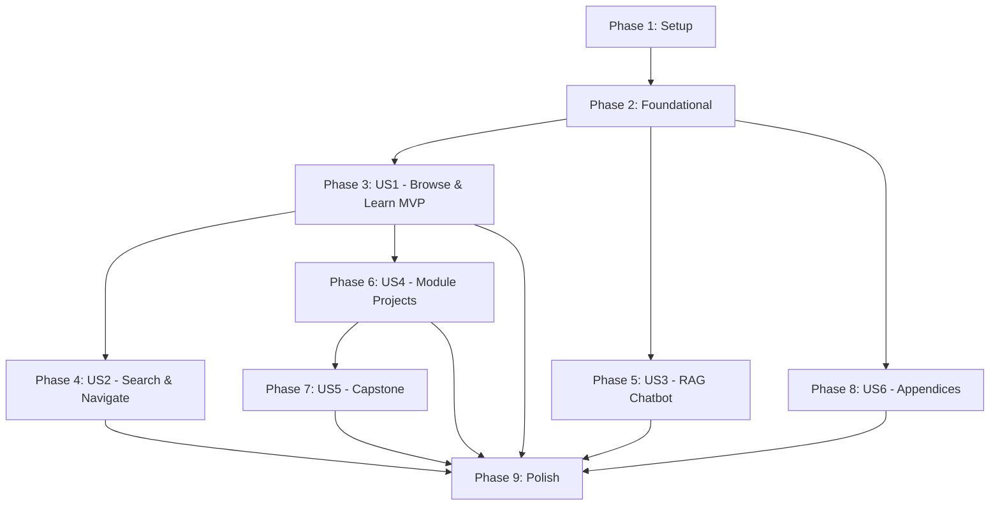

# Tasks: Physical AI & Humanoid Robotics Book

**Input**: Design documents from `/specs/001-humanoid-robotics-book/`
**Prerequisites**: plan.md, spec.md, research.md, data-model.md, contracts/chatbot-api.yaml

**Tests**: No automated tests specified. Validation is via build success, Lighthouse scores, and manual chatbot query testing.

**Organization**: Tasks grouped by user story priority (P1-P6) to enable independent implementation and MVP-first delivery.

## Format: `[ID] [P?] [Story] Description`

- **[P]**: Can run in parallel (different files, no dependencies)
- **[Story]**: US1-US6 mapping to user stories from spec.md
- Exact file paths from plan.md project structure

## Path Conventions

```text
book/                  # Docusaurus static site
├── docusaurus.config.js
├── sidebars.js
├── src/components/    # React components
├── docs/              # MDX content
└── static/            # Images, code downloads

chatbot/               # FastAPI RAG backend
├── src/
│   ├── main.py
│   ├── api/
│   ├── services/
│   └── config.py
├── scripts/
└── tests/
```

---

## Phase 1: Setup (Shared Infrastructure)

**Purpose**: Initialize project structure and development environment

- [x] T001 Initialize Docusaurus 3.x project in book/ directory
- [x] T002 [P] Configure docusaurus.config.js with site metadata, theme, and plugins
- [x] T003 [P] Initialize Python 3.10+ project in chatbot/ with pyproject.toml
- [x] T004 [P] Create .env.example files for book/ and chatbot/
- [x] T005 [P] Create .gitignore with Node, Python, and IDE patterns
- [x] T006 Configure sidebars.js with multi-level structure matching spec FR-008
- [x] T007 [P] Create GitHub Actions workflow in .github/workflows/deploy-book.yml
- [x] T008 [P] Create GitHub Actions workflow in .github/workflows/deploy-chatbot.yml

---

## Phase 2: Foundational (Blocking Prerequisites)

**Purpose**: Core site infrastructure that MUST be complete before content authoring

**⚠️ CRITICAL**: No user story work can begin until this phase is complete

- [x] T009 Create custom homepage in book/src/pages/index.js with hero section placeholder
- [x] T010 [P] Create custom.css in book/src/css/custom.css with theme variables
- [x] T011 [P] Create _category_.json files for all doc sections in book/docs/
- [x] T012 Create MDX chapter template in book/docs/_templates/chapter-template.mdx
- [x] T013 [P] Setup FastAPI app skeleton in chatbot/src/main.py with CORS
- [x] T014 [P] Create Pydantic models in chatbot/src/api/models.py per contracts/chatbot-api.yaml
- [x] T015 [P] Create config.py in chatbot/src/config.py with environment settings
- [x] T016 [P] Create static/img/ directory structure (hero/, diagrams/, screenshots/)
- [x] T017 Verify Docusaurus builds with `npm run build` in book/

**Checkpoint**: Foundation ready - content authoring can begin ✅ COMPLETE

---

## Phase 3: User Story 1 - Browse and Learn (Priority: P1) 🎯 MVP

**Goal**: Readers can access book via Docusaurus, navigate modules, view code examples

**Independent Test**: Deploy site to GitHub Pages, verify reader can navigate from homepage through Module 1 chapters, view syntax-highlighted code blocks with copy buttons

### Homepage & Navigation (US1)

- [ ] T018 [US1] Complete homepage in book/src/pages/index.js with title, hero image, overview, module links
- [ ] T019 [US1] Add top navigation bar config in docusaurus.config.js (Home, Modules dropdown, Capstone, Appendices, GitHub)
- [ ] T020 [US1] Configure footer in docusaurus.config.js with copyright, last updated, credits per FR-012
- [ ] T021 [US1] Enable dark/light mode toggle per FR-011

### Introduction Chapters (US1)

- [ ] T022 [P] [US1] Write book/docs/intro/01-foundations.mdx with learning objectives, prerequisites, key takeaways
- [ ] T023 [P] [US1] Write book/docs/intro/02-digital-to-physical.mdx
- [ ] T024 [P] [US1] Write book/docs/intro/03-humanoid-landscape.mdx (2025 update)
- [ ] T025 [P] [US1] Write book/docs/intro/04-sensor-systems.mdx

### Module 1: ROS 2 Chapters (US1)

- [ ] T026 [P] [US1] Write book/docs/module1-ros2/01-architecture.mdx with Mermaid diagram
- [ ] T027 [P] [US1] Write book/docs/module1-ros2/02-nodes-topics.mdx with code examples
- [ ] T028 [P] [US1] Write book/docs/module1-ros2/03-python-packages.mdx with rclpy examples
- [ ] T029 [P] [US1] Write book/docs/module1-ros2/04-launch-files.mdx
- [ ] T030 [P] [US1] Write book/docs/module1-ros2/05-urdf.mdx with URDF code blocks
- [ ] T031 [P] [US1] Write book/docs/module1-ros2/06-python-agents.mdx
- [ ] T032 [US1] Create book/static/code/module1/requirements.txt for reproducibility

### Module 2: Simulation Chapters (US1)

- [ ] T033 [P] [US1] Write book/docs/module2-simulation/01-gazebo-setup.mdx
- [ ] T034 [P] [US1] Write book/docs/module2-simulation/02-urdf-sdf.mdx comparing formats
- [ ] T035 [P] [US1] Write book/docs/module2-simulation/03-physics.mdx
- [ ] T036 [P] [US1] Write book/docs/module2-simulation/04-sensors.mdx
- [ ] T037 [P] [US1] Write book/docs/module2-simulation/05-unity.mdx
- [ ] T038 [P] [US1] Write book/docs/module2-simulation/06-environments.mdx
- [ ] T039 [US1] Create book/static/code/module2/requirements.txt

### Module 3: NVIDIA Isaac Chapters (US1)

- [ ] T040 [P] [US1] Write book/docs/module3-isaac/01-isaac-overview.mdx
- [ ] T041 [P] [US1] Write book/docs/module3-isaac/02-synthetic-data.mdx
- [ ] T042 [P] [US1] Write book/docs/module3-isaac/03-perception.mdx
- [ ] T043 [P] [US1] Write book/docs/module3-isaac/04-nav2.mdx with Nav2 examples
- [ ] T044 [P] [US1] Write book/docs/module3-isaac/05-rl-basics.mdx
- [ ] T045 [P] [US1] Write book/docs/module3-isaac/06-sim-to-real.mdx
- [ ] T046 [US1] Create book/static/code/module3/requirements.txt

### Module 4: VLA Chapters (US1)

- [ ] T047 [P] [US1] Write book/docs/module4-vla/01-llm-robotics.mdx
- [ ] T048 [P] [US1] Write book/docs/module4-vla/02-whisper.mdx with Whisper examples
- [ ] T049 [P] [US1] Write book/docs/module4-vla/03-cognitive-planning.mdx
- [ ] T050 [P] [US1] Write book/docs/module4-vla/04-multimodal.mdx
- [ ] T051 [P] [US1] Write book/docs/module4-vla/05-vla-pipelines.mdx
- [ ] T052 [US1] Create book/static/code/module4/requirements.txt

### Code Example Validation (US1)

- [ ] T053 [US1] Test all Module 1 code examples in Ubuntu 22.04 + ROS 2 Humble environment
- [ ] T054 [US1] Test all Module 2 code examples in Gazebo environment
- [ ] T055 [US1] Verify build passes with all chapters: `npm run build` in book/

**Checkpoint**: MVP complete - readers can browse and learn from all module chapters

---

## Phase 4: User Story 2 - Search and Navigate (Priority: P2)

**Goal**: Readers can search content and navigate efficiently via sidebar and top nav

**Independent Test**: Search for "URDF" and verify results from Module 1 and Module 2; verify mobile hamburger menu works

### Search & Navigation (US2)

- [ ] T056 [US2] Enable and configure Docusaurus search in docusaurus.config.js per FR-024
- [ ] T057 [US2] Verify sidebar navigation loads all chapters correctly
- [ ] T058 [US2] Test responsive hamburger menu on mobile viewport
- [ ] T059 [US2] Configure Modules dropdown in navbar with all 4 module links
- [ ] T060 [US2] Run search validation against 20 key terms per SC-003

**Checkpoint**: Search and navigation fully functional

---

## Phase 5: User Story 3 - RAG Chatbot (Priority: P3)

**Goal**: Readers can ask questions via embedded chatbot with full-corpus and scoped query support

**Independent Test**: Ask "What is the difference between URDF and SDF?" and verify response cites Module 2 content

### Chatbot Backend Services (US3)

- [ ] T061 [P] [US3] Implement embedding service in chatbot/src/services/embedding.py using OpenAI API
- [ ] T062 [P] [US3] Implement retrieval service in chatbot/src/services/retrieval.py using Qdrant
- [ ] T063 [P] [US3] Implement generation service in chatbot/src/services/generation.py using OpenAI
- [ ] T064 [US3] Create chunking logic in chatbot/scripts/chunk_content.py per D-003 (500 tokens, 50 overlap)

### Chatbot API Routes (US3)

- [ ] T065 [US3] Implement POST /chat/query in chatbot/src/api/routes.py per chatbot-api.yaml
- [ ] T066 [US3] Implement POST /chat/feedback in chatbot/src/api/routes.py
- [ ] T067 [US3] Implement POST /sessions in chatbot/src/api/routes.py
- [ ] T068 [US3] Implement GET/DELETE /sessions/{sessionId} in chatbot/src/api/routes.py
- [ ] T069 [US3] Implement GET /health and /health/ready in chatbot/src/api/routes.py
- [ ] T070 [US3] Implement POST /admin/reindex in chatbot/src/api/routes.py

### Database Setup (US3)

- [ ] T071 [US3] Create Neon Postgres schema using SQL from data-model.md
- [ ] T072 [US3] Create Qdrant collection "book_chunks" per data-model.md schema
- [ ] T073 [US3] Create content ingestion script in chatbot/scripts/ingest_content.py

### Content Indexing (US3)

- [ ] T074 [US3] Run ingestion script to embed all book chapters into Qdrant
- [ ] T075 [US3] Verify chunk metadata stored in Neon Postgres

### Chatbot Widget Frontend (US3)

- [ ] T076 [P] [US3] Create ChatbotWidget component in book/src/components/ChatbotWidget/index.tsx
- [ ] T077 [P] [US3] Create ChatWindow.tsx for message display
- [ ] T078 [P] [US3] Create MessageInput.tsx with query input
- [ ] T079 [US3] Create useTextSelection.ts hook for scoped queries
- [ ] T080 [US3] Create styles.module.css with theme-aware styling
- [ ] T081 [US3] Integrate ChatbotWidget into Docusaurus theme wrapper

### Chatbot Validation (US3)

- [ ] T082 [US3] Create test query suite in chatbot/scripts/test_queries.py (50 questions)
- [ ] T083 [US3] Execute test suite and verify 85% accuracy per SC-016
- [ ] T084 [US3] Test scoped queries and verify 90% correct scoping per SC-017
- [ ] T085 [US3] Verify response time <5s for 95% of queries per SC-015

**Checkpoint**: Chatbot fully functional with full-corpus and scoped queries

---

## Phase 6: User Story 4 - Module Projects (Priority: P4)

**Goal**: Each module has a hands-on project that integrates chapter concepts

**Independent Test**: Complete Module 1 Project and verify Publisher/Subscriber demo runs

### Module Projects (US4)

- [ ] T086 [P] [US4] Write book/docs/module1-ros2/project-pubsub-demo.mdx (Publisher/Subscriber Humanoid Demo)
- [ ] T087 [P] [US4] Write book/docs/module2-simulation/project-simulated-humanoid.mdx (Simulated Humanoid in Custom World)
- [ ] T088 [P] [US4] Write book/docs/module3-isaac/project-perception-pipeline.mdx (Perception and Navigation Pipeline)
- [ ] T089 [P] [US4] Write book/docs/module4-vla/project-voice-control.mdx (Voice-Controlled Task Execution)

### Module Project Code (US4)

- [ ] T090 [P] [US4] Create book/static/code/module1/project/ with project starter files
- [ ] T091 [P] [US4] Create book/static/code/module2/project/ with project starter files
- [ ] T092 [P] [US4] Create book/static/code/module3/project/ with project starter files
- [ ] T093 [P] [US4] Create book/static/code/module4/project/ with project starter files

### Module Project Validation (US4)

- [ ] T094 [US4] Test Module 1 Project produces working Publisher/Subscriber demo
- [ ] T095 [US4] Test Module 2 Project produces Simulated Humanoid in Custom World
- [ ] T096 [US4] Test Module 3 Project produces Perception Pipeline (may require RTX)
- [ ] T097 [US4] Test Module 4 Project produces Voice-Controlled demo

**Checkpoint**: All 4 Module Projects complete and validated

---

## Phase 7: User Story 5 - Capstone Project (Priority: P5)

**Goal**: Readers build autonomous voice-controlled humanoid robot integrating all modules

**Independent Test**: Follow Capstone instructions to deploy simulated humanoid responding to "Pick up the red ball"

### Capstone Chapters (US5)

- [ ] T098 [P] [US5] Write book/docs/capstone/01-overview.mdx with project introduction
- [ ] T099 [P] [US5] Write book/docs/capstone/02-integration.mdx with system architecture
- [ ] T100 [P] [US5] Write book/docs/capstone/03-voice-processing.mdx with Whisper integration
- [ ] T101 [P] [US5] Write book/docs/capstone/04-navigation-manipulation.mdx with Nav2 + manipulation
- [ ] T102 [P] [US5] Write book/docs/capstone/05-testing-deployment.mdx
- [ ] T103 [P] [US5] Write book/docs/capstone/06-extensions.mdx with future directions

### Capstone Code (US5)

- [ ] T104 [US5] Create book/static/code/capstone/ with complete project code
- [ ] T105 [US5] Create book/static/code/capstone/requirements.txt

### Capstone Validation (US5)

- [ ] T106 [US5] Test Capstone system initializes without errors per SC-009
- [ ] T107 [US5] Test "Navigate to the kitchen" voice command executes in simulation
- [ ] T108 [US5] Test "Pick up the red ball" voice command executes manipulation
- [ ] T109 [US5] Verify at least 3 distinct voice commands work per SC-020

**Checkpoint**: Capstone project complete - full educational journey validated

---

## Phase 8: User Story 6 - Hardware References (Priority: P6)

**Goal**: Appendices provide hardware recommendations, cloud alternatives, and reference materials

**Independent Test**: Verify Appendix A has 3+ hardware tiers with pricing; Appendix B has 2+ cloud options

### Appendices (US6)

- [ ] T110 [P] [US6] Write book/docs/appendices/a-hardware.mdx with budget/mid/premium tiers
- [ ] T111 [P] [US6] Write book/docs/appendices/b-cloud-alternatives.mdx with Isaac Cloud options
- [ ] T112 [P] [US6] Write book/docs/appendices/c-troubleshooting.mdx with common issues
- [ ] T113 [P] [US6] Write book/docs/appendices/d-resources.mdx with central bibliography
- [ ] T114 [P] [US6] Write book/docs/appendices/e-glossary.mdx with technical terms

### Appendix Validation (US6)

- [ ] T115 [US6] Verify Appendix A contains 3+ hardware tiers with 2025 pricing
- [ ] T116 [US6] Verify Appendix B contains 2+ cloud simulation options
- [ ] T117 [US6] Verify Appendix E glossary contains all terms defined at first use

**Checkpoint**: All appendices complete with reference material

---

## Phase 9: Polish & Cross-Cutting Concerns

**Purpose**: Final validation, quality checks, and deployment

### Citation Validation

- [ ] T118 [P] Verify minimum 25 unique citations across all chapters per SC-010
- [ ] T119 [P] Verify 60%+ citations are from official documentation
- [ ] T120 [P] Validate all citation URLs are accessible

### Build & Accessibility

- [ ] T121 Run full build: `npm run build` in book/ with zero errors per SC-001
- [ ] T122 Run Lighthouse audit on deployed site, verify 90+ score per SC-004
- [ ] T123 [P] Verify all internal links work (no broken links) per SC-002
- [ ] T124 Verify responsive design on mobile/tablet devices per FR-025

### Chatbot Reindexing

- [ ] T125 Run final content reindex after all chapters complete
- [ ] T126 Re-run 50-question test suite and verify 85% accuracy

### Deployment

- [ ] T127 Deploy book to GitHub Pages via workflow
- [ ] T128 Deploy chatbot backend to cloud provider (Render/Railway)
- [ ] T129 Update CHATBOT_API_URL in production environment
- [ ] T130 Verify chatbot widget connects to production backend

### Documentation

- [ ] T131 Update README.md with project overview and quickstart
- [ ] T132 Update book/README.md with contribution guidelines

---

## Dependencies & Execution Order

### Phase Dependencies



### User Story Dependencies

| Story | Depends On | Can Parallel With |
|-------|------------|-------------------|
| US1 (P1) | Phase 2 Foundational | - |
| US2 (P2) | US1 (content must exist to search) | US3, US6 |
| US3 (P3) | Phase 2, US1 (content for chatbot) | US2, US4, US6 |
| US4 (P4) | US1 (module chapters prerequisite) | US3, US6 |
| US5 (P5) | US4 (Module Projects prerequisite) | US6 |
| US6 (P6) | Phase 2 | US2, US3, US4 |

### Parallel Opportunities

**Within Phase 1 (Setup):**
- T002, T003, T004, T005 can run in parallel
- T007, T008 can run in parallel

**Within Phase 2 (Foundational):**
- T010, T011, T013, T014, T015, T016 can run in parallel

**Within US1 (Content Writing):**
- All intro chapters (T022-T025) can run in parallel
- All Module 1 chapters (T026-T031) can run in parallel
- All Module 2 chapters (T033-T038) can run in parallel
- All Module 3 chapters (T040-T045) can run in parallel
- All Module 4 chapters (T047-T051) can run in parallel

**Within US3 (Chatbot):**
- Services T061, T062, T063 can run in parallel
- Widget components T076, T077, T078 can run in parallel

**Within US4 (Module Projects):**
- All project chapters (T086-T089) can run in parallel
- All project code (T090-T093) can run in parallel

**Within US5 (Capstone):**
- All capstone chapters (T098-T103) can run in parallel

**Within US6 (Appendices):**
- All appendices (T110-T114) can run in parallel

---

## Parallel Example: US1 Module Chapters

```bash
# Launch all Introduction chapters together:
Task: "Write book/docs/intro/01-foundations.mdx"
Task: "Write book/docs/intro/02-digital-to-physical.mdx"
Task: "Write book/docs/intro/03-humanoid-landscape.mdx"
Task: "Write book/docs/intro/04-sensor-systems.mdx"

# Launch all Module 1 chapters together:
Task: "Write book/docs/module1-ros2/01-architecture.mdx"
Task: "Write book/docs/module1-ros2/02-nodes-topics.mdx"
Task: "Write book/docs/module1-ros2/03-python-packages.mdx"
Task: "Write book/docs/module1-ros2/04-launch-files.mdx"
Task: "Write book/docs/module1-ros2/05-urdf.mdx"
Task: "Write book/docs/module1-ros2/06-python-agents.mdx"
```

---

## Implementation Strategy

### MVP First (User Story 1 Only)

1. Complete Phase 1: Setup → Docusaurus initialized
2. Complete Phase 2: Foundational → Site structure ready
3. Complete Phase 3: US1 → All chapters browsable
4. **STOP and VALIDATE**: Deploy to GitHub Pages, verify navigation
5. MVP delivered - readers can learn!

### Incremental Delivery

| Milestone | Stories Included | Value Delivered |
|-----------|------------------|-----------------|
| MVP | US1 | Readers browse tutorials |
| v1.1 | US1 + US2 | Search enabled |
| v1.2 | US1 + US2 + US6 | Appendices available |
| v1.3 | + US4 | Module Projects complete |
| v1.4 | + US3 | Chatbot live |
| v2.0 | + US5 | Capstone complete |

### Suggested MVP Scope

**Minimum Viable Book**: Phase 1 + Phase 2 + Phase 3 (User Story 1)
- All 4 module chapters written
- Code examples with copy buttons
- Sidebar navigation working
- Deployable to GitHub Pages

---

## Summary

| Metric | Count |
|--------|-------|
| **Total Tasks** | 132 |
| **Setup Tasks** | 8 |
| **Foundational Tasks** | 9 |
| **US1 Tasks** | 38 |
| **US2 Tasks** | 5 |
| **US3 Tasks** | 25 |
| **US4 Tasks** | 12 |
| **US5 Tasks** | 12 |
| **US6 Tasks** | 8 |
| **Polish Tasks** | 15 |

| Parallel Opportunities | Count |
|------------------------|-------|
| Parallelizable tasks [P] | 85+ |
| Sequential dependencies | ~47 |

**MVP Tasks**: T001-T055 (55 tasks) delivers browsable book with all chapters

---

## Notes

- [P] tasks can run on different files with no dependencies
- [USX] labels map tasks to user stories for traceability
- Each user story is independently testable at its checkpoint
- Content writing tasks (chapters) are the bulk of work
- Chatbot (US3) can be developed in parallel with content writing
- Verify Docusaurus builds frequently during content authoring
- Commit after each chapter or logical task group
